# 🧩 Day 68 Django REST API DRF 1

---

# 🌐 REST API

---

## ⚙️ API

- 두 소프트웨어가 서로 **통신** 할 수 있게 하는 **메커니즘**  
- 클라이언트와 서버처럼 서로 다른 프로그램에서 요청과 응답을 받을 수 있도록 많은 체계

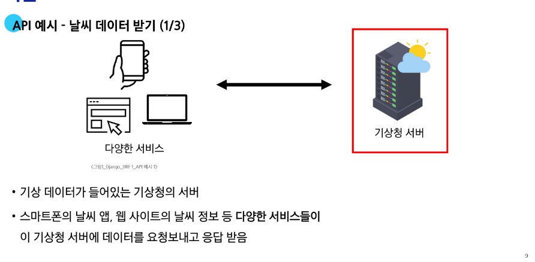

---

## 🌍 Web API

- 웹 서버 또는 웹 브라우저를 위한 API  
- 현대 웹 개발은 하나부터 열까지 직접 개발하기보다 여러 **OPEN API**를 활용해서 개발을 진행한다.

1) **OPEN API**  
   - 누구나 접근할 수 있도록 공개된, 외부 소프트웨어와 통신하기 위한 인터페이스

2) **Third Party**  
   - 직접 개발하지 않은 외부의 서비스나 소프트웨어를 활용하는 주체

---

## 🔗 REST API

- API Server를 개발하기 위한 일종의 **소프트웨어 설계 방법론**  
- 집을 지을 때, 기초 → 골조 → 내장 → 마감처럼 정해진 순서를 따른다.

1) **RESTful API**  
   - 각각 API 서버 구조를 작성하는 모습이 다르기 때문에 어느 정도 약속을 만들어 통일한 것  
   - 실제 네이버나 카카오도 REST API 규격을 만들어 두었다.

2) **REST에서 자원을 정의하고 주소를 지정하는 방법**
   1. **URI** : 자원의 **식별**  
   2. **HTTP Methods** : 자원의 **행위**  
   3. **JSON 데이터** : 자원의 **표현** (최종 결과물)  
   - 개발자는 URL만 보고 무슨 데이터를 어떤 방식으로 처리할지 예측할 수 있어야 하며, 어떤 데이터 포맷을 사용할지 기준을 정해야 한다.

---

## 🧭 자원의 식별

1. **URI** : 인터넷에서 자원을 식별하는 문자열  
2. **URL** : 웹에서 주어진 자원의 주소  
3. **Schema(Protocol)** : 브라우저가 자원을 요청하는데 사용하는 약속  
   - **mailto** : 메일을 열기 위한 주소  
   - **ftp** : 파일을 전송하기 위한 주소  
   
4. **Domain Name** : IP 주소를 외우기 어려우니 붙이는 이름  
   
5. **Port** : 웹 사이트에 접근하기 위한 문  
   - HTTP 프로토콜의 표준 포트는 생략 가능  
   
6. **Path** : 웹 서버의 자원 경로  
   - 최근에는 추상화된 형태의 구조를 표현한다.  
   
7. **Parameters** : 웹 서버에 제공하는 추가적인 데이터  
   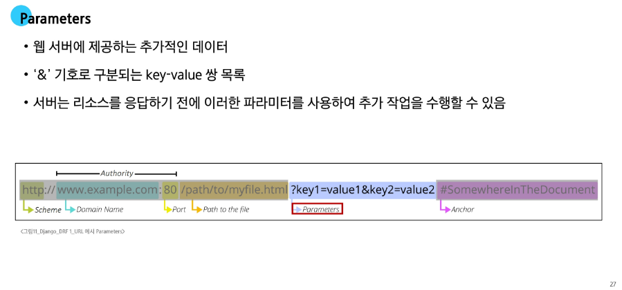
8. **Anchor** : 일종의 **북마크**를 나타내며 브라우저에 해당 지점의 콘텐츠를 표시  
   - `#`으로 시작하고 이후 부분은 서버에 전송되지 않는다.  
   - 앵커가 있는 주소를 공유하면 해당 부분으로 바로 이동이 가능하다.  
   - 브라우저가 해당 지점으로 페이지를 이동시킬 수 있도록 한다.  
   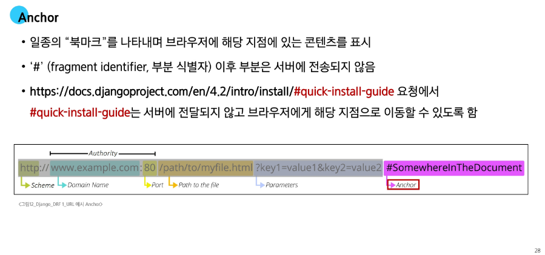

---

## 🧠 자원의 행위

1. **HTTP Request Method** : 자원에 대한 행위 (수행하고자 하는 동작을 정의)  
2. **HTTP Request Method 종류**
   1) **GET** – 서버에 리소스 표현을 요청 (데이터만 검색)  
   2) **POST** – 데이터를 지정된 리소스에 제출 (서버 상태 변경)  
   3) **PUT** – 요청한 주소의 리소스를 수정  
   4) **DELETE** – 지정된 리소스를 삭제
3. **HTTP response status codes**  
   - 특정 HTTP 요청이 성공적으로 완료되었는지 여부를 나타낸다  
   

---

## 🪄 자원의 표현

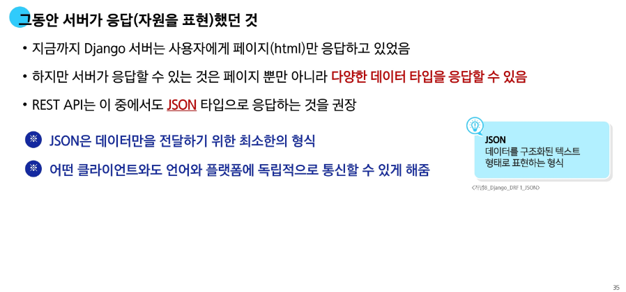
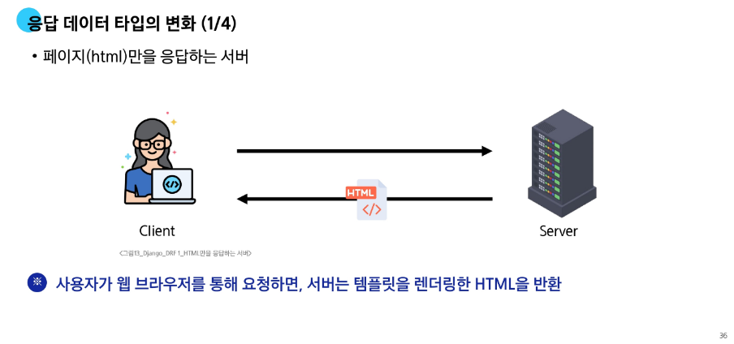

---

# ⚡ DRF with Single Model

---

## 🧰 Django REST Framework

- Django에서 Restful API 서버를 쉽게 구축할 수 있도록 도와주는 **오픈소스 라이브러리**  
- 빠르고 안정적으로 Restful 구조를 구현할 수 있도록 도와주는 개발 도구 세트

---

## 🔄 Serializer

1) **Serialization**  
   - 여러 시스템에서 활용하기 위해 데이터 구조나 객체 상태를 **재구성할 수 있는 포맷으로 변환하는 과정**

   

2) **Serializer**  
   - 어떤 언어나 환경에서도 다시 쉽게 사용할 수 있는 **포맷으로 변환하는 과정**

   
   

---

# 🧱 CRUD with ModelSerializer

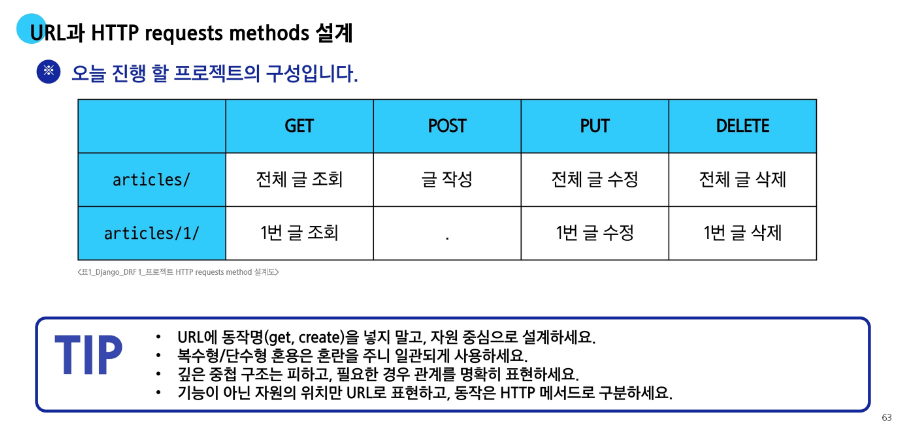

---

## 🔍 GET method - 조회

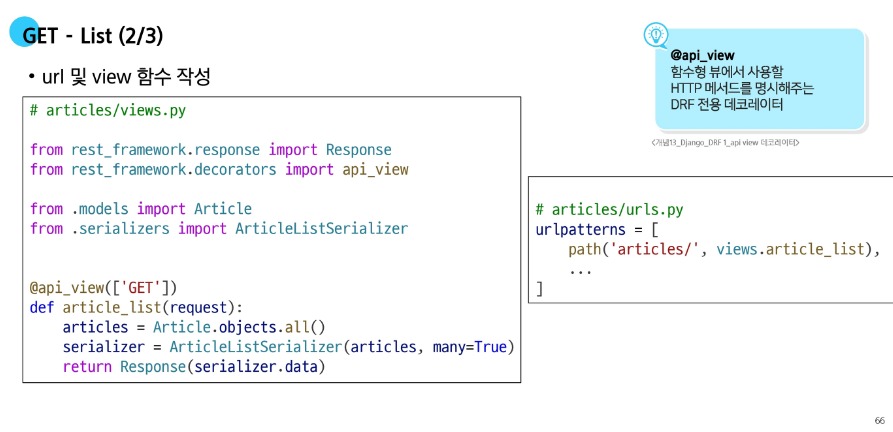

- `many` 옵션을 지정하지 않으면 단일 객체로 처리된다.

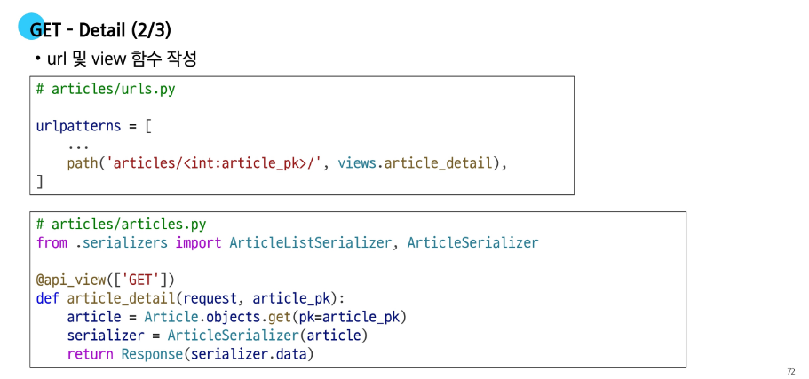

---

## 📝 POST method - 생성

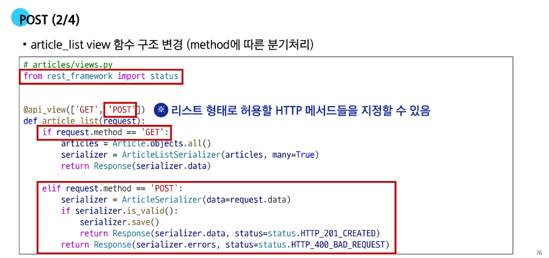

---

## ❌ DELETE method - 삭제

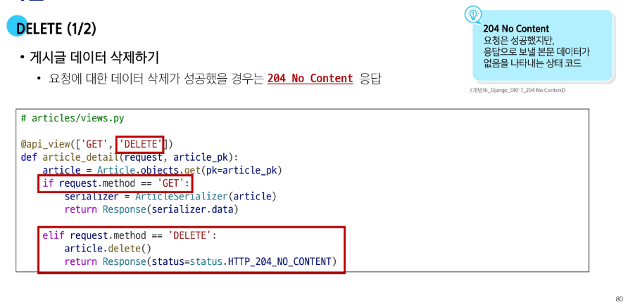

---

## 🧩 PUT method - 수정

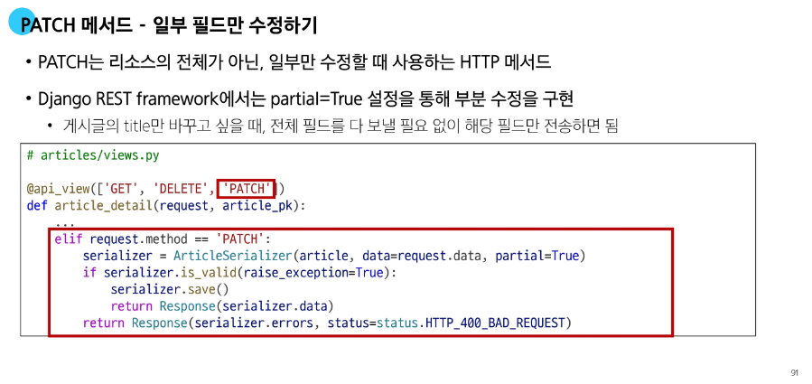

- **PATCH** : 리소스 전체가 아닌 일부만 수정하려면 권장  
  - PUT 대신 **PATCH**를 주로 사용  

---

# 📚 참고

## ⚠️ raise_exception

