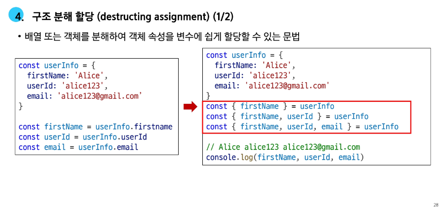
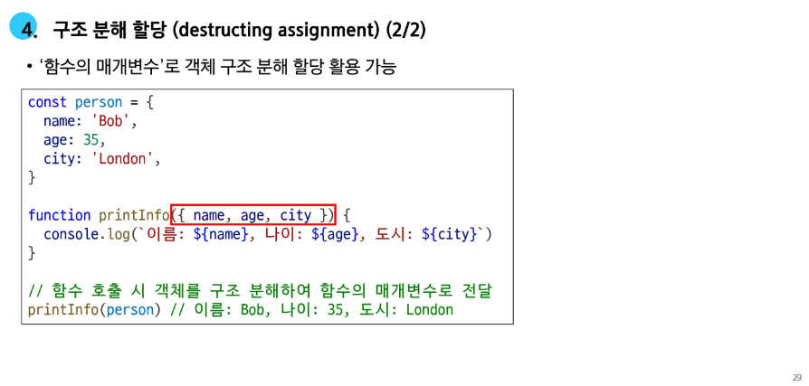
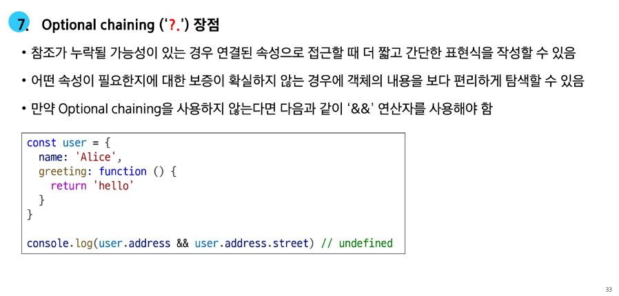
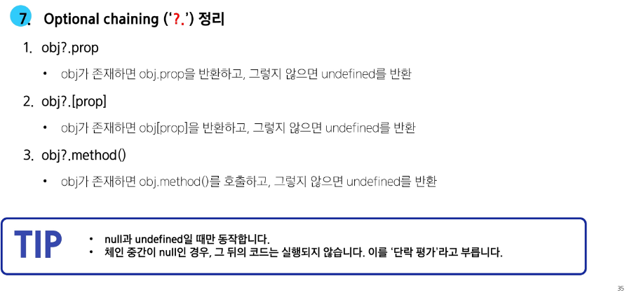
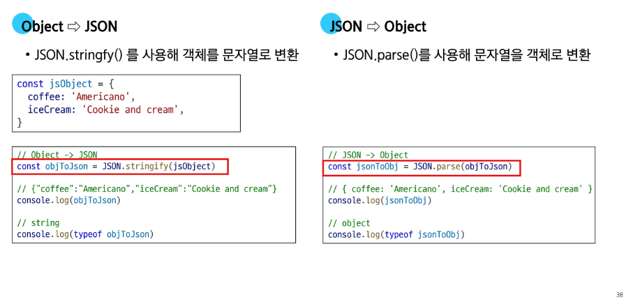
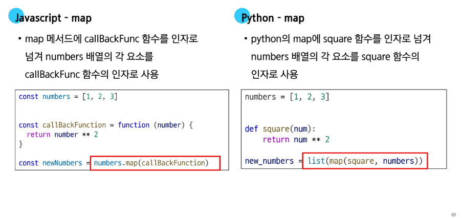
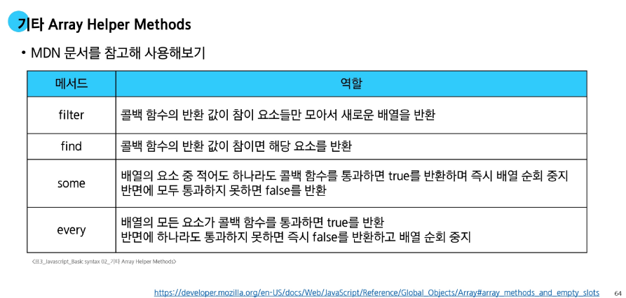

# 📘 Day 72 JavaScript Basic syntax 02

## 🧱 객체

  - Object : 키로 구분된 데이터 집합을 저장하는 자료 (data collection)
    - *Python*의 딕셔너리와 동일

### 🧩 구조 및 속성

  - **객체 구조**
    - 중괄호 ```{}```를 이용해 작성
    - 중괄호 안에는 **key: value** 쌍으로 구성된 속성(property)을 여러 개 작성 가능
    - key는 문자형만 허용
    - value는 모든 자료형 허용

    ```javascript
    const user = {
      name: 'Alice',
      'key with space': true,
      greeting: function() {
        return 'hello'
      }
    }
    ```

  - **속성 참조**
    - 점 ```.``` 표기법 또는 대괄호 ```[]```표기법으로 객체 속성에 접근
    - key 이름에 띄어쓰기 같은 구분자가 있으면 대괄호 접근만 가능
  
    ```javascript
    // 조희
    console.log(user.name)  // Alice
    console.log(user['key with space']) // true

    // 추가
    user.address = 'korea'
    console.log(user) // {name: 'Alice', 'key with space': true, greeting: f, address: 'korea'}

    // 수정
    user.name = 'Bella'
    console.log(user.name)  // Bella

    // 삭제
    delete user.name
    console.log(user) // {key with space': true, greeting: f, address: 'korea'}
    ```
  
  - **in 연산자**
    - 속성이 객체에 존재하는지 여부를 확인
    - 객체의 키나 배열의 인덱스 존재 여부를 확인하는 연산자

    ```javascript
    console.log('greeting' in user) // true
    console.log('country' in user)  // false
    ```

    - *객체에서 포함 여부를 확인하려면, ```in```연산자 대신 ```hasOwnProperty()``` 메서드를 사용한다*
      - **프로토타입 체인**을 따라 상속된 속성까지 확인하므로, 의도치 않게 true가 나올 수 있기 때문에 주의해야 한다.
    
    - **프로토타입** : 객체들이 기능을 물려받는 원본. ('부모' 역할을 하는 객체)
    - **프로토타입 체인** : 자신에게 없는 속성이나 기능을 부모, 조상 순으로 찾아가는 것

### ⚙️ 메서드

- **Method** : 객체 속성에 정의된 함수
  - ```object.method()``` 방식으로 호출
  - 메서드는 객체가 '행동'할 수 있게 한다.
  ```javascript
  console.log(user.greeting())  // hello
  ```

- **Method 기본 문법**
  - 메서드도 값이 함수인 속성
  ```javascript
  const myObj2 = {
    numbers: [1, 2, 3],
    myfunc: function () {
      this.numbers.forEach(function (number) {
        console.log(this) // window
      })
    }
  }

  console.log(myObj2.myfunc())
  ```

  - 메서드와 일반 함수의 차이는?
    - 메서드는 자신이 속한 객체의 다른 속성들에 접근할 수 있다
    - 이를 위한 방법이 *```this```*

### 🧭 this

- **this** : 함수나 메서드를 호출한 객체를 가르키는 키워드
  - *```this```* 키워드를 사용해 객체에 대한 특정한 작업을 수행할 수 있다.

- **Method & this 사용 예시**

```javascript
const person = {
  name: 'Alice',
  greeting: function() {
    return `Hello my name is ${this.name}`
  },
}

console.log(person.greeting())  // Hello my name is Alice
```


- **단순 호출 ```this```**
  - 가르키는 대상 => *전역 객체*
  ```javascript
  const myFunc = function() {
    return this
  }

  console.log(myFunc()) // window
  ```

- **메서드 호출시 ```this```**
  - 가르키는 대상 => *메서드를 호출한 객체*
  ```javascript
  const myObj = {
    data: 1,
    myFunc: function () {
      return this
    }
  }

  console.log(myObj.myFunc()) // myObj
  ```

- **중첩된 함수에서의 ```this``` 문제점**
  - ```forEach```의 인자로 전달된 콜백 함수는 일반 함수로 호출되므로, ```this```는 전역 객체를 가리킴
  ```javascript
  const myObj2 = {
    numbers: [1, 2, 3],
    myfunc: function () {
      this.numbers.forEach(function (number) {
        console.log(this) // window
      })
    }
  }

  console.log(myObj2.myfunc())
  ```

- **중첩된 함수에서의 ```this``` 문제 **해결방안**
  - *화살표 함수는 자신만의 this를 가지지 않음*
  - 따라서 외부 함수```(myfunc)```에서의 ```this``` 값을 가져옴
  ```javascript
  const myObj3 = {
    numbers: [1, 2, 3],
    myfunc: function () {
      this.numbers.forEach((number) => {
        console.log(this) // myObj3
      })
    }
  }

  console.log(myObj3.myfunc())
  ```

- **javaScript ```this``` 정리**
  - javaScript의 함수는 호출될 때 ```this```를 암묵적으로 전달 받는다
  - javaScript ```this```는 함수가 *호출되는 방식*에 따라 결정되는 현재 객체를 나타낸다
  - Python의 ```self```와 Jave의 ```this```가 선언 시점에 이미 값이 정해지는 것과 달리 javaScript의 ```this```는 **함수가 호출될 떄 동적으로 결정**
  - 장점
    - 함수(메서드)를 하나만 만들어 여러 객체가 공유하여 각자 자신의 데이터로 동작할 수 있다
  - 단점
    - 이러한 유연함이 실수로 이어질 수 있다
  - ```this```가 헷갈릴 땐 *누가 점(.)을 찍어 호출했는가?* 에 집중해보자. 점 앞의 객체가 ```this```가 된다

### 🧩 추가 객체 문법

- **추가 객체 문법**

1. 단축 속성
2. 단축 메서드
3. 계산된 속성
4. 구조 분해 할당
5. 객체와 전개 구문
6. Object keys() / values() / entries()
7. Otional chaining('?.')










### 🧾 JSON

- **JSON** : Key-Value 형태로 이루어진 자료 표기법
  - ```Object```와 유사한 구조를 가지고 있지만 ```JSON```은 일정한 형식을 가진 **문자열**
  - 특정 언어에 종속되지 않는 데이터 형식으로, API 통신 등에서 널리 사용된다



---

## 📚 배열

- **배열** : 순서가 있는 데이터 집합을 저장하는 자료 구조

- **배열 구조**
  - 대괄호 ```[]```를 이용해 작성
  - 요소의 자료형은 제약 없다
  - ```length```속성을 사용해 배열에 담긴요소 개수 확인 가능
  ```javascript
  const names = ['Alice', 'Bella', 'Cathy']

  console.log(names[0]) // Alice
  console.log(names[1]) // Bella
  console.log(names[2]) // Cathy

  console.log(names.length) // 3
  ```

### 배열 메서드

- **```push()```**
  - 배열 끝에 요소를 추가한다
  - 원본 배열을 직접 수정한다
  - 반환 값 : 추가된 후의 새로운 배열의 길이
  ```javascript
  const names = ['Alice', 'Bella', 'Cathy']
  
  names.push('Dan')

  cosole.log(names) // ['Alice', 'Bella', 'Cathy', 'Dan']
  ```

- **```pop()```**
  - 배열 끝 요소를 제거한다
  - 원본 배열을 직접 수정한다
  - 반환 값 : 제거한 요소
  ```javascript
  const names = ['Alice', 'Bella', 'Cathy']
  
  console.log(names.pop())  // Dan

  cosole.log(names) // ['Alice', 'Bella', 'Cathy']
  ```

- **```unshift()```**
  - 배열 앞에 요소를 추가한다
  - 원본 배열을 직접 수정한다
  - 반환 값 : 추가된 후의 새로운 배열의 길이
  - 배열의 모든 요소를 뒤로 한 칸씩 밀어야 하므로, 배열이 클 수록 성능이 저하된다. (**가급적 사용 X**)
  ```javascript
  names.unshift('Eric')

  console.log(names)  // ['Eric' ,'Alice', 'Bella', 'Cathy']
  ```

- **```shift()```**
  - 배열 앞 요소를 제거하고, 제거한 요소를 반환
  - 원본 배열을 직접 수정한다
  - 반환 값 : 제거한 요소
  - 배열의 모든 요소를 당겨와야 하므로, 배열이 클수록 성능이 저하 (**가급적 사용 X**)
  ```javascript
  console.log(names.shift())  // Eric

  console.log(names)  // ['Alice', 'Bella', 'Cathy']
  ```

---

## ⚡ Array helper method

- **Array helper method**
  - 배열 조작을 보다 쉽게 수행할 수 있는 특별한 메서드 모음
  - ES6에 도입
  - 배열의 각 요소를 **순회**하며 각 요소에 대한 함수(**콜백함수**)를 호출
  - 대표 메서드
    - ```ForEach()```, ```map()```
    - ```filter()```
    - ```every()```
    - ```some()```
    - ```reduce()```
  - 메서드 호출 시 인자로 함수(**콜백함수**)를 받는 것이 특징

### 💡 콜백 함수

- **콜백함수** : 다른 함수로 인자로 전달되는 함수
  - 외부 함수 내에서 호출되어 일종의 루틴이나 특정 작업을 진행
  - 특정 작업(1초 기다리기)이 완료된 후, 시스템에 의해 나중에 호출(*call back*)되는 함수

- **콜백 함수 예시**
```javascript
// 예시 1
const numbers1 = [1, 2, 3]

numbers1.forEach(
  function (num) {
    console.log(num)
  }
)

// 1
// 2
// 3
```
```javascript
// 예시 2
const numbers2 = [1, 2, 3]

const callBackFunction = function (num) {
  console.log(num)
}

numbers2.forEach(callBackFunction)

// 1
// 2
// 3
```

- **주요 Array helper method**
  - *```forEach()```*
    - 배열 내의 모든 요소에 각각에 대해 함수(콜백함수)를 호출
    - 반환 값 없음
  
  - *```map()```*
    - 배열 내의 모든 요소 각각에 대해 함수(콜백함수)를 호출
    - 함수 호출 결과를 모아 새로운 배열을 반환

### 🔁 forEach

- **```forEach()```**
  - 배열의 각 요소를 반복하며 모든 요소에 대해 함수(콜백함수)를 호출
  ```javascript
  // forEach 예시
  array.forEach(function (item, index, array) {
    console.log(item)
  })
  ```
  - 콜백 함수는 3가지 매개변수로 구성된다
    - ```item``` : 처리할 배열의 요소
    - ```index``` : 처리할 배열 요소의 인덱스 (*선택인자*)
    - ```array``` : forEach를 호출할 배열 (*선택인자*)
  
- **```forEach``` 예시**
  - 간단한 콜백 함수의 경우, 화살표 함수를 사용하는 것이 가독성, ```this```를 다루는 방식의 차이가 있으므로 가능한 **화살표 함수** 사용이 권장된다
  ```javascript
  // 실행 코드
  const names = ['Alice', 'Bella', 'Cathy']

  // 일반 함수 표기
  names.forEach(function (name) {
    console.log(name)
  })

  // 출력 결과
  // Alice
  // Bella
  // Cathy
  ```
  ```javascript
  // 실행 코드
  const names = ['Alice', 'Bella', 'Cathy']

  // 화살표 함수 표기
  names.forEach((name) => {
    console.log(name)
  })

  // 출력 결과
  // Alice
  // Bella
  // Cathy
  ```

- **```forEach``` 활용**
  - ```forEach```는 항상 ```undefined```를 반환
  - ```break```문으로 반복을 중단할 수 없다.
  - 간결한 코드를 위해서 필요한 매개변수만 활용한다
  ```javascript
  const names = ['Alice', 'Bella', 'Cathy']

  // 화살표 함수 표기
  names.forEach((name, index, array) => {
    console.log(`${name} / ${index} / ${array}`)
  })

  // 출력 결과
  // Alice / 0 / Alice, Bella, Cathy
  // Bella / 1 / Alice, Bella, Cathy
  // Cathy / 2 / Alice, Bella, Cathy
  ```

### 🧮 map

- **```map()```**
  - 배열의 모든 요소에 대해 함수(콜백 함수)를 호출하고, 반환 된 호출 결과 값을 모아 **새로운 배열을 반환**
  ```javascript
  const newArr = array.map(function (itme, index, array){
    return array.item
  })
  ```
  - 콜백 함수는 3가지 매개변수로 구성된다
    - ```item``` : 처리할 배열의 요소
    - ```index``` : 처리할 배열 요소의 인덱스 (*선택인자*)
    - ```array``` : forEach를 호출할 배열 (*선택인자*)
  
  - 반환 값
    - 배열의 각 요소에 대해 실행한 *callback의 결과를 모은 새로운 배열*
    - ```forEach``` 동작 원리와 같지만 ```forEach```와 달리 **새로운 배열을 반환 한다**

- **```map()``` 예시**
  - 배열을 순회하며 각 객체의 ```name``` 속성 값을 추출하기 (```for...of```와 비교)
  - ```map()```은 *배열 반환*이라는 의도가 명확히 나타나, ```for```문보다 코드가 간결하고 직관적이다
  - ```map()```은 새로운 배열을 반환하므로, 다른 메서드를 **체이닝**할 수 있다.
    - 체이닝 : 함수의 반환 값에 꼬리를 물고 다음 함수를 바로 호출하는 기술
  ```javascript
  // map 예시 1
  const persons = [
    { name: 'Alice', age: 20 },
    { name: 'Bella', age: 21 },
  ]
  
  let result = []
  for (const person of persons) {
    result.push(person.name)
  }
  
  console.log(result) // ['Alice', 'Bella']
  ```
  ```javascript
  // map 예시 2
  const persons = [
    { name: 'Alice', age: 20 },
    { name: 'Bella', age: 21 },
  ]

  const result2 = persons.map(function (person) {
    return person.name
  })

  console.log(result2)  // ['Alice', 'Bella']
  ```

- **```map``` 활용**
  - 화살표 함수를 활용해 간결하게 활용할 수 있다
  - 원본 배열 (```names```)를 변경하지 않고 항상 새로운 배열을 반환(불변성)
  ```javascript
  // map 활용 예시 1
  const names = ['Alice', 'Bella', 'Cathy']

  const result3 = names.map(function (name) {
    return name.length
  })

  const result4 = names.map((name) => {
    return name.length
  })

  console.log(name) // ['Alice', 'Bella', 'Cathy']
  console.log(result3)  // [5, 5, 5]
  console.log(result4)  // [5, 5, 5]
  ```

  - **커스텀 콜백 함수 활용**
    - 콜백 함수를 변수에 담아두면, ```map``` 외 다른 곳에서도 같은 로직을 사용할 수 있어서 유용하다
  - ```myCallBackFunc()```가 아닌 **```myCallBackFunc```**를 전달
  ```javascript
  // map 활용 예시 2
  const numbers = [1, 2, 3]

  const myCallBackFunc = function (number) {
    return number * 2
  }

  const doubleNumber = numbers.map(myCallBackFunc)

  console.log(doubleNumber) // [2, 4 ,6]
  ```

  

### 🔂 배열 순회 종합

- **배열 순회 정리**
  - ```for loop```
    - 배열의 인덱스를 이용하여 각 요소에 접근
    - ```break```, ```continue``` 사용 가능
  - ```for ... of```
    - 배열 요소에 바로 접근 가능
    - ```break```, ```continue``` 사용 가능
  - ```forEach()```
    - 간결하고 가독성이 높다
    - ```callback``` 함수를 이용하여 각 요소를 조작하기 용이
    - ```break```, ```continue``` *사용 불가*
    - javascript에서 **사용 권장**
  ```javascript
  const names = ['Alice', 'Bella', 'Cathy']

  // for loop
  for(let idx = 0; idx < names.length; idx++){
    console.log(names[idx])
  }

  // for ... of
  for(name of names) {
    console.log(name)
  }

  // forEach
  names.forEach((name) => {
    console.log(name)
  })
  ```
  

### 🌈 배열 with '전개 구문'

- **배열 with '전개 구문'**
  - `...`은 배열의 괄호를 없애고 내용물만 꺼내기 때문에, 배열을 합차거나 중간에 삽입할 때 유용
  - 전개 구문은 항상 새로운 배열을 만든다
    - *원본 배열은 전혀 변경되지 않는다*
  - 배열 안의 객체는 데이터가 아닌, 주소값만 복사된다
    - *복사본의 객체를 수정하면 원본도 바뀐다*
  ```javascript
  let parts = ['어깨', '무릎']
  let lyrics = ['머리', ...parts, '발']

  console.log(lyrics) // ['머리', '어깨', '무릎', '발']
  ```

---

## 참고

### 🏗️ 클래스

- **클래스(class)**
  - 객체를 생성하기 위한 템플릿
  - 객체의 속성, 메서드를 정의하는 *청사진*역할

- **클래스 기본 문법**
  - ```class``` 키워드
    - 객체의 *설계도*인 클래스를 정의하기 위해 사용하는 **예약어**
    - *호이스팅* 되지만, 선언 전에 접근하면 에러가 발생한다 (*TDZ*)
      - **호이스팅** : 코드를 실행하기 전에 함수, 변수, 클래스 등 맨 위로 끌어 올리는 것처럼 보이는 현상
      - **TDZ** : ```let```, ```const``` 선언 전, 변수 접근을 막는 일시적 사각지대
  - 클래스 이름
    - 일반적으로 파스칼 케이스로 작성한다
    - 함수처럼 이름을 생략한 *익명 클래스 표현식*으로 작성하는 것도 가능
  - 생성자 메서드
    - ```new```로 객체 생성 시 자동으로 호출되며, 속성 값의 초기 설정을 담당한다
    - ```constructor```라는 이름을 가진 메서드가 단 하나만 존재할 수 있다
  ```javascript
  // 클래스 기본 문법
  class MyCalss {
    // 여러 메서드를 정의할 수 있다
    constructor() {...}
    method1() {...}
    method2() {...}
    method3() {...}
    ...
  }
  ```

- **클래스 특징**
  - *ES6*에서 도입
  - 생성자 함수를 사용하던 기존의 객체 생성 방식을 더 명확하고 객체 지향적으로 표현하기 위해 도입
  - 클래스는 내부적으로 생성자 함수를 기반으로 동작함
  ```javascript
  // 생성자 함수
  function Member(name, age) {
    this.name = name
    this.age = age
    this.sayHi = function () {
      console.log(`Hi, I am ${this.name}`)
    }
  }
  ```
  ```javascript
  // 클래스
  class Member {
    constructor(name, age) {
      this.name = name
      this.age = age
    }
    sayHi() {
      console.log(`Hi, I am ${this.name}`)
    }
  }
  ```

- **클래스 활용**
  - ```new``` 키워드는 새 객체를 만들고, ```constructor```를 호출하여 초기 속성 값을 설정
  - 메서드 안의 ```this```는 호출한 ```member3```자신을 가리킴
  ```javascript
  class Member {
    constructor(name, age) {
      this.name = name
      this.age = age
    }
    sayHi() {
      console.log(`Hi, I am ${this.name}`)
    }
  }

  const member3 = new Member('Alice', 20)

  console.log(member3)  // Member { name: 'Alice', age: 20 }
  console.log(member3.name) // Alice
  member.sayHi()  // Hi, I am Alice
  ```

- **```new``` 연산자**
  - 클래스나 생성자 함수를 사용하여 새로운 객체를 생성
  - 클래스의 ```constructor()```는 ```new``` 연산자에 의해 자동으로 호출되며 특별한 절차없이 객체를 초기화 할 수 있다
  - ```new```없이 클래스를 호출하면 ```TypeError``` 발생
  ```javascript
  const instance = new ClassName(arg1, arg2)
  ```

### 🧩 콜백 함수의 이점

- **콜백 함수 구조를 사용하는 이유**
  1. 함수 유용성 측면
    - 함수를 호출하는 코드에서 콜백 함수의 동작을 자유롭게 변경할 수 있다
    - ```map``` 함수는 동일하지만, 어떤 *콜백 함수*를 전달하느냐에 따라 결과가 달라진다
    ```javascript
    const numbers = [1, 2, 3, 4]

    // 콜백 함수 1 : 각 요소를 두배로 만드는 함수
    const double = function (number) {
      return number * 2
    }

    // 콜백함수 2 : 각 요소를 제곱하는 함수
    const square = function (number) {
      return number * number
    }

    // 1. double 콜백을 사용
    const doubleNumbers = numbers.map(double)
    console.log(doubleNumbers)  // [2, 4, 6, 8]

    // 2. square 콜백을 사용
    const squareNumbers = numbers.map(square)
    console.log(squareNumbers)  // [1, 4, 9, 16]
    ```
  
  2. 비동기적 측면
    - ```setTimeout``` 함수는 콜백 함수를 인자로 받아 일정 시간이 지난 후에 실행된다
    - 이때, ```setTimeout``` 함수는 비동기적으로 콜백 함수를 실행하므로, 다른 코드의 실행을 방해하지 않는다
    ```javascript
    console.log('a')

    setTimeout(() => {
      console.log('b')
    }, 3000)

    console.log('c')

    // a
    // c
    // b
    ```

### 🧭 forEach에서 break 사용하기

- **```forEach```에서 ```break``` 사용하기**
  - ```forEach```에서는 ```break``` 키워드를 사용할 수 없다
  - 대신 ```some```과 ```every```의 특징을 활용해 마치 ```break```를 사용하는 것처럼 활용할 수 있다.
  ```javascript
  // some 동작 예시
  const array = [1, 2, 3, 4, 5]
  
  const isEvenNumber = array.some(function (element) {
    return element % 2 === 0
  })

  console.log(isEvenNumber) // true
  ```
  ```javascript
  // every 동작 예시
  const array = [1, 2, 3, 4, 5]
  
  const isAllEvenNumber = array.every(function (element) {
    return element % 2 === 0
  })

  console.log(isAllEvenNumber) // false
  ```

- **```forEach```에서 ```break```하는 대안**
  1. ```some```을 활용한 예시
    - 콜백 함수가 ```true```를 반환하면 즉시 순회를 중단하는 특징을 활용
    ```javascript
    // some 활용
    const names = ['Alice', 'Bella', 'Cathy']
    
    names.some(function (name) {
      console.log(name) // Alice, Bella
      if (name === 'Bella') {
        return true
      }
      return false
    })
    ```
  
  2. ```every```를 활용한 예시
    - 콜백 함수가 ```false```를 반환하면 즉시 순회를 중단하는 특징을 활용
    ```javascript
    // every 활용
    const names = ['Alice', 'Bella', 'Cathy']
    
    names.every(function (name) {
      console.log(name) // Alice, Bella
      if (name === 'Bella') {
        return false
      }
      return true
    })
    ```

### 🧮 배열은 객체다

- **배열은 객체다**
  - 배열도 키와 속성들을 담고 있는 참조 타입의 객체
  - 배열의 요소를 대괄호 접근법을 사용해 접근하는 건 객체 문법과 동일
    - *배열의 키는 숫자*
  - 숫자형 키를 사용해 객체의 기본 기능 외로 *순서가 있는 컬렉션*을 제어하는 특별한 메서드 제공
  - 배열은 인덱스를 키로 가지며 ```length``` 속성을 갖는 특수한 객체
  ```javascript
  cosnt numbers = [1, 2, 3]
  console.log(Object.getOwnPropertyDescriptors(numbers))
  ```

  