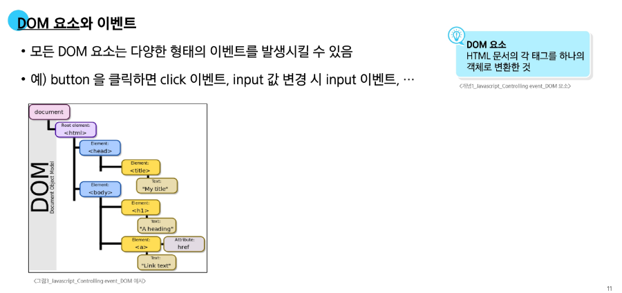
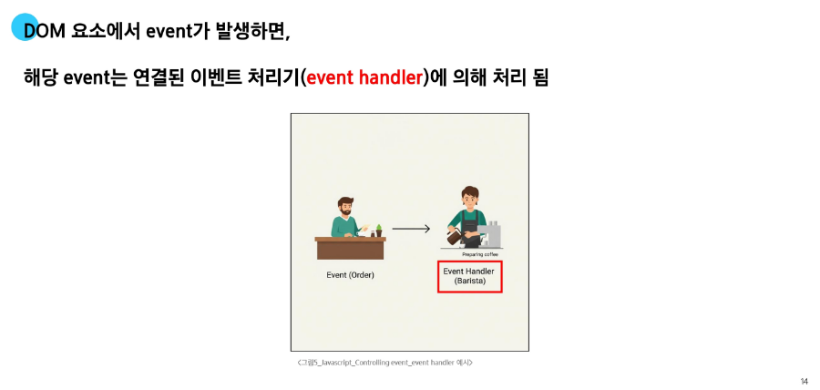
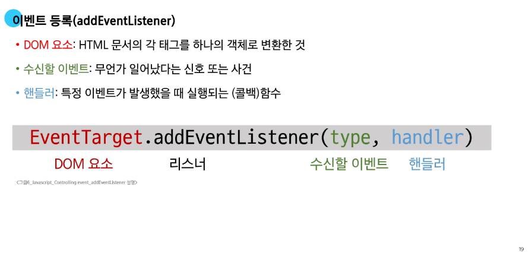
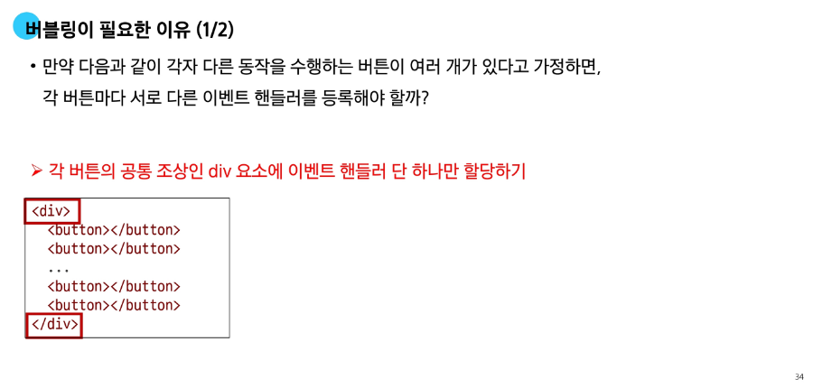
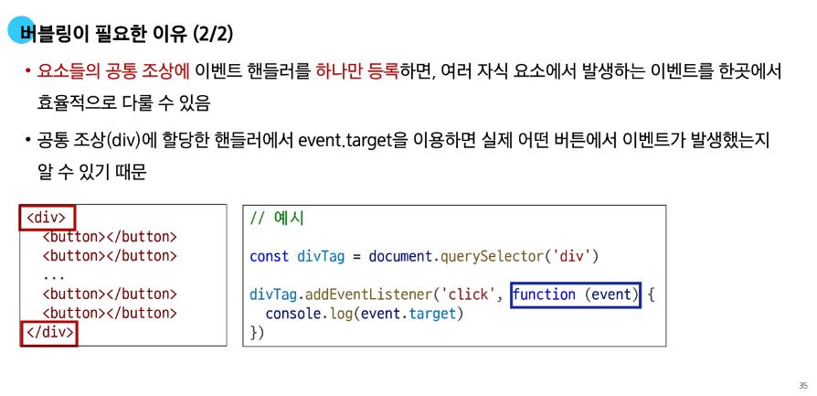
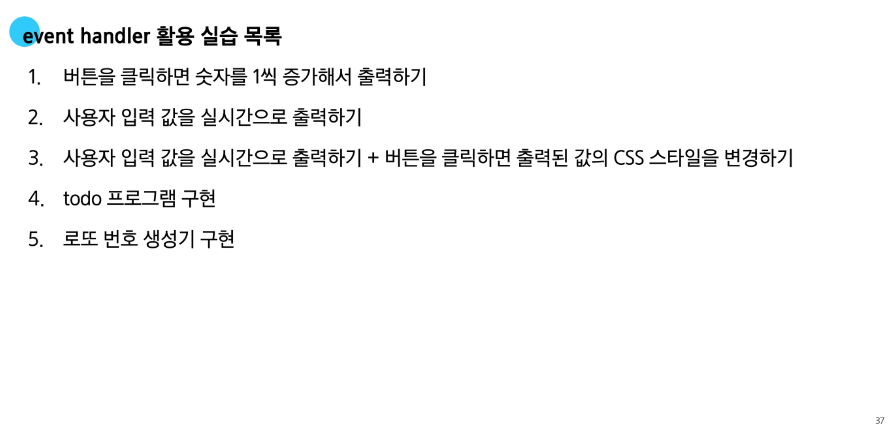
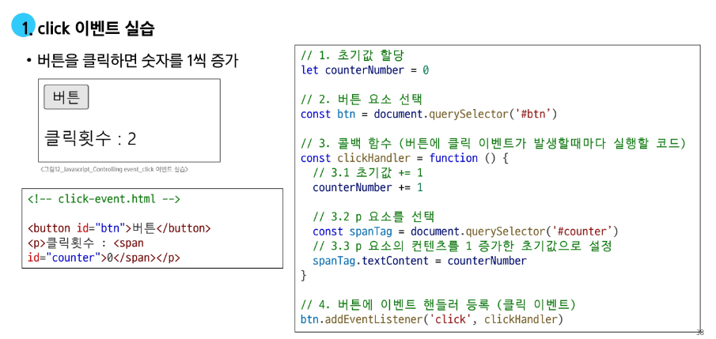
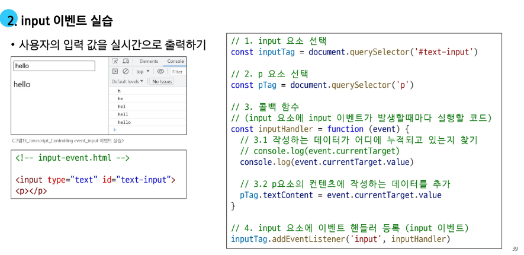
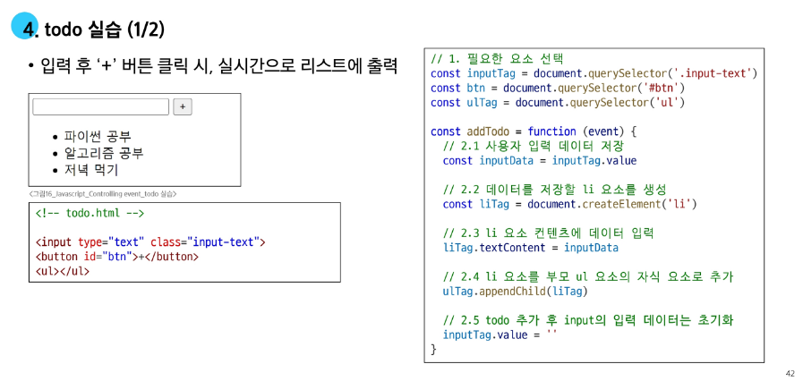
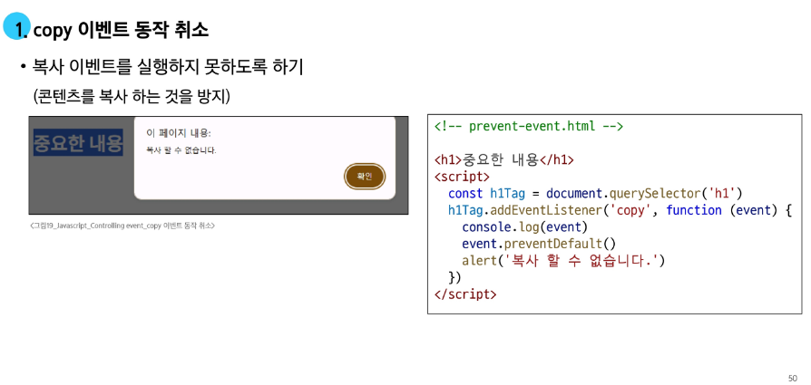

# 📅 Day 73 JavaScript Controlling event

---

## ⚡ 이벤트

- **일상 속의 이벤트**
    - 컴퓨터 키보드를 눌러 텍스트를 입력하는 것
    - 전화벨이 울려 전화가 왔을을 알리는 것
    - 손을 흔들어 인사하는 것

- **웹에서의 이벤트**
    - 화면을 스크롤 하는 것
    - 버튼을 클릭했을 때 팝업 창이 출력되는 것
    - 마우스 커서의 위치에 따라 드래그 앤 드롭 하는 것

---

### 🎬 event

- **event** : 웹 페이지 상에서 무언가 일어났다는 신호
    - 영화 포스터에 마우스를 올리면 이벤트, 마우스의 움직임을 감지하는 리스너, 미리보기 영상이나 설명을 보여주는 핸들러



---

### 📂 event object

- **event object** : DOM에서 이벤트가 발생하면, 브라우저는 해당 이벤트에 관한 정보를 담은 **event object**를 자동으로 생성
- **이벤트 종류** :
    - mouse
    - input
    - keyboard
    - 이외 등등



- *이벤트 처리기는 일종의 함수*
    1. 요소를 찾는다.
    2. 이벤트 핸들러를 작성한다.
    3. 요소와 핸들러를 연결한다.

---

## 🖥️ event handler

- **event handler** : 특정 이벤트가 발생했을 때 실행되는 함수

- **요소.addEventListener()** : 특정 이벤트를 듣도록 추가하는 것
    - 특정 DOM 요소에 지정한 이벤트가 발생했을 때 실행할 이벤트 핸들러를 등록하는 메서드
- **이벤트 핸들러를 DOM 요소에 연결하는 역할을 담당**


- ```const button = document.querySelector('button')``` :  ‘버튼’ 이라는 요소 가져오기
- 이벤트 핸들러 작성하기
    - ```window.alert()``` : 알림을 띄우는 것



- DOM 요소 : querySelector로 가져온 요소
- 수신할 이벤트 : 사용자 인풋 값
- 핸들러 : 사용자 인풋 값에 따라 실행될 함수
- **2번 이벤트 핸들러의 첫번째 인자는 무조건 event를 넣어야한다.**

- **이벤트 핸들러의 `this`**
    - 이벤트 핸들러에서는 ```this```를 사용하지 않는다.
    - 이벤트 핸들러는 일반 함수로 작성되지만 ```addEventListener```에 의해 객체와 연결되기 때문에 ```this```를 사용하지 않는다.

---

## 🔼 버블링

- **버블링** : 한 요소에 이벤트가 발생하면 해당 요소의 핸들러(함수)가 동작한 후 부모 요소의 핸들러가 동작하는 현상
    - 가장 최상단의 조상 요소를 만날 때까지 요소 각각에 할당된 핸들러가 동작한다.
    - ```form > div > p``` 형태의 중첩된 구조에 각각 이벤트 핸들러가 연결되어 있을 때, ```p 요소```만 클릭했는데도 불구하고 모든 핸들러가 동작한다.


- `event.currentTarget` : 발생한 이벤트 정보를 가지고 있다.
    - 현재 내가 반응한 요소
- [event.target](http://event.target) : 원본, 근본
    - 실제 이벤트가 시작된 요소

---

### 🎯 캡처링

- **캡처링** : 최상위 조상에서 하위 요소까지 전파되는 단계 (버블링과 반대)
- 캡처링은 실무에서 거의 사용하지 않는다.
- `formElement.addEventListener('click', clickHandler1, true)` 처럼 **3번째 요소에 true**를 넣으면 캡처링이 된다.

---

### 💡 버블링의 필요성

  


- 요소들의 공통 조상에 이벤트 핸들러를 하나만 등록하면 여러 자식 요소에서 발생하는 이벤트를 한곳에서 효율적으로 다룰 수 있다.

---

## 🎮 event handler 활용

  
  
  
  
  
  
  
  


---

### 🚫 이벤트 기본 동작 취소하기

- HTML의 각 요소가 기본적으로 가지고 있는 이벤트가 때로는 방해가 되는 경우가 있어 이벤트의 기본 동작을 취소할 필요가 있음
- 예시 :
    - form 요소의 제출 이벤트를 취소하여 페이지 새로고침을 막을 수 있음
    - <a> 태그를 클릭했을 때 페이지 이동을 막고, 대신 다른 로직을 수행할 수 있음

- `요소.preventDefault()` : 해당 이벤트에 대한 기본 동작을 실행하지 않도록 지정

  


---

## 📚 참고
### addEventListener와 화살표 함수 관계


