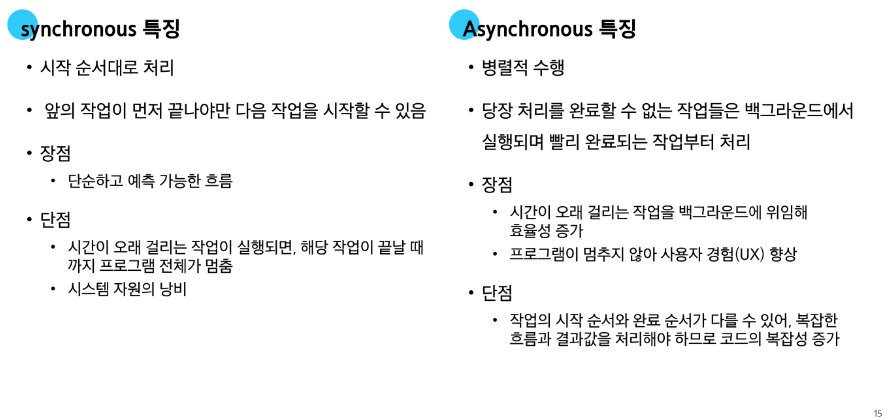
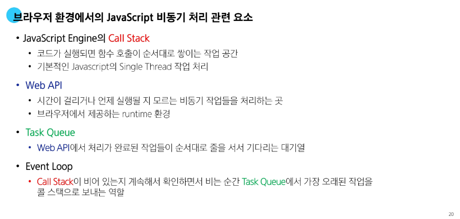
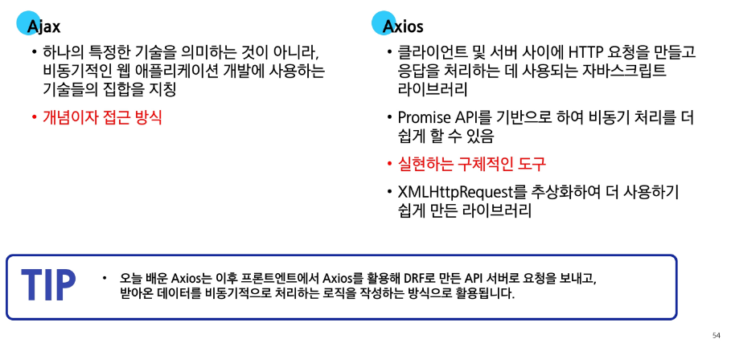
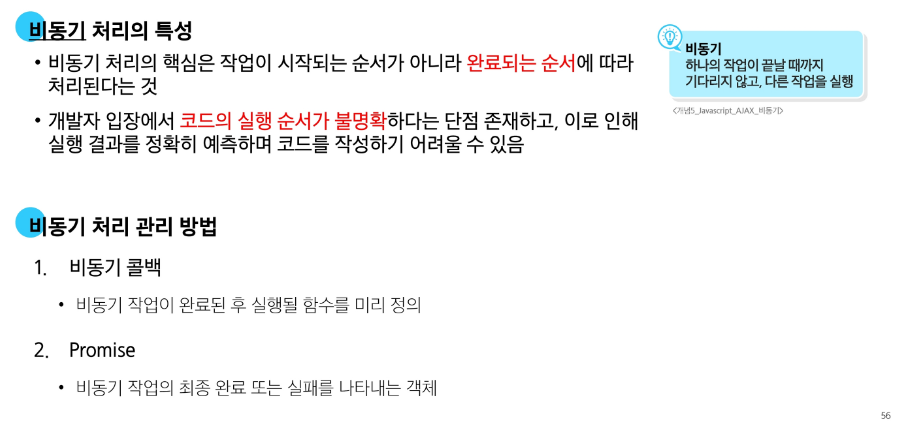
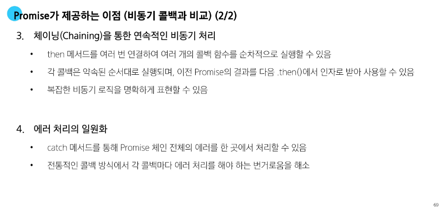

# 📚 Day_74 JavaScript Ajax

## 📱 비동기

- **Synchronous (동기)** : 하나의 작업이 완료된 후에 다음 작업이 실행되는 방식 (순차적으로 진행)
    - 카페에서 커피 주문할 때, 손님 1의 **주문이 완료되어야만 다음 손님의 주문을 진행**할 수 있다.

    ```javascript
     // 동기 코드 예시
     console.log('작업 1 시작')

     const syncTask = function () {
        for (let i = 0; i < 1000000; i++) {
            // 반복 실행 동안 잠시 대기
        }
        return '작업 완료'
     }

     const result = syncTask()
     console.log(result)

     console.log('작업 2 시작')

     /* 출력 결과 */
     // 작업 1 시작
     // (반복 실행 동안 잠시 대기)
     // 작업 완료
     // 작업 2 시작
    ```
    - **동기 코드** : 반복이 완료 될 때 까지 다음 작업이 시작되지 않는다.

- **Asynchronous (비동기)** : 한 작업의 완료를 기다리지 않고 다른 작업을 동시에 수행할 수 있는 방식
    - 카페에서 커피 주문할 때, 손님 1의 커피가 **만들어지는 동안 다음 손님의 주문을 처리**할 수 있다
    - 메일 **전송 작업이 진행되는 중에도 사용자는 다른 작업을 진행** 할 수 있다
    - 브라우저가 웁 페이지를 처리할때 병렬적으로 처리한다

    ```javascript
    console.log('작업 1 시작')

    const asyncTask = function (callBack) {
        // 3초를 기다렸다가 콜백 함수를 호출하는 함수
        setTimeout(() => {
            callBack('작업 완료')
        }, 3000)
    }

    asyncTask((result) => {
        console.log(result)
    })

    console.log('작업 2 시작')

    /* 출력 결과 */
    // 작업 1 시작
    // 작업 2 시작
    // 작업 완료
    ```
    - ```setTimeout()``` 비동기 함수라 코드를 즉시 실행하지 않고, 3초 뒤에 실행하도록 예약만 한 뒤 바로 다음 코드로 넘어간다
    - ```작업 2 시작```이 먼저 출력되고, 3초가 지난 후에 예약되었던 ```콜백함수```가 실행




## 🌐 JavaScript와 비동기

- **Single Thread**
    - JS는 한 번에 **하나의 일만 수행할 수 있는 Single Thread** 언어로 동시에 여러 작업을 처리할 수 없다
    - JavaScript는 하나의 작업을 요청한 순서대로 처리할 수 밖에 없다


### 💻 JavaScript Runtime

- **JavaScript Runtime**
    - JavaScript는 Single Thread이므로 비동기 처리를 할 수 있도록 도와주는 환경이 필요하다
    - JavaScript가 동작할 수 있는 환경(Runtime)
        - 브라우저
        - Node.js

    
    - CallStack : 코드가 실행되면 쌓이는 작업 공간
    - Web API : 비동기 작업을 처리하는 곳
    - Task Queue : 기다리는 대기열 (선입선출)
    - Event Loop : 가장 오래된 작업을 콜 스택으로 보내는 역할

    ```javascript
    console.log('Hi')

    setTimeout(function myFunc() {
        console.log('Work')
    }, 3000)

    console.log('Bye')
    ```
    - 실제로 비동기 작업이 ```3000```이라고 해도 3초 이상 걸릴 수도 있다
        - 최소 3초라는 이야기는 어떤 작업이 있느냐에 따라 작업속도가 달라질 수 있다


## 🛠️ Ajax

- **Ajax**
    - 비동기적인 웹 애플리케이션 개발을 위한 기술
    - 새로고침하지 않고, 백그라운드에서 서버와 데이터를 주고 받는 비동기 통신 기술
    - ```Ajax```의 ```X```는 원래 ```XML```을 의미했지만, 현재는 더 가볍고 JavaScript에서 다루기 쉬운 JSON 형식을 주로 사용


- **XHR 객체**
    - 웹 브라우저와 서버 간의 비동기 통신을 가능하게 하는 javaScript 객체
    - 최근 HTTP 요청은 XHR 이벤트 핸들러보다, ```Promise```와 ```async/await```를 주로 사용한다

### ✨ Axios

- **Axios**
    - 브라우저와 Node.js 환경에서 모두 사용할 수 있는, ```Promise``` 기반의 HTTP 클라이언트 라이브러리
    - 브라우저를 위한 ```XHR``` 객체 생성
    - 간편한 API를 제공하며, ```Promise``` 기반의 비동기 요청을 처리

- **Axios 설치 및 사용**
    1. CDN 방식으로 사용하기
    ```javascript
    <script
    src="https://cdn.jsdelivr.net/npm/axios/dist/axios.min.js">
    </script>
    ```

    2. ```axios``` 객체를 활용해 요청을 보낸 후 응답 데이터 ```promise 객체```를 받는다.
    ```javascript
    axios({
        method: 'get',
        url: 'https://api.thecatapi.com/v1/images/search'
    })
        .then((response) => {
            console.log(response)
            console.log(response.data)
        })
        .catch((error) => {
            console.log(error)
        })
    ```
    - ```then()``` : 작업이 성공적으로 완료되었을 때 실행될 콜백 함수를 지정
    - ```catch()``` : 작업이 실패했을 때 실행될 콜백 함수를 지정


### 🚀 Axios 활용

- **고양이 사진 가져오기 실습 기본**
    - The Cat API (https://api.thecatapi.com/v1/images/search)
    - response 예시
    ```javascript
    // https://api.thecatapi.com/v1/images/search
    [
        {
            "id": "d6n",
            "url": "https://cdn2.thecatapi.com/images/d6n.jpg",
            "width": 333,
            "height": 500,
        }
    ]
    ```
    ```javascript
    /* cat-api.html */
    <script src="https://cdn.jsdelivr.net/npm/axios/dist/axios.min.js"></script>
    <script>
        const URL = 'https://api.thecatapi.com/v1/images/search'
        axios({
            method: 'get',
            url: URL,
        })
            .then((response) => {
                console.log(response)
                console.log(response.data)
            })
            .catch((error) => {
                console.log(error)
                console.log('실패했다옹')
            })
        console.log('야옹야옹')
    </script>
    ```

- **고양이 사진 가져오기 실습 심화**
    1. 버튼을 누르면
    2. 고양이 이미지를 요청하고
    3. 요청이 처리되어 응답이 오면
    4. 응답 데이터에 있는 이미지 주소 값을 img 태그에 넣어 이미지 출력하기

    - 버튼을 작성하고 ```axios``` 로직을 콜백 함수로 작성 및 이벤트 핸들러 부착
    ```javascript
    /* cat-api.html */
    <button>냥냥 펀치</button>
    ```
    ```javascript
    const URL = 'https://api.thecatapi.com/v1/images/search'
    const btn = document.querySelector('button')
    const getCats = function () {
        axios({
            method: 'get',
            url: URL,
        })
            .then((response) => {
                console.log(response)
                console.log(response.data)
            })
            .catch((error) => {
                console.log(error)
                console.log('실패했다옹')
            })
        console.log('야옹야옹')
    }
    btn.addEventListener('click', getCats)
    ```

    - 응답 데이터에서 필요한 이미지 주소 값 찾기
    ```javascript
    const URL = 'https://api.thecatapi.com/v1/images/search'
    const btn = document.querySelector('button')
    const getCats = function () {
        axios({
            method: 'get',
            url: URL,
        })
            .then((response) => {
                // console.log(response)
                // console.log(response.data)
                console.log(response.data[0].url)
            })
            .catch((error) => {
                console.log(error)
                console.log('실패했다옹')
            })
        console.log('야옹야옹')
    }
    btn.addEventListener('click', getCats)
    ```

    - 찾은 이미지 주소를 활용해 ```HTML img``` 태그 구성하기
    ```javascript
    const getCats = function () {
        axios({
            method: 'get',
            url: URL,
        })
            .then((response) => {
                const imgUrl = response.data[0].url
                const imgElem = document.createElement('img')
                imgElem.setAttribute('src', imgUrl)
                document.body.appendChild(imgElem)
            })
            .catch((error) => {
                console.log(error)
                console.log('실패했다옹')
            })
        console.log('야옹야옹')
    }
    btn.addEventListener('click', getCats)
    ```

### 📝 Ajax와 Axios




## Callback과 Promise



### 🔧 비동기 콜백

- **비동기 콜백**
    - 비동기적으로 처리되는 작업이 완료되었을 때 실행되는 함수
    - 연쇄적으로 발생하는 **비동기 작업을 순차적으로 동작**할 수 있게 함
    ```javascript
    const asynTask = function (callback) {
        setTimeout(function () {
            console.log('비동기 작업 완료')
            callback()  // 작업 완료 후 콜백 호출

        }, 200)         // 1초 후에 작업 완료
    }

    // 비동기 작업 수행 후 콜백 실행
    asyncTask(function () {
        console.log('작업 완료 후 콜백 실행')
    })
    ```

- **비동기 콜백의 한계**
    - 비동기 콜백 함수는 보통 어떤 기능의 실행 결과를 받아서 다른 기능을 수해하기 위해 많이 사용된다
    - 이 과정을 작성하다 보면 비슷한 패턴이 계속 발생
        - A를 처리해서 결과가 나오면, 첫 번째 callback 함수를 실행하고
        - 첫 번째 callback 함수가 종료되면, 두 번째 callback 함수를 실행하고
        - 두 번째 callback 함수가 종료되면, 세 번째 callback 함수를 실행하고...

- **콜백 지옥 (Callback Hell)**


- **콜백 함수 정리**
    - 콜백 함수는 비동기 작업을 순차적으로 실행할 수 있게 하는 반드시 필요한 로직
    - 비동기 코드를 작성하다 보면 콜백 함수로 인한 콜백 지옥은 빈번히 나타나는 문제이며, 이는 코드의 가독성을 해치고 **유지 보수가 어려워진다**
    - **이 문제를 해결하기 위해 ```promise``` 객체를 활용한다**

### 🌐 Promise

- **promise**
    - javacript에서 비동기 작업의 결과를 나타내는 객체
    - 비동기 작업이 완료되었을 때 결과 값을 반환하거나, 실패 시 에러를 처리할 수 있는 기능을 제공
    - 콜백 지옥 문제를 해결하기 위해 등장한 비동기 처리를 위한 객체
    - ```Promise``` 기반의 HTTP 클라이언트 라이브러리가 바로 ```Axios```

- **비동기 콜백**
    - 함수를 중첩시켜 코드가 깊어진다
    ```javascript
    // 비동기 콜백 방식

    work1(function () {
        
        // 첫 번째 작업 ...
        work2(result1, function (result2) {

            // 두 번째 작업 ...
            work3(result2, function (result3) {
                console.log('최종 결과 :' + result3)
            })
        })
    })
    ```

- **Promise**
    - ```then``` 메서드를 통해 여러 비동기 작업을 연결하는 **체이닝(Chaining)** 하여 순차적으로 연결
    ```javascript
    // promise 방식
    work1()
        .then((result1) => {
            // work2
            return result2
        })
        .then()((result2) => {
            // work3
            return result3
        })
        .catch((error) => {
            // error handling
        })
    ```


- **then 메서드 chaining의 장점**
    1. 가독성
        - 비동기 작업의 순서와 의존 관계를 명확히 표현할 수 있어 코드의 가독성이 향상
    2. 에러 처리
        - 각각의 비동기 작업 단계에 발생하는 에러를 분할에서 처리 가능
    3. 유연성
        - 각 단계마다 필요한 데이터를 가공하거나 다른 작업을 수행할 수 있어서 더 복잡한 비동기 흐름을 구성할 수 있다
    4. 코드 관리
        - 비동기 작업을 분리하여 구성하면 코드를 관리하기 용이





## 📚 참고

- ```async``` **함수**
    - ```async``` 키워드는 함수 앞에 붙여서 비동기 함수를 만들 수 있다
    - ```async``` 함수 내에서 ```await``` 키워드 사용 가능
    ```javascript
    async function example() {
        return "Hello, world!";
    }

    example()
        .then(console.log); // "Hello, world!"
    ```

- ```await``` **키워드**
    - ```await``` 키워드는 ```Promise```가 종료될 때 까지 기다린 후 결과를 반환
    - ```await```는 ```async``` **함수 내에서만 사용 가능**
    ```javascript
    async function example() {
        let result = await fetch('https://api.example.com/data'); // 비동기 작업
        let data = await result.json(); // 응답을 JSON으로 파싱
        console.log(data);
    }

    example();

    ```