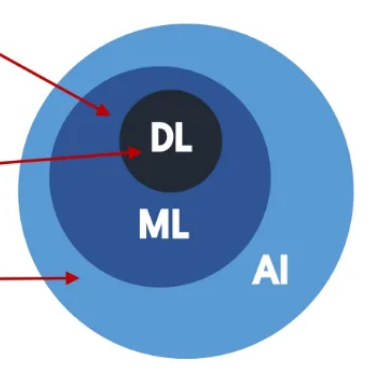
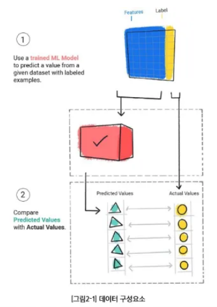
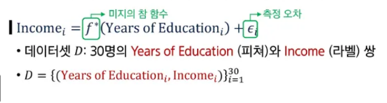
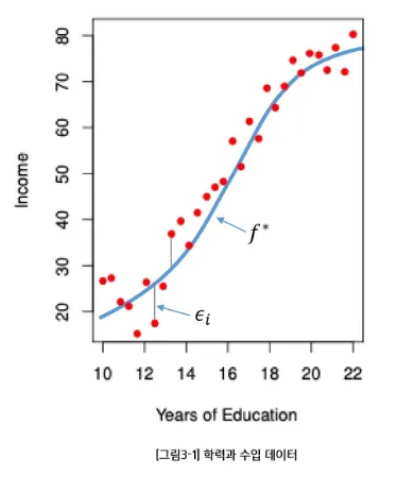
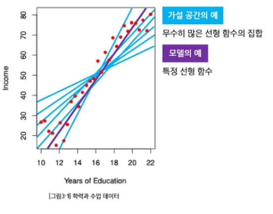
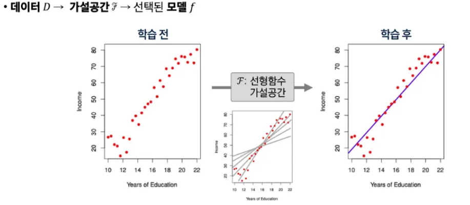
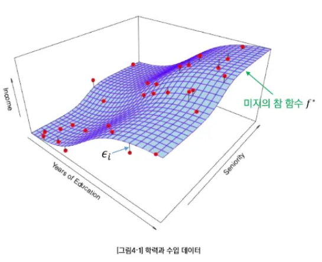
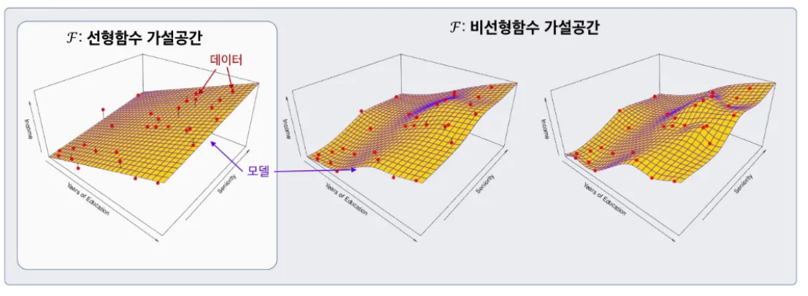

# 🧠 AI 3일차 학습 정리

## 📘 1. AI, ML, DL의 정의
### AI (Artificial Intelligence, 인공지능)
- **AI**는 인간의 지능을 기계에 구현하려는 기술입니다.
- 목표는 사람처럼 생각하고, 학습하고, 결정을 내리는 시스템을 만드는 것.

### ML (Machine Learning, 머신러닝)
- **ML**은 데이터로부터 학습하여 패턴을 찾고, 예측이나 결정을 내리는 기술입니다.
- 인간의 개입 없이 데이터를 분석하고 결과를 예측할 수 있습니다.

### DL (Deep Learning, 딥러닝)
- **DL**은 ML의 하위 분야로, 인공 신경망(ANN)을 사용하여 데이터를 분석합니다.
- 복잡한 데이터에서 더 정교한 특성을 학습할 수 있습니다.

---

## 📊 2. 데이터와 학습의 이해

### 2.1 데이터 구성 요소 (Feature/Label)
- **Feature**: 입력 데이터의 특성이나 속성으로, 모델이 예측하려는 값을 예측하는 데 사용됩니다.
- **Label**: 예측하려는 결과값으로, **정답**에 해당합니다. 지도 학습에서는 이 값이 주어집니다.

### 2.2 ML 실생활 예시
- **주택 가격 예측**: Feature - 집 크기, 방 개수, 위치 등 / Label - 집 가격
- **스팸 이메일 분류**: Feature - 이메일 내용, 발신자 / Label - 스팸 여부 (스팸/정상)

---

## 📈 3. 단일 피쳐 기반 학습

### 3.1 1D 피쳐 기반 학습
- **1D 피쳐**는 하나의 특성만 사용하는 학습 방법입니다.
- 예시: 집 크기만 사용하여 가격을 예측하는 모델

### 3.2 모델과 가설공간
- **모델**은 학습 알고리즘에 따라 데이터를 예측하는 함수입니다.
- **가설공간**은 가능한 모든 모델들이 포함된 공간으로, 이 공간에서 최적의 모델을 찾습니다.

### 3.3 학습이란?
- **학습**은 모델이 주어진 데이터를 바탕으로 패턴을 찾아내고, 이를 기반으로 예측하는 과정을 의미합니다.

---

## 📊 4. 복수 피쳐 기반 학습

### 4.1 2D 피쳐 기반 학습
- **2D 피쳐**는 여러 개의 특성을 동시에 고려하여 학습하는 방법입니다.
- 예시: 집 가격을 예측할 때, 집 크기와 방 개수 두 가지 특성을 동시에 고려

### 4.2 일반적 용어 정리 및 모델 가정
- **모델 가정**은 데이터에 대한 특정 가정이나 제약을 의미합니다.
  예시: 선형 회귀 모델에서는 데이터가 직선적인 관계를 따른다고 가정

### 4.3 왜 \( f(x) \)를 학습하는가?
- \( f(x) \)는 입력값 \( x \)에 대한 예측값을 생성하는 함수입니다.
- 모델은 \( f(x) \)를 학습하여 새로운 데이터에 대한 예측을 할 수 있게 됩니다.

---

## 📚 정리
| 구분 | 주요 개념 | 핵심 포인트 |
|------|------------|-------------|
| AI | 인공지능 | 사람의 지능을 기계에 구현 |
| ML | 머신러닝 | 데이터로부터 학습하여 예측 |
| DL | 딥러닝 | 인공 신경망을 활용한 고도화된 학습 |

---

> 💡 **Tip:**  
> **딥러닝**은 복잡한 데이터에서 **정교한 특성**을 학습할 수 있어, 특히 이미지나 음성 데이터를 다룰 때 유리합니다.
