# 🧠 AI 4일차 학습 정리

## 📘 1. 선형회귀 : 입력과 출력의 선형관계를 찾는 방법
- **선형회귀**는 입력 변수와 출력 변수 간의 선형 관계를 찾아 예측하는 방법입니다.
- 주로 **단순선형회귀**와 **다중선형회귀**로 구분됩니다.

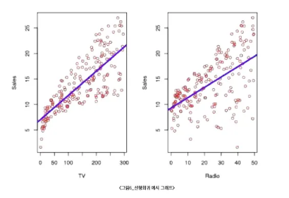

---

## 📈 2. 단순선형회귀 : 하나의 입력 변수로 출력 예측하기

### 🔹 최소제곱법 (Least Squares Method)
- **최소제곱법**은 회귀선이 데이터와 얼마나 잘 맞는지 평가하는 방법입니다.
- 목표는 예측값과 실제 값 간의 차이 **제곱합**을 최소화하는 것입니다.

=\sum_{i=1}^{n}(y_i-\hat{y}_i)^2)

---

## 📊 3. 다중선형회귀 : 여러 입력 변수를 활용한 예측

### 🔹 다중선형회귀의 추정과 예측
- **다중선형회귀**는 여러 입력 변수를 이용해 예측을 수행합니다. 
- 여러 변수들 간의 관계를 파악하여 보다 정교한 예측을 합니다.

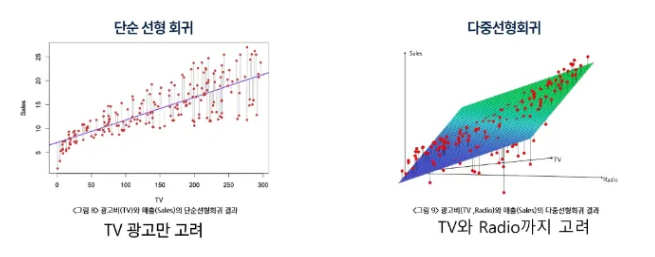
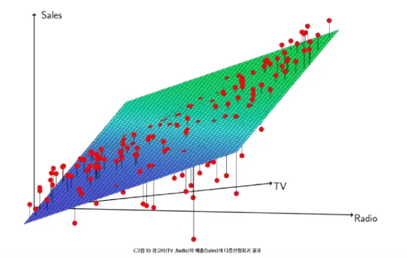

---

## ⚠️ 4. 선형회귀 주의사항 : 변수 상관(다중공선성), 상관과 인과 구분
- **다중공선성**: 두 개 이상의 독립 변수 간에 강한 상관 관계가 있을 때 발생. 이는 모델의 예측 능력을 저하시킬 수 있습니다.
- **상관과 인과 구분**: 상관관계는 두 변수 간의 관계를 나타내지만, 인과관계는 한 변수가 다른 변수에 영향을 미친다는 의미입니다.

---

## 🏷️ 5. 분류(Classification)

### 🔹 분류란?
- **분류**는 주어진 데이터가 어떤 클래스에 속하는지 예측하는 작업입니다. 예시로, 스팸 이메일 분류나 신용카드 연체 여부 예측 등이 있습니다.

### 🔹 예시: 신용카드 연체
- **Feature**: 연체 금액, 사용한 신용 카드 한도 등  
- **Label**: 연체 여부(0 - 정상, 1 - 연체)

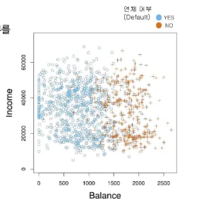

### 🔹 분류 모델에서 선형회귀의 한계
- **선형회귀**는 연속적인 값을 예측하는 데 적합하지만, **이진 분류**(0 또는 1로 구분되는 값)를 예측하는 데는 한계가 있습니다.

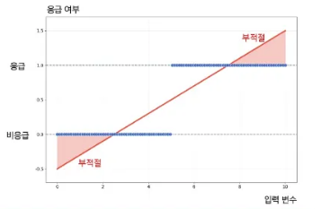
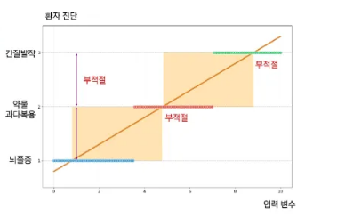

---

## 🔄 6. 로지스틱 회귀(Logistic Regression)

### 🔹 로지스틱 회귀의 모형식
- 로지스틱 회귀는 이진 분류 문제를 해결하는데 사용되는 회귀 모델입니다.  
- 예시: 신용카드 연체 여부 예측

=\frac{1}{1+e^{-z}})

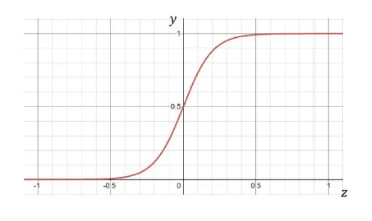

### 🔹 MLE 활용 모수 추정
- **최대 우도 추정(MLE)**을 사용하여 모수(파라미터)를 추정합니다.

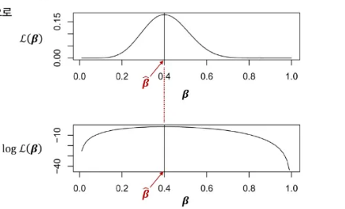

### 🔹 로지스틱 회귀 결과 : 신용카드 연체 데이터
- **Feature**: 카드 한도, 사용액, 나이 등  
- **Label**: 연체 여부(0 또는 1)

---

## 🧠 7. 신경망 모델

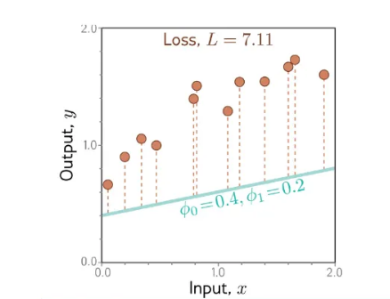
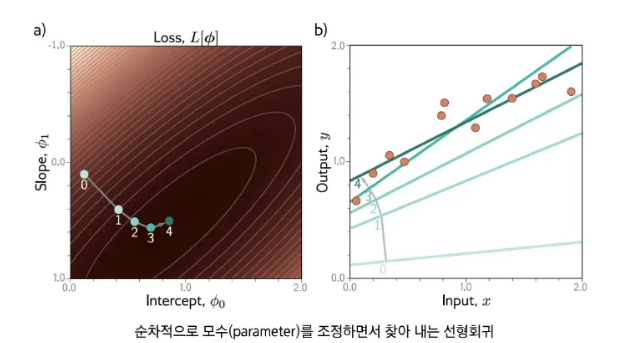

### 7-1 Shallow 네트워크
- **구조 및 활성화 함수**: 입력과 출력을 연결하는 층과 그 사이의 활성화 함수
- **조각별 선형 표현**: 신경망에서 각 층의 출력은 조각별 선형 함수로 근사됩니다.

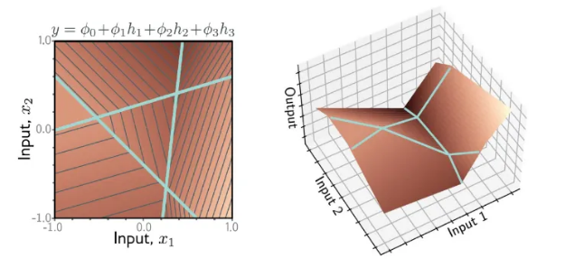

### 7-2 Deep Network
- **네트워크 합성과 층별 출력**: 깊은 신경망은 여러 층을 사용하여 복잡한 패턴을 학습합니다.

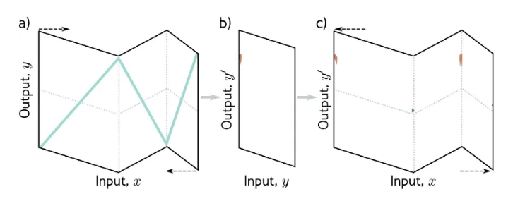

- **Shallow vs Deep 비교**: 깊은 네트워크는 복잡한 문제를 더 잘 해결할 수 있지만, 학습이 어려울 수 있습니다.

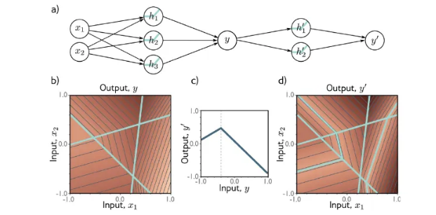

### 🔹 행렬 . 벡터 수식화와 도식
- 신경망에서의 입력과 출력은 행렬 연산으로 수식화되며, 이 과정을 시각화하여 직관적으로 이해할 수 있습니다.

---

## 🧮 8. 신경망 적합

### 8-1 선형회귀 예시
- **손실 함수**: 모델의 예측 값과 실제 값 사이의 차이를 측정하는 함수
- **경사 하강법**: 모델의 파라미터를 최적화하기 위한 방법으로, 손실 함수의 기울기를 계산하여 파라미터를 
업데이트합니다.

### 8-2 수학 리뷰
- **미분을 이용한 최적화**: 경사 하강법에서 손실 함수의 기울기를 계산하여 모델 파라미터를 업데이트합니다.

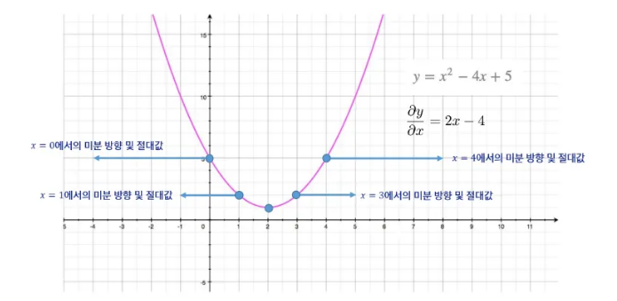

### 8-3 확률적 경사 하강법
- **경사하강법의 단점**: 학습 속도가 느릴 수 있음
- **업데이트 방식의 차이점**: 확률적 경사 하강법은 데이터셋의 일부를 샘플링하여 빠르게 업데이트합니다.
- **확률적 경사 하강법의 특성**: 전체 데이터보다 일부 데이터로 업데이트가 이루어지므로, 학습 속도와 효율성이 향상됩니다.

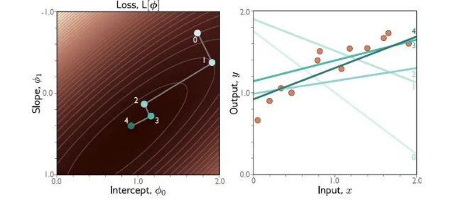

### 8-4 역전파 (Backpropagation)
- **네트워크 파라미터의 미분**: 네트워크의 파라미터를 미분하여 최적화 방향을 결정
- **연쇄법칙**: 미분값을 층별로 전달하여 업데이트합니다.
- **역전파**: 각 파라미터의 기울기를 계산하여 네트워크를 학습시킵니다.

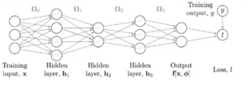
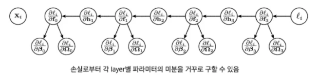

---

## 📚 정리
| 구분 | 주요 개념 | 핵심 포인트 |
|------|------------|-------------|
| 선형 회귀 | 최소제곱법, 예측 | 단순 선형 및 다중 선형 회귀 |
| 분류 | 분류란?, 예시 | 이진 분류 및 선형 회귀의 한계 |
| 로지스틱 회귀 | MLE, 모수 추정 | 이진 분류를 위한 회귀 모델 |
| 신경망 | Shallow vs Deep 네트워크 | 복잡한 문제 해결을 위한 모델 |
| 경사 하강법 | 확률적 경사 하강법 | 최적화 방법 및 역전파 |

---

> 💡 **Tip:**  
> 신경망에서 **Deep Learning**은 **Shallow**보다 더 복잡한 문제를 해결할 수 있지만, 학습 과정에서 더 많은 시간이 소요됩니다.
