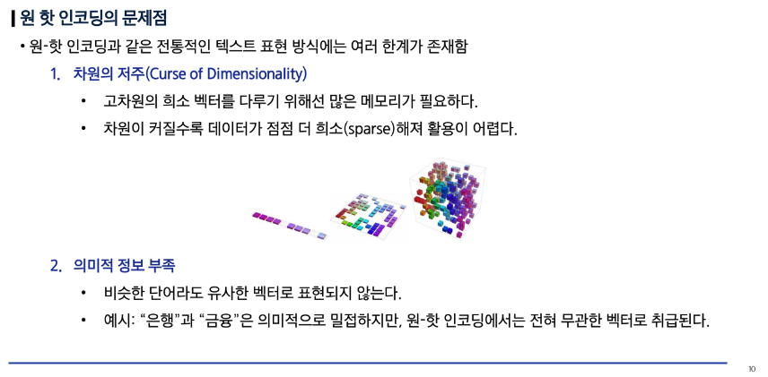
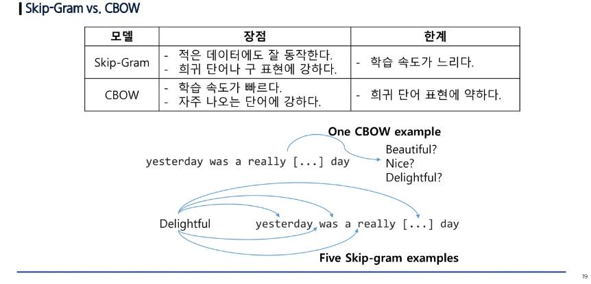
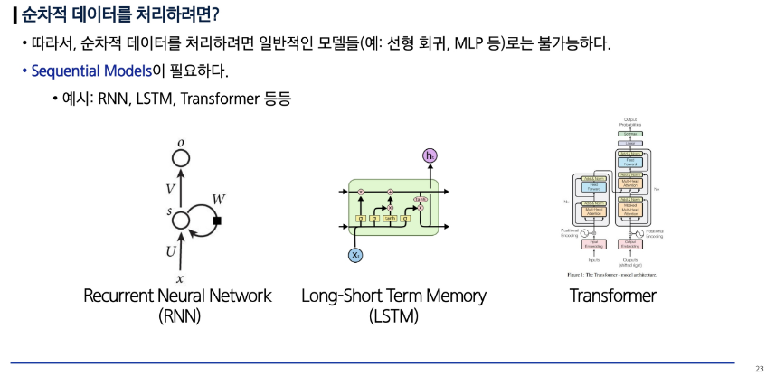
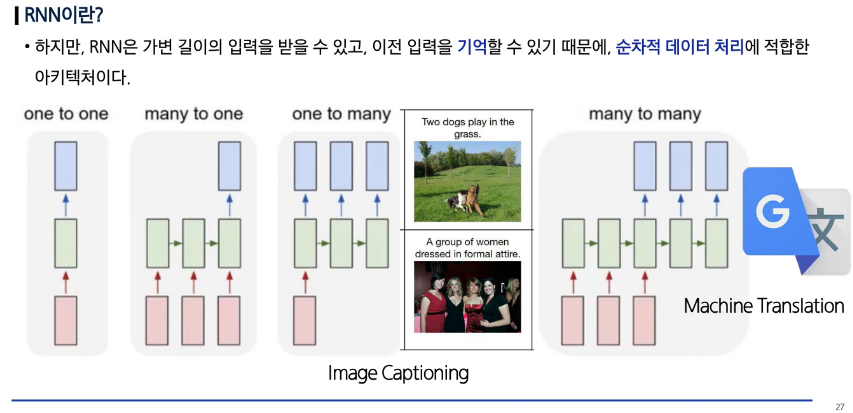
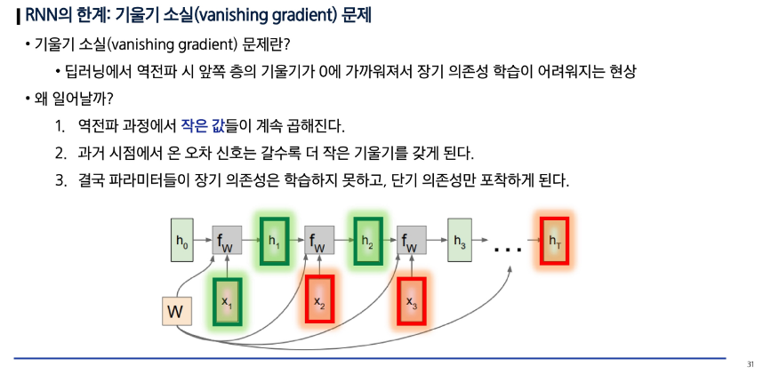
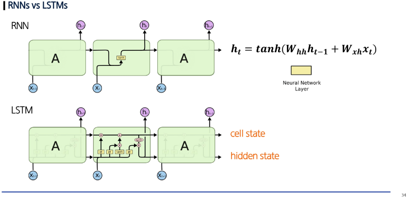

# 🧠 AI 5일차: 워드 임베딩과 순환신경망 기반 모델

---

## 📘 1. 워드 임베딩 (Word Embedding): 단어를 숫자로 표현하기

자연어 처리는 텍스트 데이터를 컴퓨터가 이해할 수 있도록 **숫자 벡터로 변환**하는 과정이 필요합니다.  
이를 **워드 임베딩(Word Embedding)** 이라 합니다.

---

### 🔹 원-핫 인코딩(One-Hot Encoding)이란?
- 각 단어를 고유 인덱스로 변환한 뒤, 해당 위치만 `1`로 표시하고 나머지는 `0`으로 표현하는 방식입니다.

| 단어 | 인덱스 | 원-핫 벡터 |
|------|---------|-------------|
| 고양이 | 0 | [1, 0, 0, 0] |
| 강아지 | 1 | [0, 1, 0, 0] |
| 새 | 2 | [0, 0, 1, 0] |
| 물고기 | 3 | [0, 0, 0, 1] |

#### ⚠️ 문제점
- 벡터의 차원이 단어 수만큼 커짐 (고차원 문제)
- 단어 간 **의미적 유사성**을 표현할 수 없음  
  → 예: ‘왕’과 ‘여왕’, ‘남자’와 ‘여자’는 서로 연관 있지만, 원-핫 인코딩에서는 완전히 다른 벡터

  

---

### 🔹 워드 임베딩(Word Embedding)이란?
- 단어를 **의미 공간(Semantic Space)** 에 매핑하여 **유사한 의미의 단어가 가까운 벡터로 표현되도록 학습**하는 방법  
- 저차원(보통 100~300차원)의 **실수 벡터**로 단어를 표현합니다.

#### 예시:
| 단어 | 임베딩 벡터 예시 |
|------|-------------------|
| 왕(King) | [0.8, 0.5, 0.3, ...] |
| 여왕(Queen) | [0.7, 0.5, 0.4, ...] |
| 남자(Man) | [0.9, 0.2, 0.1, ...] |
| 여자(Woman) | [0.8, 0.3, 0.2, ...] |

#### ✅ 대표 알고리즘
- **Word2Vec**
  - CBOW(Continuous Bag of Words): 주변 단어로 중심 단어를 예측  
  - Skip-Gram(SG): 중심 단어로 주변 단어를 예측  
  - 학습 과정에서 단어의 **의미적 관계**를 내재적으로 학습함

---

## 📗 2. 순차적 데이터의 특징: 언어는 순서가 중요하다

언어 데이터는 **순서(Sequence)** 가 의미를 결정짓는 중요한 특징을 가집니다.

예를 들어,  
- “나는 밥을 먹었다.”  
- “밥을 나는 먹었다.”  
→ 단어 구성은 같지만, **순서**가 바뀌면 어색하거나 의미가 변함

### 🔹 순차적 데이터의 특징
- 시간적 또는 문맥적 **연속성(temporal dependency)** 존재  
- 이전 단어(또는 상태)가 다음 단어의 의미에 영향을 줌  
- 예: 음성, 텍스트, 시계열 데이터, 음악 등

---

## ⚙️ 3. RNN (Recurrent Neural Network): 문맥을 기억하는 신경망

### 🔹 RNN이란?
- **순차적 데이터**를 처리하기 위한 신경망 구조  
- 입력 데이터의 **이전 정보(문맥)** 를 기억하여 다음 단계의 예측에 반영함

- \( h_t \): 현재 은닉 상태(hidden state)  
- \( x_t \): 현재 입력  
- \( h_{t-1} \): 이전 은닉 상태  
- \( W, U, b \): 학습 파라미터  

---

### 🔹 RNN의 특징
- 문맥(Context) 정보를 활용하여 연속된 데이터 처리  
- 음성 인식, 텍스트 생성, 감정 분석 등에 활용  

---

### 🔹 RNN의 한계: 기울기 소실(Vanishing Gradient)
- 긴 문장을 학습할 때, **오래된 정보가 소실**되어 문맥을 유지하기 어려움  
- 역전파 과정에서 기울기가 점점 작아져 **학습이 정체**

---

## 🧩 4. LSTM (Long Short-Term Memory): 더 오래 기억하는 신경망

### 🔹 LSTM이란?
- RNN의 한계를 해결하기 위해 고안된 구조  
- **‘오래된 정보는 잊고, 중요한 정보는 유지’** 하는 능력을 갖춤

LSTM은 3개의 게이트(Gate)를 통해 정보 흐름을 제어합니다:
1. **입력 게이트(Input Gate)**: 새로운 정보 반영 여부 결정  
2. **망각 게이트(Forget Gate)**: 불필요한 정보 삭제  
3. **출력 게이트(Output Gate)**: 다음 단계로 전달할 정보 결정  

- \( f_t \): 망각 게이트  
- \( \sigma \): 시그모이드 함수  
- \( h_{t-1} \): 이전 은닉 상태  
- \( x_t \): 현재 입력  

---

## 📚 요약

| 구분 | 개념 | 핵심 내용 |
|------|------|------------|
| 원-핫 인코딩 | 단어를 0과 1 벡터로 표현 | 단어 간 의미 관계 반영 불가 |
| 워드 임베딩 | 단어를 실수 벡터로 표현 | 의미적 유사성을 반영 |
| RNN | 순차 데이터 처리 | 문맥 정보를 기억하지만, 기울기 소실 존재 |
| LSTM | RNN 개선 구조 | 중요한 정보만 장기 기억 가능 |

---

> 💡 **Tip:**  
> “RNN은 문맥을 ‘기억’하지만, LSTM은 문맥을 ‘관리’한다.”
