# 📅 Day 69 Django REST API DRF 1

---

## 🔗 DRF with N:1 Relation

### 📝 GET method

- **GET - List**  
  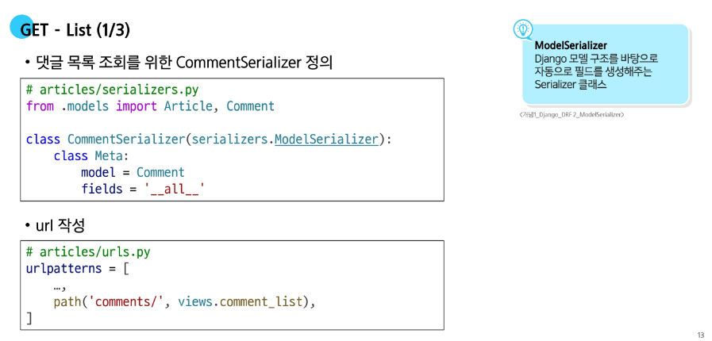  
  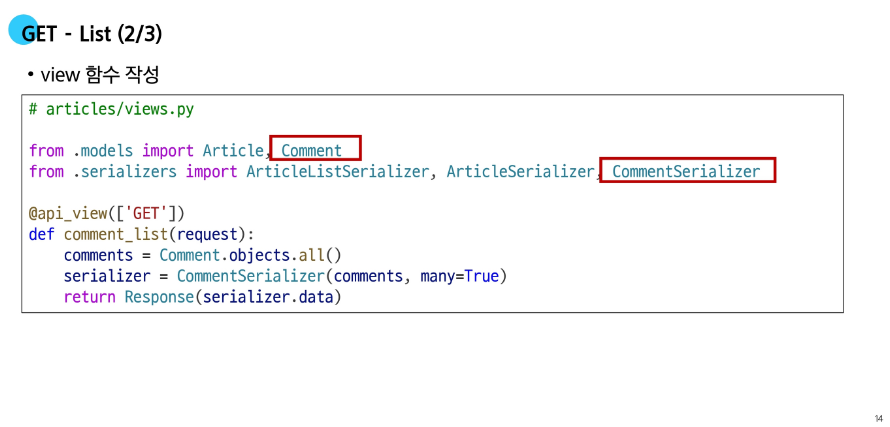

- **GET - Detail**  
  

---

### 🖊️ POST method

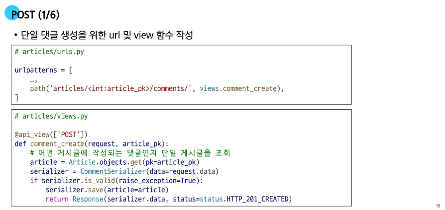  
 - `raise_exception=True` 로 설정하면 `return Response(serializer.errors, status=status.HTTP_400_BAD_REQUEST)` 를 생략할 수 있다.  
   
 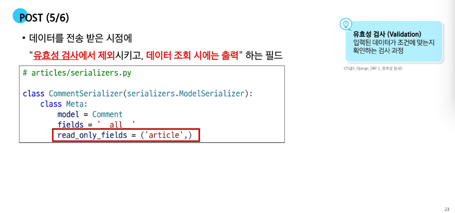

---

### 📖 읽기 전용 필드

- **읽기 전용 필드** : 서버가 조회 요청에 대한 응답 시에만 값을 표시하는 필드  
    - `read_only_fields`는 클라이언트가 입력해서는 안되는 필드를 응답 전용 필드로 지정  
    - 값을 직접 주입하지 않으면 필드 값이 빠졌다고 판단해 400 에러를 발생시킨다.

- **읽기 전용 필드 사용 목적**
    - 클라이언트 측에서 직접 수정하면 안되는 경우
    - 서버 로직에 의해 자동 생성 및 관리되는 값 활용
    - 입력은 받지 않지만 정보를 제공해야 하는 경우
    - 새로운 필드 값(추가 계산, 가공)을 만들어 제공해야 하는 경우

- **읽기 전용 필드 특징 및 주의사항**
    - 유효성 검사에서 제외  
        - 클라이언트가 보내는 요청 데이터에서 고려되지 않기 때문에 제외된다.  
        - 클라이언트가 해당 필드에 값을 넣어도 무시되고 검증 오류가 없다.
    - 생성 및 수정 요청 모두에서 적용 가능  
        - 수정(PUT) 요청에서도 해당 필드는 여전히 클라이언트 입력을 받지 않고, 응답 시에만 노출된다.

    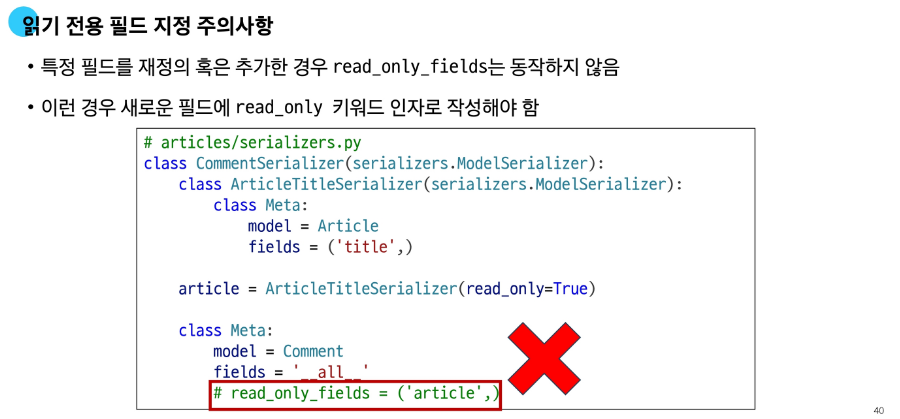  
    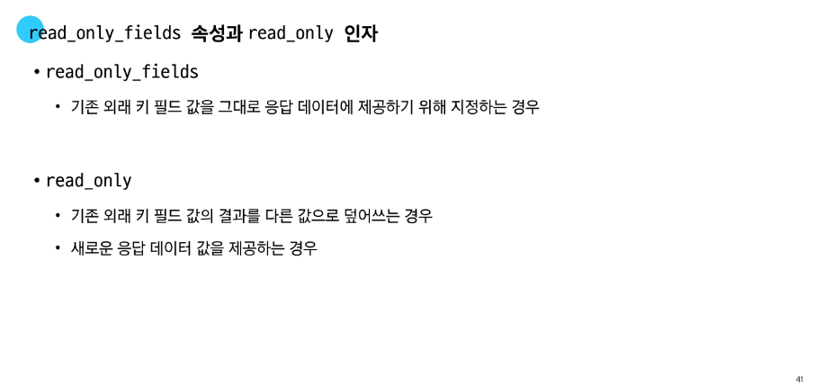

---

### ❌ DELETE & PUT method


---

### 🔄 응답 데이터 재구성

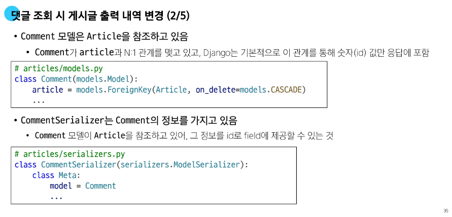  
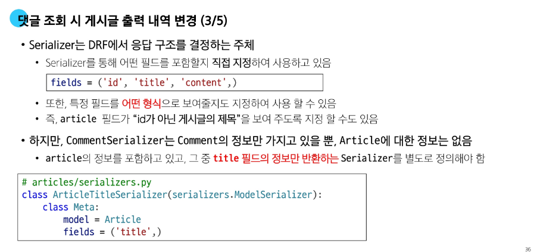  
  
- 재정의 할 경우 아래 `read_only_fields = ('article',)`이 실행되지 않기 때문에 `article = ArticleTitleSerializer()` 안에 파라미터로 넣어준다.

---

## 🔄 역참조 데이터 구성

- 단일 게시글 조회시 **해당 게시글에 작성된 댓글 목록**도 함께 붙여서 응답한다 → **역참조**  
- 단일 게시글 조회시 **해당 게시글에 작성된 댓글 개수**또 함께 붙여서 응답한다. → 역참조 + 새로운 필드

### 📜 단일 게시글 + 댓글 목록


```python
# serializers.py
class ArticleSerializer(serializers.ModelSerializer):

    class CommentDetailSerializer(serializers.ModelSerializer):
        class Meta:
            model = Comment
            fields = ('id', 'content',)

    # 역참조 매니저 이름으로 응답에 제공할 필드를 재정의
    # 주의 ! (역참조 매니저 이름이 아니면 동작하지 않음)

    # 만약 comment_set이 아닌 다른 이름으로 사용하고 싶다면
    # models.py에서 외래키 필드에서 related_name 설정으로 변경하고,
    # 여기서도 related_name 값으로 변경해야 한다.
    # comments = CommentDetailSerializer(many=True, read_only=True)
    comment_set = CommentDetailSerializer(many=True, read_only=True)

    class Meta:
        model = Article
        fields = '__all__'
```

```python

# models.py
class Comment(models.Model):
    article = models.ForeignKey(Article, on_delete=models.CASCADE)
    # article = models.ForeignKey(Article, on_delete=models.CASCADE, related_name='comments')
    content = models.CharField(max_length=200)
    created_at = models.DateTimeField(auto_now_add=True)
    updated_at = models.DateTimeField(auto_now=True)


```

---

### 단일 게시글 + 댓글 개수

- 단일 게시글 조회 시, 댓글 개수도 함께 제공하고 싶다면?
    - 기본적으로 게시글을 조회하면 참조 중인 댓글의 개수는 알 수 없다.
        - **댓글의 개수를 저장하는 별도 필드**는 Article 모델에 정의한 적이 없기 때문
    => 댓글 수를 응답하려면, **직접 계산해서 응답에 포함** 시켜야 한다.

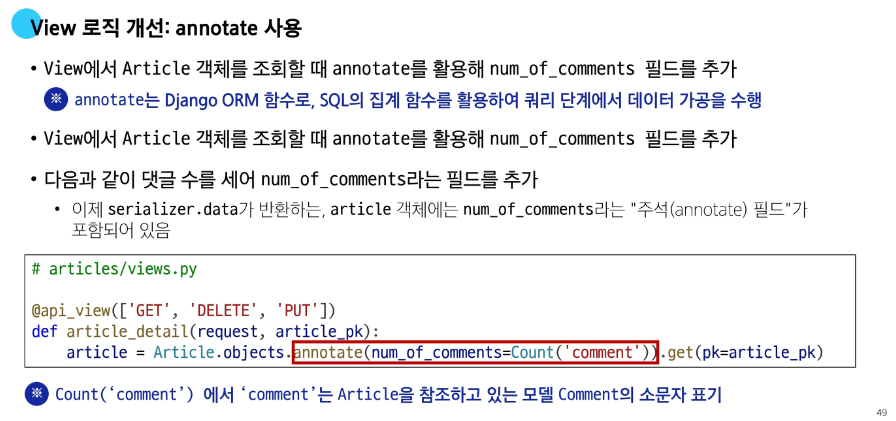
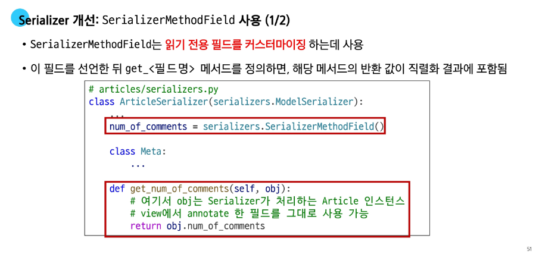


---

### SerializerMethodField

- Serializer에서 추가적인 데이터 가공을 하고 싶을 때 사용한다
    - 특정 필드 값을 조합해 새로운 문자열 필드를 만들거나 부가적인 계산 (비율, 합계, 평균)을 하는 경우에 활용

```python

class ArticleSerializer(serializers.ModelSerializer):

    class CommentDetailSerializer(serializers.ModelSerializer):
        class Meta:
            model = Comment
            fields = ('id', 'content',)

    # 역참조 매니저 이름으로 응답에 제공할 필드를 재정의
    # 주의 ! (역참조 매니저 이름이 아니면 동작하지 않음)

    # 만약 comment_set이 아닌 다른 이름으로 사용하고 싶다면
    # models.py에서 외래키 필드에서 related_name 설정으로 변경하고,
    # 여기서도 related_name 값으로 변경해야 한다.
    # comments = CommentDetailSerializer(many=True, read_only=True)
    comment_set = CommentDetailSerializer(many=True, read_only=True)

    # 댓글 개수를 제공할 새로운 읽기전용 필드를 정의
    num_of_comments = serializers.SerializerMethodField()

    class Meta:
        model = Article
        fields = '__all__'

    def get_num_of_comments(self, obj):
        return obj.num_of_comments

```

---

### 역참조 데이터 구성 참고

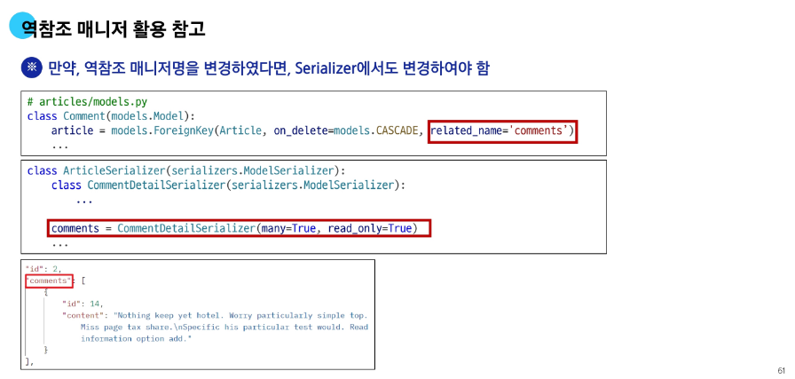


---

## API 문서화

- **OpenAPI Specification** : API에 대한 세부 사항을 기술할 수 있는 공식 표준
- OAS 기반 API에 대한 문서를 생성하는 데 도움을 주는 오픈소스 프레임워크
    - Swagger
    - Redoc

---

### 문서화 활용

- DRF 라이브러리 설치

```python

pip install drf-spectacular

# settings.py

INSTALLED_APPS = [
    ...,
    'drf_spectacular',
    ...,
]

REST_FRAMEWORK = {
    # YOUR SETTINGS
    'DEFAULT_'
}


```