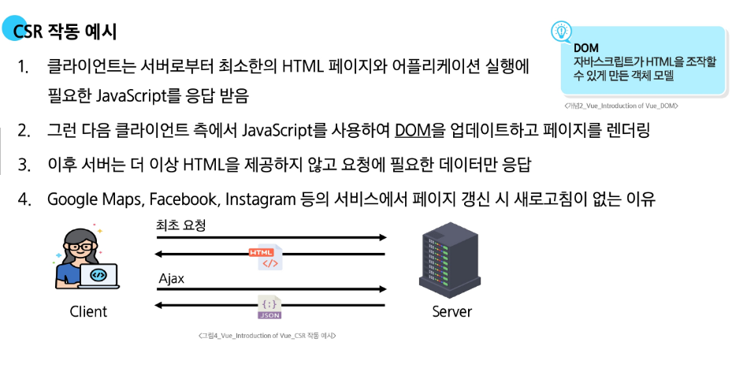
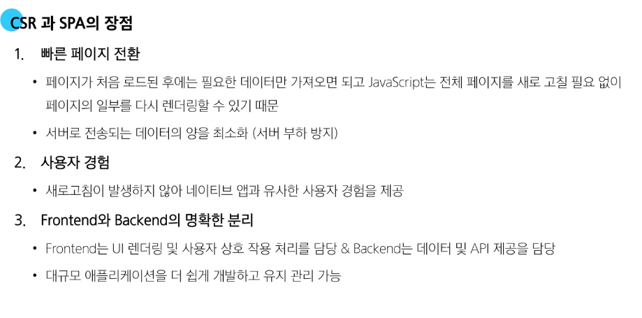
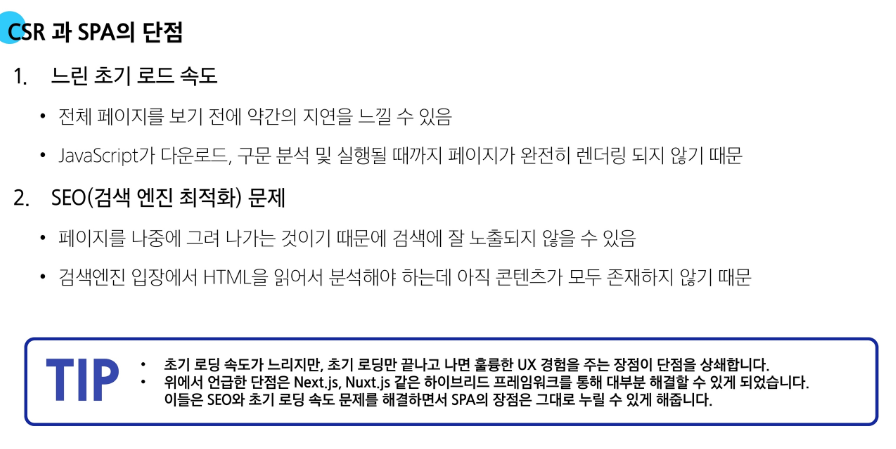
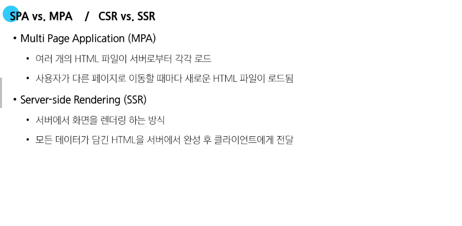
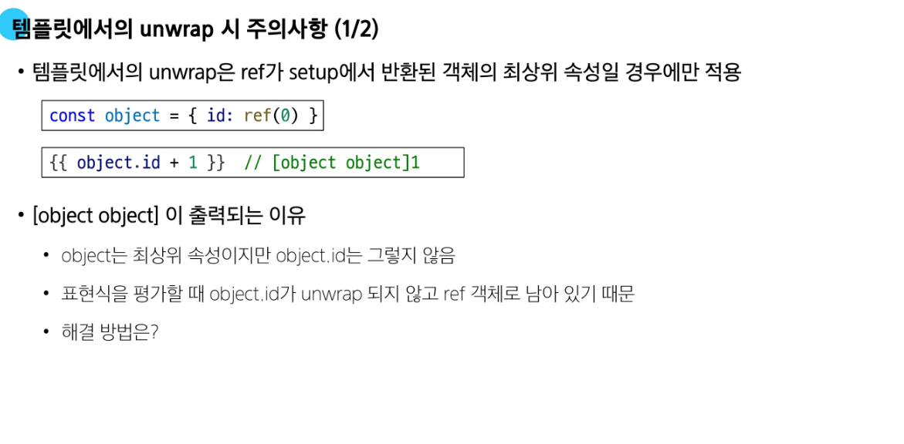

# 💻 Day_76 Introduction of Vue

## 🌐 Frontend Development

- **Frontend Development**
    - 웹 사이트와 웹 애플리케이션의 사용자 인터페이스(UI)와 사용자 경험(UX)을 만들고 디자인 하는 것

### 📱 Client-side frameworks

- **Client-side frameworks**
    - 클라이언트 측에서 UI와 상호작용을 개발하기 위해 사용되는 JavaScript 기반 프레임 워크
    - 최근 동적 웹 사이트는 **Vue**, **React**, **Angular**가 가장 대표적이다

- **Client-side frameworks가 필요한 이유**
    1. 단순히 무언가를 읽는 곳에서 -> 무언가를 하는 곳으로 변화
    2. 다루는 데이터가 많아진다
    3. 기본 JS만으로는 불필요한 코드가 반복된다

- **Client-side frameworks의 필요성**
    1. 동적이고 반응적인 웹 애플리케이션 개발
    2. 코드 재사용성 증가
    3. 개발 생산성 향상

### 🛠️ SPA

- **Single Page Application**
    - 단일 페이지에서 동작하는 웹 애플리케이션
    - 하나의 HTML 파일 윙서 JS가 필요한 부분만 교체하며 페이지 이동 없이 동작한다

- - **Single Page Application (SPA) 작동 원리**
    1. 최초 로드시 어플리케이션에 필요한 주요 리소스를 다운로드
    2. 페이지 갱신에 대해 필요한 데이터만을 비동기적으로 전달 받아 화면의 필요한 부분만 동적으로 갱신
    3. JS를 사용하여 클라이언트 측에서 동적으로 콘텐츠를 생성하고 업데이트
        - **CSR 방식**

### 🛠️ CSR

- **Client Side Rendering**
    - 클라이언트에서 콘텐츠를 렌더링 하는 방식
    - 빈 집(HTML)에 들어간 뒤, 가구(JavaScript)를 배송받아 직접 조립하는 방식

- **Client Side Rendering (CSR) 작동 원리**
    1. 사용자가 웹사이트에 요청을 보냄
    2. 서버는 최소한의 HTML과 JavaScript 파일을 클라이언트로 전송
    3. 클라이언트는 HTML과 JavaScript를 다운로드 받는다
    4. 브라우저가 JavaScript를 실행하여 동적으로 페이지 콘텐츠를 생성
    5. 필요한 데이터는 API를 통해 서버로부터 비동기적으로 가져온다

    

- **CSR과 SPA의 장단점**
    
    
    


## 🔥 Vue

- **Vue**
    - 사용자 인터페이스를 구축하기 위한 JavaScript 프레임 워크
    - 데이터가 바뀌면 화면도 자동으로 바뀌는 **반응성**이 가장 큰 특징
    [Vue 공식문서](https://ko.vuejs.org/)


- **Vue의 2가지 핵심 기능**
    1.  선언적 렌더링 (Declarative Rendering)
        - 표준 HTML을 확장하는 Vue "템플릿 구문"을 사용하여 JavaScript 상태를 기반으로 화면에 출력될 HTML을 선언적으로 작성
    2. 반응성 (Reactivity)
        - JavaScript 상태 변경을 추적하고, 변경사항이 발생하면 자동으로 DOM을 업데이트


### 🌱 Component

- **Component**
    - *재사용이 가능한 코드 블록*
    - UI를 독립적이고 재사용 가능한 일부분으로 분할하고 각 부분을 개별적으로 다룰 수 있다
    - 자연스럽게 애플리케이션은 중첩된 Component의 트리 형태로 구성된다
    

## 💡 Vue tutorial

- **Vue를 사용하는 방법**
    1. ```CDN``` 방식
    2. ```NPM``` 설치 방식
        - Node.js를 활용한 방식 (수업에서 주로 사용)

### 📦 Vue Applictation

- **Vue를 사용하기 위한 CDN 작성**
    ```html
    <script src="https://unpkg.com/vue@3/dist/vue.global.js"></script>
    ```
- **Applictation instance**
    - 구조분해할당 문법으로 createApp 함수를 가져온다
    ```javascript
    const { createApp } = Vue
    ```

- **Root Component**
    - 모든 App에는 다른 컴포넌트들을 하위 컴포넌트로 포함할 수 있는 Root 컴포넌트가 필요
    ```javascript
    const app = createApp({
        setup()
    })
    ```

- **Mounting the App (앱 연결)**
    - 각 앱 인스턴스에 대해 mount()는 한 번만 호출할 수 있다
    ```javascript
    app.mount('#app')
    ```

### 📜  반응형 상태

- ```ref()```
    - 반응형 상태를 선언하는 함수 (반응형 객체)

- ```ref``` 함수
    - ```.value``` 속성이 있는 ref 객체로 래핑하여 반환하는 함수
    - ref로 선언된 변수의 값이 변경되면, 해당 값을 사용하는 템플릿에서 자동으로 업데이트
    - 인자는 어떠한 타입도 가능
    ```javascript
    const { createApp, ref} = Vue

    const app = createApp({
        setup() {
            const message = ref('Hello vue!')
            console.log(message)    // ref 객체
            console.log(message.value)  // Hello vue!
        }
    })
    ```

    - 템플릿의 참조에 접근하려면 `setup` 함수에서 선언 및 반환 필요
    - 편의상 템플릿에서 `ref`를 사용할 때는 `.value`를 작성할 필요 없다
    ```javascript
    const app = createApp({
        setup() {
            const message = ref('Hello vue!')
            return {
                message
            }
        }
    })
    ```
    ```html
    <!-- vue-instance.html -->

    <div id='app'>
        <h1>{{ message }}</h1>
    </div>
    ```

### 📝 Vue 기본 구조

- **Vue 기본 구조**
    - `createApp()`에 전달되는 객체는 `Vue` 컴포넌트
    - 컴포넌트의 상태는 `setup()`함수 내에서 선언되어야 하며 **객체를 반환해야 함**
    - 변수를 할당하고 `return`이 필요하다
    ```javascript
    const app = createApp({
        setup() {
            const number = ref(0)
            const increment = function() {
                number.value++
            }
            return {
                numbe,
                increment,
            }
        }
    })
    ```
    ```html
    <!-- vue-instance.html -->

    <div id='app'>
        <button v-on:click="increment">버튼</button>
        <p>{{ number }}</p>
        <p>{{ number }}</p>
        <p>{{ number }}</p>
    </div>
    ```
    - `number++`가 아닌 `number.value++`를 한 이유는 number가 `ref`로 선언 되었기 때문이다.


## 📚 참고

### 🔧 ref 객체


- 내부적으로 사용하는 변수인 경우 ref가 필요없지만 외부적으로 보여줘야하는 변수인 경우에는 ref를 활용해 실시간으로 변경을 표시할 수 있다

### ⚙️ Ref Unwrap 주의 사항




## 🚀 SEO


## ✨ CSR과 SSR

