# 💻 Day_77 Vue Baisc Syntax 01

---

## 📌 Template Syntax

- **Template Syntax**
  - `Vue`는 `DOM`을 컴포넌트 인스턴스의 데이터에 선언적으로 바인딩할 수 있는 `HTML` 기반 템플릿 구문을 사용한다
  - `Java Script` 데이터와 `HTML` 화면을 쉽고 직관적인 방법으로 연결할 수 있다

- **Template Syntax 종류**
  - Text Interpolation
  - Raw HTML
  - Atrribute Bindings
  - JavaScript Expressions

1. Text Interpolation
  - 데이터 바인딩의 가장 기본적인 형태
  - 이중 중괄호 구문 (콧수염 구문)을 사용
  - 콧수염 구문은 해당 컴포넌트 인스턴스의 msg 속성 값으로 대체
  - msg 속성이 변경될 때마다 업데이트 된다
  ```vue
  <p>Message: {{ msg }}</p>
  ```

2. Raw HTML
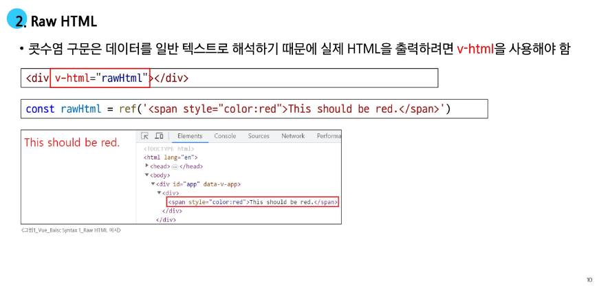
- Raw HTML : 화면에 그대로 출력하는 것
    - `div` 안의 `rawHtml` 이라는 자식 요소를 출력한다
    - `XSS`라는 해킹 기법 때문에 보안 위험으로 잘 사용하지 않는다. (사용 자제)
    - 안정적인 화면에서만 사용

3. Atrribute Bindings

- `Attribute Bindings` : `id` 속성 값을 `vue`의 `dynamicd` 속성과 동기화 한다
  - `v-bind` 는 뷰를 사용하는 동안 계속 사용할 것

4. JavaScript Expressions

- `JavaScript Expressions` : `vue` 템플릿 냉서 자바 스크립스 표현식을 사용할 수 있다
- `<div id=”{{ myValue }}”>` 와 같이 사용할 수 없다
  - 반드시 속성과 묶을 때는 `v-bind`를 써야한다

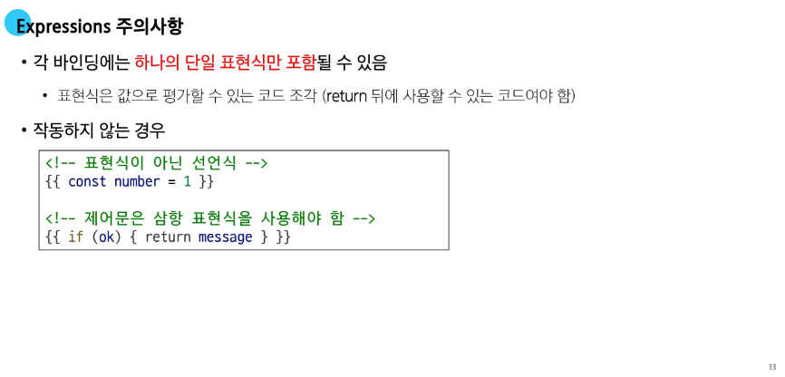
- 각 바인딩에는 하나의 표현식만 가능하다
- `if문`은 `OK ? message : null` 같이 **3항 연산자**를 사용해야 한다

### 🧩 Directive

- Directive
  - `v-접두사`를 가진 속성으로 `DOM요소`에 특정 반응형 동작을 적용하는 명령어


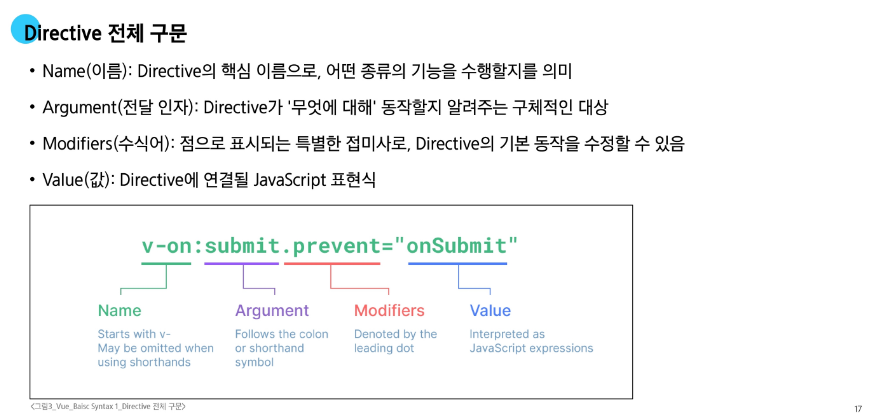
- 전체 모양은 이렇게 생겼지만 각각 디렉티브 마다 사용법이 다르다
- 디렉티브 이름 : 전달인자.수식어.값


- `Arguments` : 인자


- `Modifiiers` : 추가적인 동작을 위해 붙이는 것 (수식자)


---

## 🛠️ Dynamically data binding

### 🔧 v-bind

- v-bind
  - 하나 이상의 속성 또는 컴포넌트 데이터를 표현식에 동적으로 바인딩 한다
  - `Vue`에서 매우 많이 사용 된다

- Directive
  1. Attribute Bindings
  2. Class and Style Bindings

### 🧰 Attribute Bindings

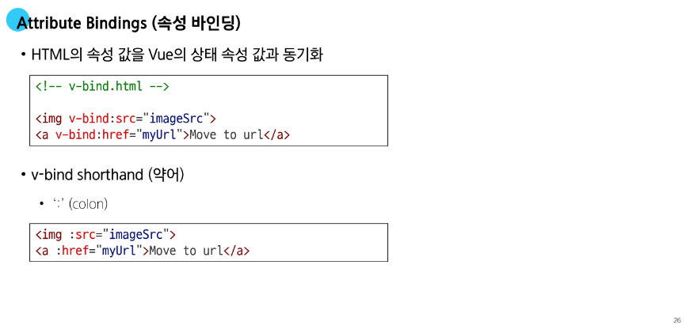
- v-bind를 속성 앞에 붙이면 된다
- 변수는 ref()로 선언된 변수를 할당하면 된다
- 많이 사용하기 때문에 v-bind의 약어를 `:` 으로 만들어 두었다
  - `: 속성명`  ⇒ `v-bind`
  - `v-bind` 는 생략 가능


- 대괄호 안에 작성하는 이름은 반드시 소문자로만 구성 가능!
  - `dynamicAttr` 라고 적었으면 dynamicattr라고 적어야 한다.


### 🧱 Class and Style Bindings

- Class and Style Bindings (클래스와 스타일 바인딩)
  - `class`와 `style`은 모두 `HTML` 속성이므로 다른 속성과 마찬가지로 `v-bind`를 사용하여 동적으로 문자열 값을 할당할 수 있다
  - `Vue`는 `class` 및 `style` 속성 값을 `v-bind`로 사용할 때 객체 또는 배열을 활용하여 작성할 수 있도록 한다
  ⇒ *단순히 문자열 연결을 사용하여 이러한 값을 생성하는 것은 번거롭고 오류가 발생하기 쉽기 때문*

- Class and Style Bindings가 가능한 경우
  - Bindings and Style Classes
    1. Binding to Objects
    2. Binding to Arrays
  - Bindings Inline Style
    1. Binding to Objects
    2. Binding to Arrays

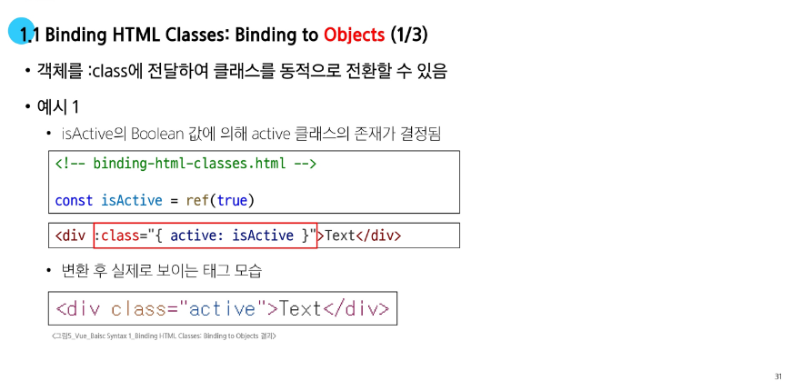
- 반응형 `class=”{ 클래스명: boolean 타입 }”`
  - `boolean` 타입이 `true`라면 바인딩이 되고, `false`라면 바인딩 되지 않는다

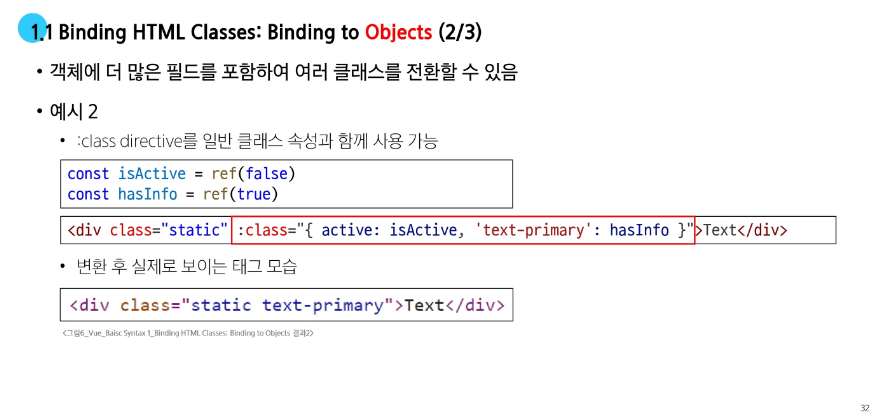


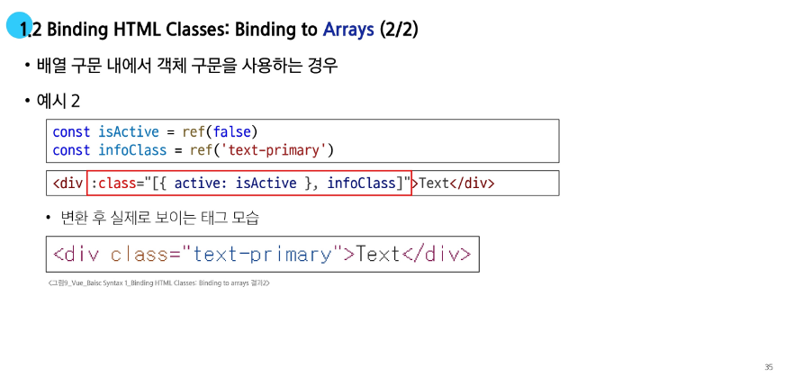


- 스타일에 `color` 라는 `key`와 `crimson `이라는 `value` 를 작성해야한다


- `font-size` 처럼 문자열로 작성하면 된다

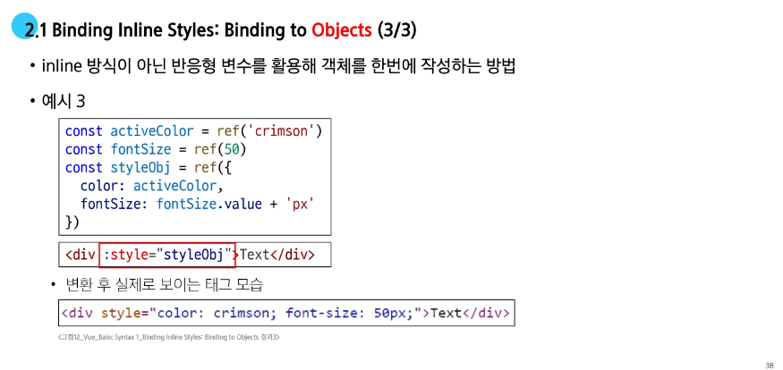

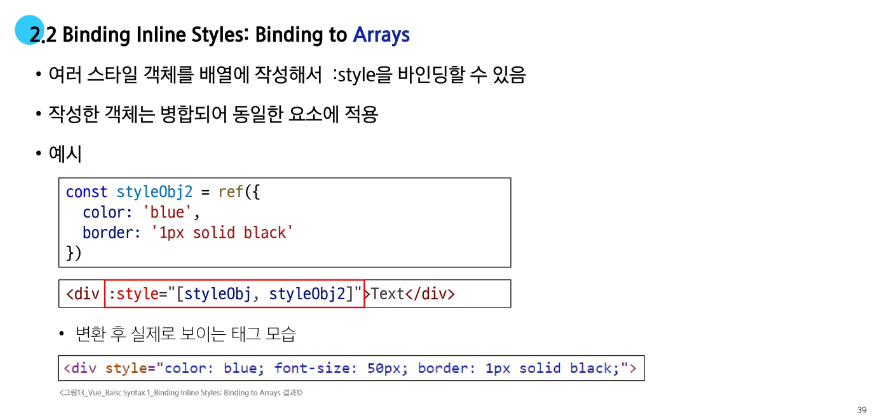


---

## 🛠️ Event Handling

### 🔧 v-on

- v-on
  - DOM 요소에 이벤트 리스너를 연결 및 수신한다
  - 버튼 클릭, 키보드 입력 등 사용자의 이벤트를 갑지하고, 지정된 코드를 실행시키는 디렉티브

### 🧰 Modifiers


- v-on은 @ 로 단축 사용할 수 있다.
- `@ 이벤트 = “실행 함수”`
- `prevent`를 많이 사용한다


- v-on 사용시 버블링이 적용되므로 JS 이벤트 처럼 활용할 수 있다.
- 버블링을 취소 하고 싶으면 .`stop` 모디파이를 사용하면 된다

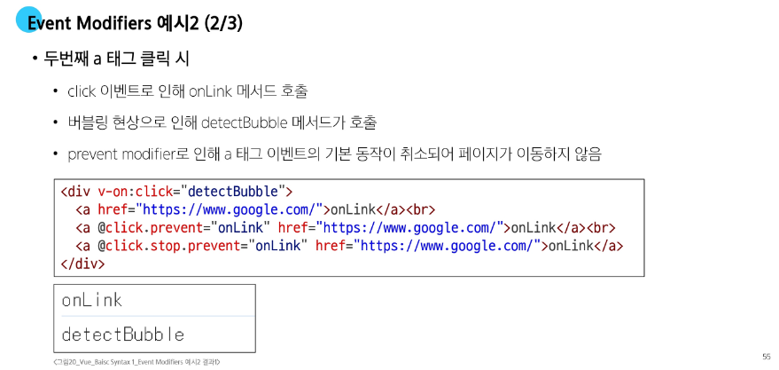
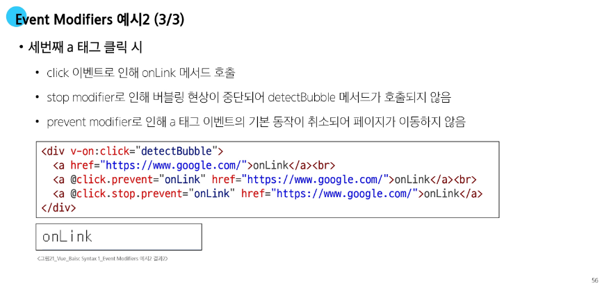

- **keyup** : 눌린 키를 떼엇을 때
- **keydown** : 키를 눌렀을 때
- `@keydown.ctrl.enter`  : 컨트롤과 엔터가 동시에 눌생


---

## 🛠️ Form Input Bindings

- Form Input Bindings(폼 입력 바인딩)
  - `form`을 처리할 때 사용자가 `input`에 입력하는 값을 실시간으로 `JavaScript` 상태에 동기화해야 하는 경우 (양방향 바인딩)

- 양방향 바인딩 방법
  - `v-bind`와 `v-on`을 함께 사용
  - `v-model` 사용

- 속성 바인딩 : `class=’myValue’`
  - `const myValue = ref(’’)`
- 속성 바인딩은 단방향 인데 사용자한테 입력 받음으로써 양뱡향 바인딩이 가능하다
  - `tesxArea`, `checkBox`, `radioButton` 등 (input 타입)

### 🧷 v-bind with v-on


### 🔧 v-model
- v-model
  - `form input` 요소 또는 컴포넌트에서 **양방향 바인딩**을 만든다.
  - `input`, `textArea`, `select` 처럼 사용자한테 입력 받을 수 있을 때만 사용이 의미 있어진다


- `v-model=”ref()로 감싸진 변수”`

### 📡 v-model 활용

- v-model과 다양한 입력(input) 양식
  - `v-model`은 단순 `Text input` 뿐만 아니라 다양한 타입의 사용자 입력 방싱과 함께 사용 가능
    - `Checkbox`
    - `Select`
    - `Radio`
    - `Textarea`
    - ...

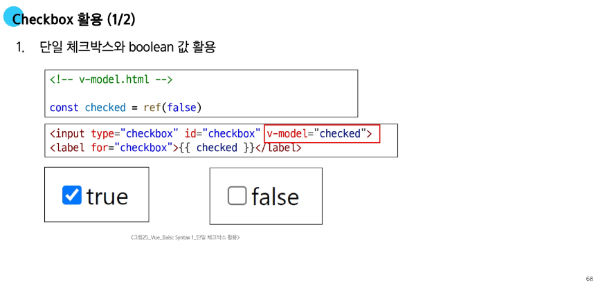
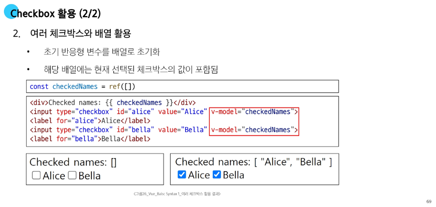

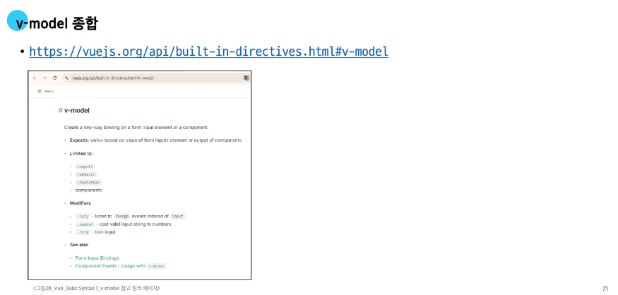

---

## 📚 참고

### 🗳️ 접두어 $

- `$` 접두어가 붙은 변수
  - `Vue` 인스턴스 내에서 사용할 수 있도록 `Vue`가 제공하는 공용 프로퍼티
  - 사용자가 지정한 반응형 변수나 메서드와 구분하기 위함
    - 주로 `Vue` 인스턴스 내부 상태를 다룰 때 사용

- `TIP`
  - 내가 만드는 데이터와 메서드 이름에 `$`나 `"` 접두사를 사용하지 않는 것이 좋다
  - `_`로 시작하는 속성은 내부용이므로 직접 사용하면 예고없이 변경될 수 있기 때문에 안된다

### 📝 IME

- IME (Input Method Editor)
  - 사용자가 입력 장치에서 기본적으로 사용할 수 없는 문자(비영어권 언어)를 입력할 수 있도록 하는 운영체제 구성 프로그램
  - 일반적으로 키보드 키보다 자모가 더 많은 언어에서 사용해야 한다
  - `IME`가 활설화된 상태 (예: 한글 조합 중)에서 `Input` 이벤트가 발생하는 방식과 `v-model`의 업데이트 방식이 충돌하여, 의도치 않은 동작이 발생할 수 있다

- `TIP`
  - `v-model`에 `.lazy` 수식어를 붙이면 문제를 해결할 수 있지만 데이터가 실시간으로 반영되지 않고, 사용자가 입력을 마친 후 다른 곳을 클릭하는 등 포커스를 잃었을 때 한 번에 반영된다

---

# 🔥 요약 정리

- **템플릿 구문 (Template Syntax)**
  - `Vue`가 `HTML`을 기반으로 사용하는 특별한 문법
  - 이를 통해 `DOM`과 `Vue` 인스턴스의 데이터를 선언적으로 연결(바인딩) 가능

- **디렉티브(Directive)**
  - `v- 접두사`가 붙은 특수 속성으로, `DOM`에 특정 반응형 동작을 적용하는 명령어
  - 디렉티브의 값으로는 단일 `JavaScript` 표현식만 가능

- **v-bind(데이터 바인딩)**
  - `v-bind`는 `HTML` 태그의 속성 값을 `Vue`의 데이터와 동적으로 연결하는 디렉티브
  - 약어(shorthand)는 콜론(`:`)을 사용
  - `v-bind`를 사용하면 데이터 값의 변경에 따라 `src`, `href` 같은 `HTML` 속성을 실시간으로 업데이트 가능
  - **클래스와 스타일 바인딩**
    - `class`와 `style` 속성에 `v-bind`를 사용하면, 객체나 배열을 활용해 여러 클래스의 스타일을 조건부로 동적 적용할 수 있어 편리

- **v-on (이벤트 핸들링)**
  - `v-on`은 `click`, `submit`과 같은 `DOM` 이벤트가 발생했을 때 지정된 `JavaScript` 코드를 실행하는 디렉티브
  - 약어(shorthand)는 `@` 기호를 사용
  - 이벤트 수식어(Modifiers)
    - `.prevent`(기본 동작 방지), `.stop`(이벤트 전파 중단)과 같이 디렉티브 뒤에 점(`.`)으로 붙여 이벤트의 동작을 제어하는 특별한 접미사

- **v-model (폼 입력 양방향 바인딩)**
  - `v-model`은 `<input>`, `<textarea>`, `<select>` 같은 폼 요소에서 사용하며, 사용자의 입력과 Vue 데이터를 실시간으로 동기화하는 양방향 바인딩을 생성
  - 사용자 입력 필드의 값을 입력하면 연결된 데이터가 즉시 업데이트 되고, 데이터 값이 변경되면 입력 필드의 값도 자동으로 변경
  - 사실 `v-model`은 `v-bind`로 값을 연결하고 v-on으로 입력 이벤트를 감지하여 값을 변경하는 두 동작을 합친 축약형


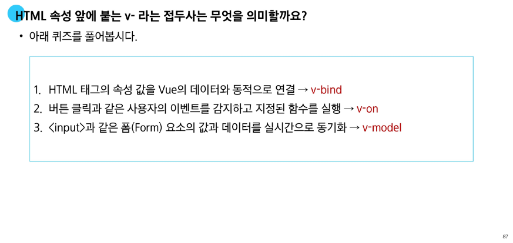