# 💻 Day_80 Component State Flow

## 🚀 Passing Props

### ✨ Props

- **Props**
  - 부모 컴포넌트로부터 자식 컴포넌트로 데이터를 전달하는데 사용되는 사용자 지정 특성

- **Props 특징**
  - 부모의 데이터가 업데이트되면 자식에게 전달되지만, **그 반대는 불가능**
  - 객체/배열 `props`는 자식에서 값을 변경하면 부모의 원본도 변경되니 주의해야 한다

- **One-Way Data Flow**
  - 모든 `props`는 자식 속성과 부모 속성 사이에 **하향식 단방향 바인딩**을 형성한다
  - *하향식 단방향인 이유*
    - 하위 컴포넌트가 실수로 상위 컴포넌트의 상태를 변경하여 앱에서의 데이터 흐름을 이해하기 어렵게 만드는 것을 방지하지 위함
    - 데이터 흐름의 *일관성* 및 *예측 가능성*을 높이는 것이 목표

### 👨‍💻 Props 선언


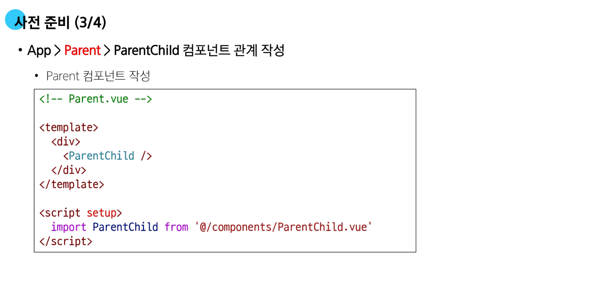

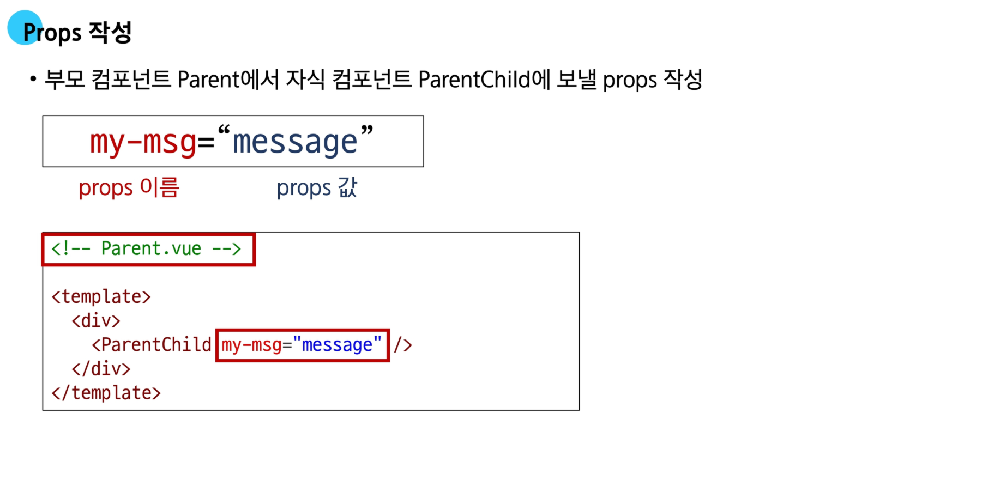
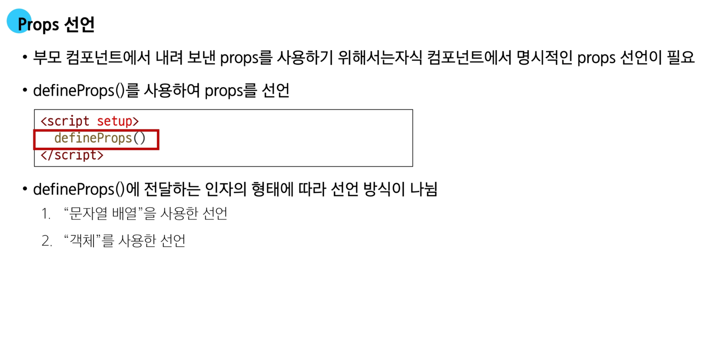


  - 수업에서는 객체 형태를 사용한다
  - 객체로 작성시 데이터 타입을 작성할 수 있고 이 방식으로 하면 데이터 타입 이외의 타입이 들어왔을 때 오류가 발생한다


  - 네모 박스 부분은 이름을 일치 시키는 것이 데이터 관리 측면에서 좋다
  - defineProps() 안의 객체를 동적으로 바인딩 해서 보낸다
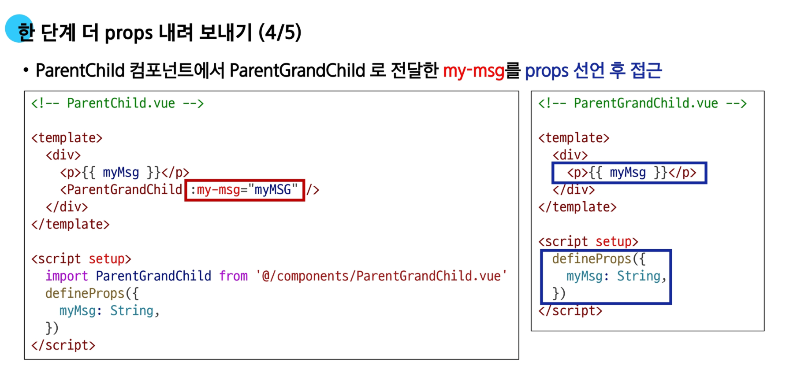


### 📜 Props 세부 사항

1. Props Name Casing (Props 이름 컨벤션)
2. Static Props와 Dynamic Props
  - 지금까지 작성한 것은 Static (정적) props
  - v-bind를 사용하여 동적으로 할당된 props를 사용할 수 있다
  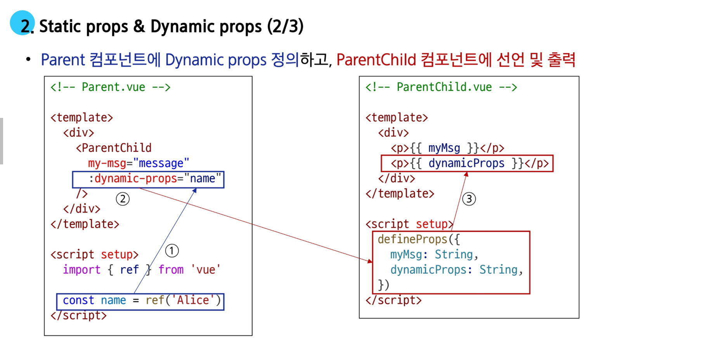
  


### 📱 Props 활용


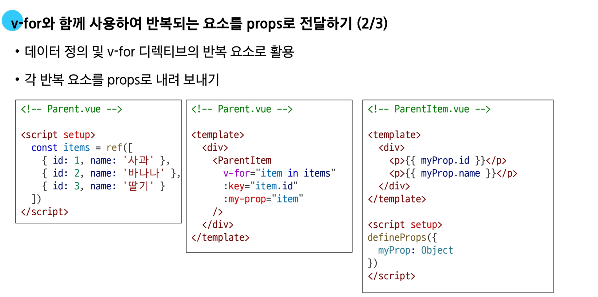


## 🚀 Component Events

### ✨ Emit
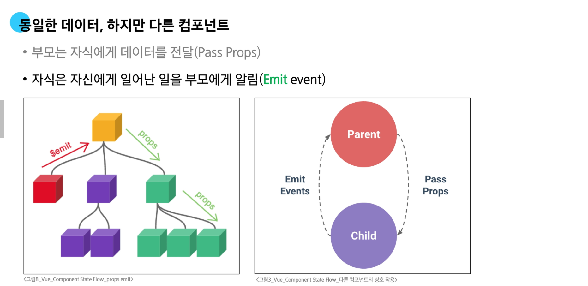
  - 자식이 업데이트 된 것을 이벤트를 발생시켜 부모에게 알리는 것

- **$emit()**
  - 자식 컴포넌트가 이벤트를 발생시키면 부모 컴포넌트로 데이터를 전달하는 메서드
  - `props`가 내려가는 이벤트라면 *`emit`*은 올라가는 이벤트

- `emit` 메서드
  ```vue
  $emit(event, ...args)
  ```
  - `event`
    - 커스텀 이벤트 이름
  - args
    - 추가 인자 (여러 값을 처리할 때는 `...` 사용)
  - `$` 표기
    - `Vue` 인스턴스의 내부 변수들을 가르킨다
    - Life cycle hooks, 인스턴스 메서드 등 내부 특정 속성에 접근할 때 사용한다

### 📝 이벤트 발신 및 수신

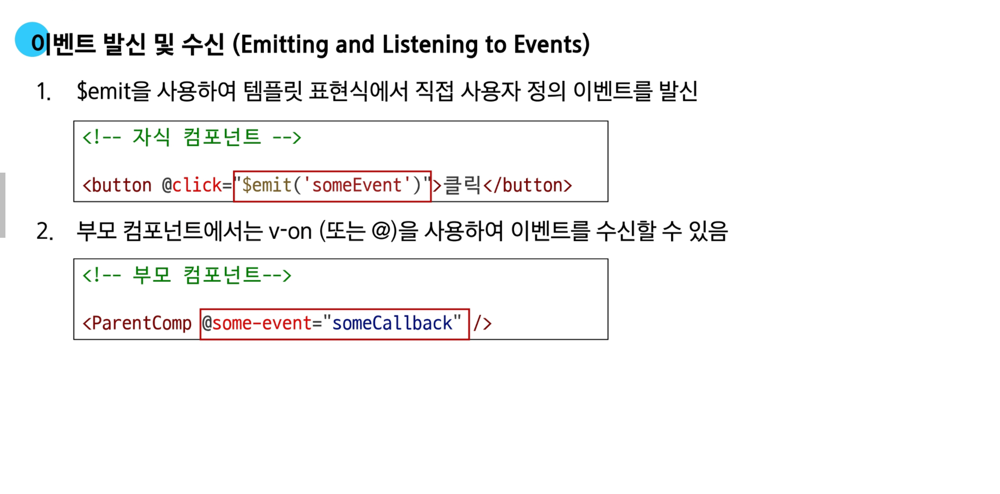
  - `emit()` 안에는 이벤트 명을 작성한다
  - 부모 컴포넌트에서는 `v-on`으로 이벤트를 받으면 된다

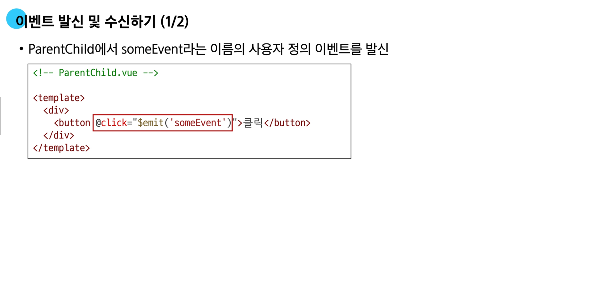


### 👨‍💻 emit 이벤트 선언

- `emit` 이벤트 선언
  - `defineEmits()`를 사용하여 발신할 이벤트 선언
  - `props`와 마찬가지로 `defineEmits()`에 작성하는 인자의 데이터 타입에 따라 선언 방식이 나뉜다
    - 배열
    - 객체 (객체를 활용한 선언을 권장)
  - `defineEmits()`는 `<script setup>` 내에서 이벤트를 발신하기 위한 **emit 함수를 반환**
    - 템플릿의 `$emit`과 달리 `<script setup>`에서는 직접 접근할 수 없기 때문


  - `defineEmits(['발생할 이벤트 명'])`

### 🛠️ 이벤트 전달

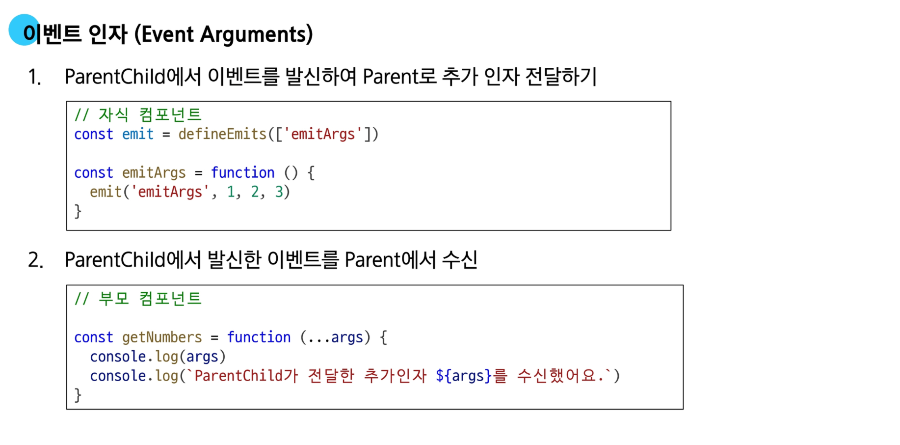
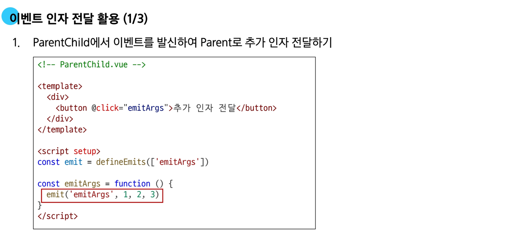

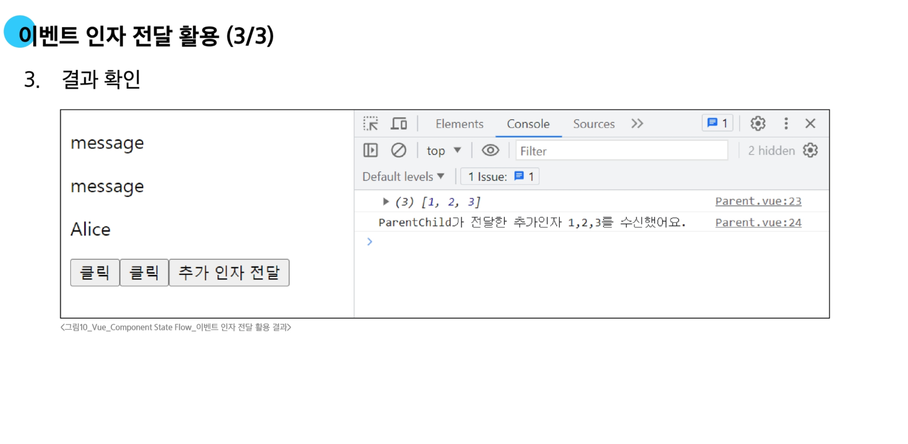

### 📜 이벤트 세부사항

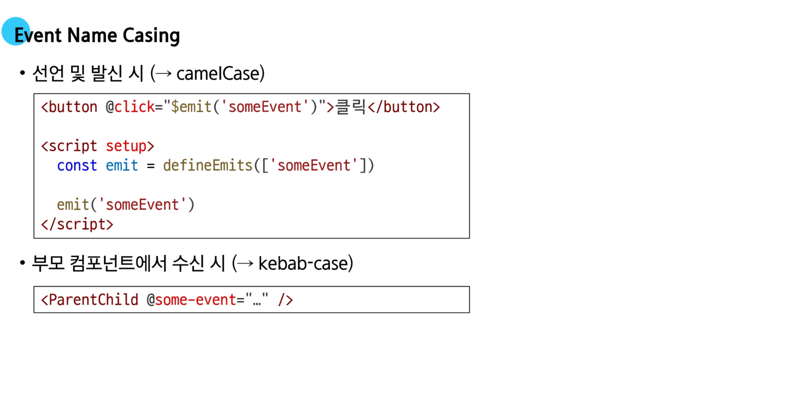
  - 자식이 이벤트를 보낼 때는 카멜 케이스 사용
  - 부모가 이벤트를 받을 때는 케밥 케이스 사용

### 🧠 emit 이벤트 활용

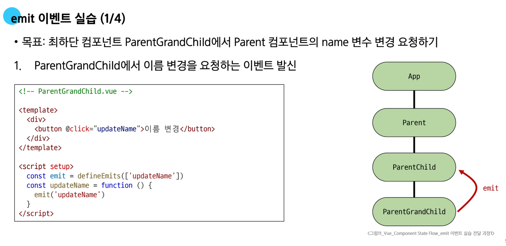


## 📚 참고

### 📚 정적 & 동적 props 주의 사항

```vue
<!-- 1 -->
<SomeComponent num-props="1" />

<!-- 2 -->
<SomeComponent :num-props="1" />
```
- 첫 번째는 정적 `props`로 문자열 *1*을 전달
  - `v-bind`가 없기 때문에 문자열로 전달된다
- 두 번째는 동적 `props`로 숫자 *1*을 전달
  - `v-bind`가 있어서 `“”` 안은 표현식으로 처리가 되어 숫자 1로 판단된다


### 📚 Props & Emit 객체 선언 문법


  - 객체 선언 문법을 사용하지 않으면 `console` 창에 에러 메세지가 출력되고, 이는 단단한 웹페이지 구성에 문제가 된다


# 🔥 요약 정리

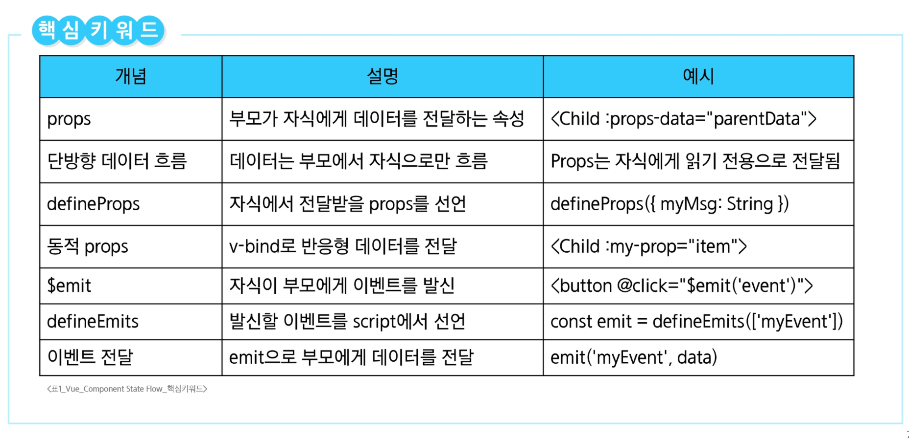

- **Props**
  - 부모 컴포넌트가 자식 컴포넌트에게 데이터를 전달할 때 사용하는 특별한 속성
  - 자식 컴포넌트는 전달받은 `props`를 직접 수정할 수 없으머, 읽기 전용으로 사용하는 것을 권장
  - 자식 컴포넌트
    - `defineProps()` 메서드를 사용해 전달받을 `props`를 선언
    - 문자열 배열 `['myMsg']` 또는 객체 `{myMsg: String}` 형태로 선언 가능 (객체로 선언을 권장)
    - 유효성 검사를 위해 객체 형식이 권장
  - 부모 컴포넌트
    - 자식 컴포넌트 태그에 속성처럼 `props`를 전달
  - Props 이름 컨벤션
    - **HTML 템플릿**에서는 `kebab-case (my-msg)`로, **JavaScript 스크립트**에서는 `camelCase (myMsg)`로 작성한다
    - 정적 vs 동적 props
      - 정적 `Props` : 고정된 문자열 값 전달 `my-msg="hello"`
      - 동적 `Props` : `v-bind` (또는 약어 `:`)를 사용하여 부모의 반응형 데이터를 전달 `:my-msg="parentDate"`

- **Emit**
  - 자식 컴포넌트가 부모 컴포넌트에게 특정 이벤트가 발생했음을 알리고 데이터를 함께 전달하는 기능
  - 자식 컴포넌트
    - `<script setup>` 안에서 `defineEmits()` 매크로를 사용해 발신할 이벤트를 선언
    - `defineEmits()`는 `emit` 함수를 반환하며, 이 함수를 호출해 이벤트를 발신 `emit('evnet-name', date)`
  - 부모 컴포넌트
    - `v-on (또는 약어 @)` 디렉티브를 사용해 자식이 발신한 이벤트를 수신 `@event-name="handlerMethod"`
    - 자식이 `emit`으로 전달한 데이터는 부모의 핸들러 메서드에서 매개변수로 받을 수 있다


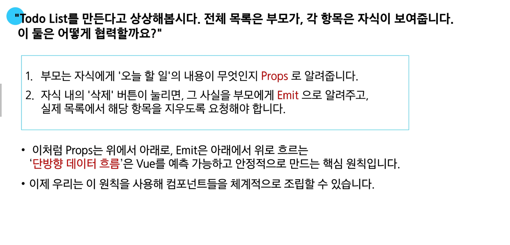