# 💻 Day_81 Vue State Management

## 🔧 State Management

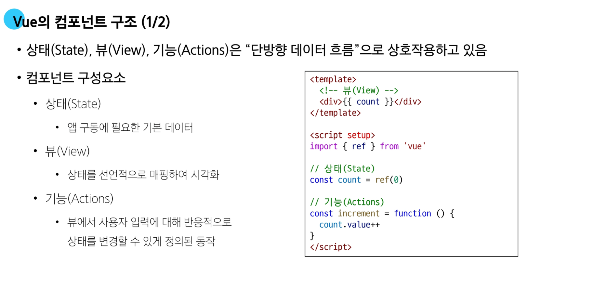
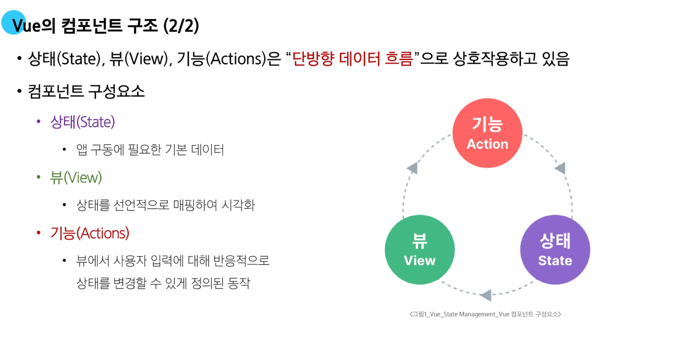

- **상태 관리의 단순성(단방향 데이터 흐름)이 무너지는 시점
  1. 여려 뷰가 동일한 상태에 종속되는 경우
  2. 서로 다른 뷰의 기능이 동일한 상태를 변경시켜야 하는 경우

  
  - props의 계층 구조가 깊어질 수록 비효율적이고 관리가 어렵다
    - 중간에 props 과정을 누락하면 이후의 데이터가 누락된다
  
  
  - 반대편에 변경된 부분을 적용해야한다고 하면 복잡해진다

- **해결 방법**
  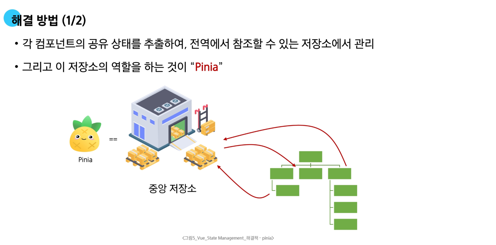
  - 각 컴포넌트의 공유 데이터를 추출해서 하나의 저장소에 집중하여 관리하는 방법으로 해결할 수 있다

  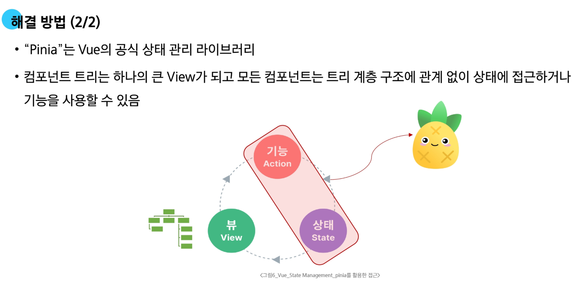
  - 기능과 상태는 중앙 저장소에서 관리해야 하는 것들 (공유가 필요한 데이터)은 전부 `Pinia`에서 관리한다
  - 변수나 함수 같은 경우에는 컴포넌트에서만 사용한다

## 📦 State Management library (Pinia)

### ⚙️ Pinia

- `Pinia`
    - 여러 컴포넌트를 함께 사용해야하는 공통 데이터를 중앙 저장소에서의 통합 관리를 도와주는 도구
    - `Vue` 공식 상태 관리 라이브러리

- .js 파일의 파일명은 얼마든지 변경 가능하다
- js 안에는 상태와 함수를 작성할 수 있다

### 📜 Pinia 구성요소

- **Pinia 구성요소**
  1. `store`
  2. `state`
  3. `getters`
  4. `actions`
  5. `반환 값`
  6. `plugin`

1. Pinia 구성요소 : `store`
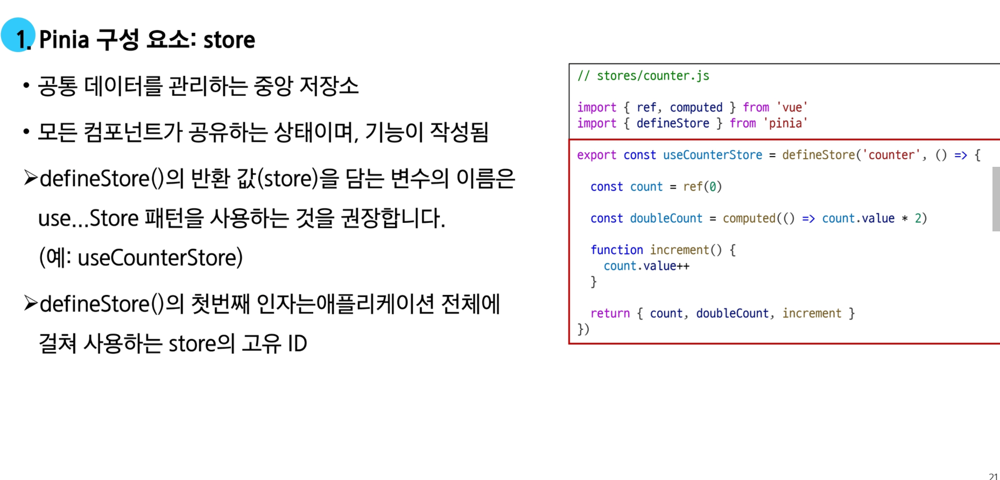
- 실질적으로 공유 데이터를 저장하는 중앙 저장소
- `defineStore(저장소명, 콜백함수)`
  - 첫번째 인자는 store의 고유 ID

2. Pinia 구성요소 : `state`
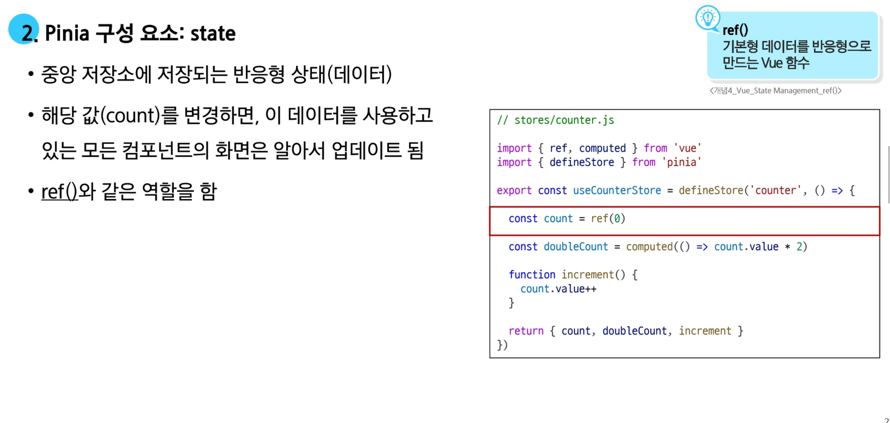
- `ref`로 선언된 변수

3. Pinia 구성요소 : `getters`

- `computed()`와 같이 계산 된 값
- 값이 변경되면 캐싱되어 알아서 변경된다

4. Pinia 구성요소 : `actions`

- 컴포넌트에서 `state`의 데이터를 직접 변경 권장X
    - 변경지점이 분산되어 있으면 추적하기 어렵고 유지보수 및 코드 가독성이 불편해진다
    - `store`에 정의된 `action`을 호출해서 간접적으로 변경을한다

5. Pinia 구성요소 : `반환 값`
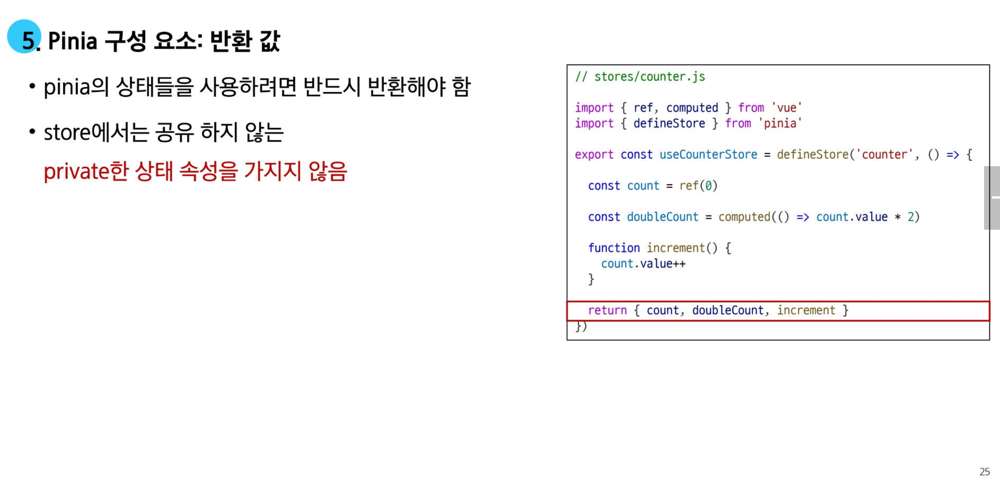
- `return`에 반환값을 반드시 지정해야 한다
  - 값을 지정하지 않으면 제대로 동작하지 않는다 

6. Pinia 구성요소 : `plugin`
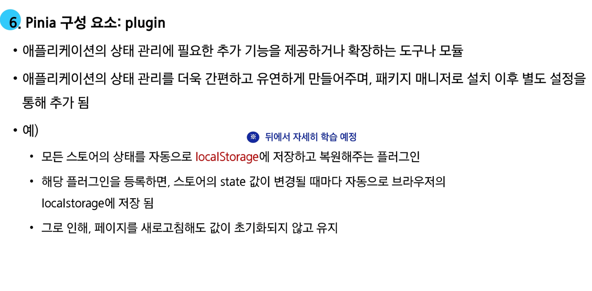
- 모든 스토어의 상태를 자동으로 localStorage에 저장하고 복원해주는 플러그인
- 페이지를 새로고침해도 값이 초기화되지 않고 유지 된다

### 👨‍💻 Pinia 구성요소 활용

- `store` 인스턴스로 `state`에 접근하여 직접 읽고 쓸 수 있다.
1. `store`를 `import` 한다
2. `store` 객체를 반환받아서 리턴 값 사용 가능
3. 전역 변수 `count`를 직접 사용하지 말고 변수에 담아서 (`newCount`) 사용한다

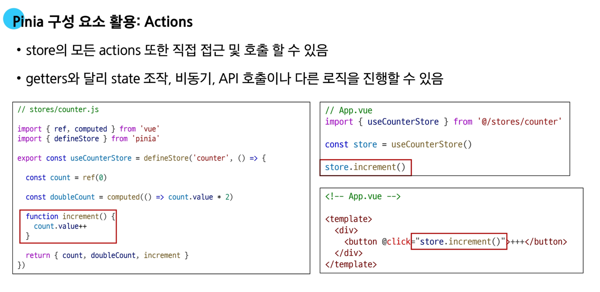
- `action`을 호출하여 사용한다

## 🚀 Pinia 실습
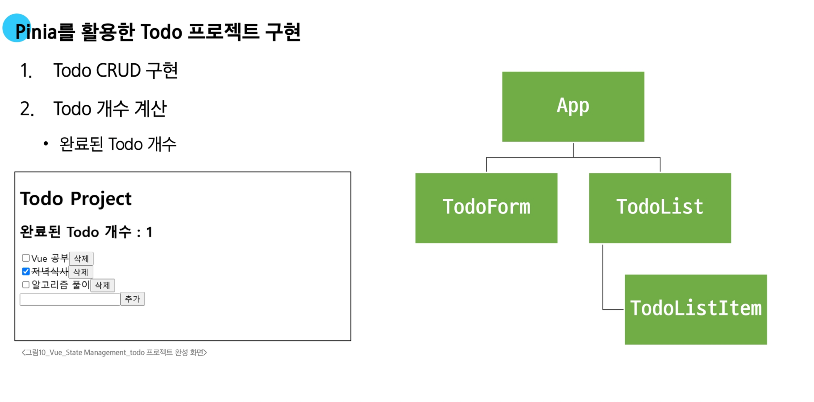

### 📜 사전 준비

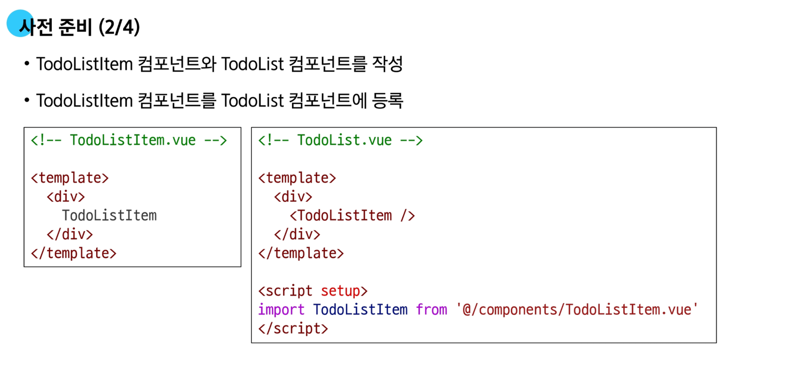

### 📝 Todo 조희 (Read)
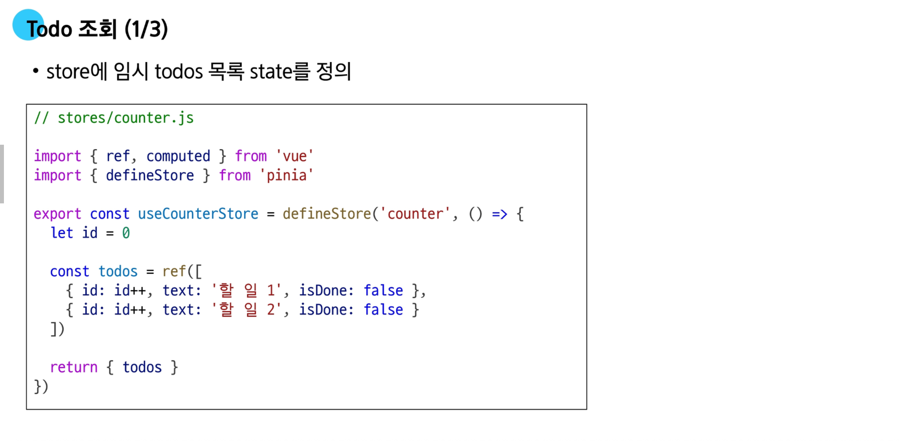

### 📝 Todo 생성 (Create)

- 특정 `DOM`을 가져올 때 `ref` 속성을 쓴다
    - 내부 값과 `JS` 변수 값이 동일해야 제대로 동작한다 (`formElem`)
- `reset()` 메서드는 `clear` 기능

### 📝 Todo 삭제 (Delete)

- `store`의 `deleteTodo`에 삭제 로직 구현
- 삭제 방법 1
  - `findindex`를 활용해 하나만 찾아서 삭제
- 삭제 방법 2
  - `filter`로 삭제하지 않아도 되는 것들만 모아서 재생성

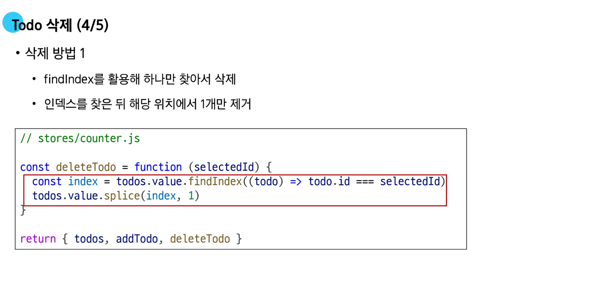
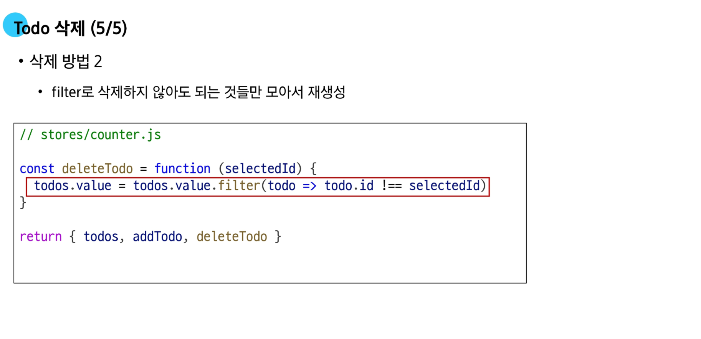

### 📝 Todo 수정(Update)
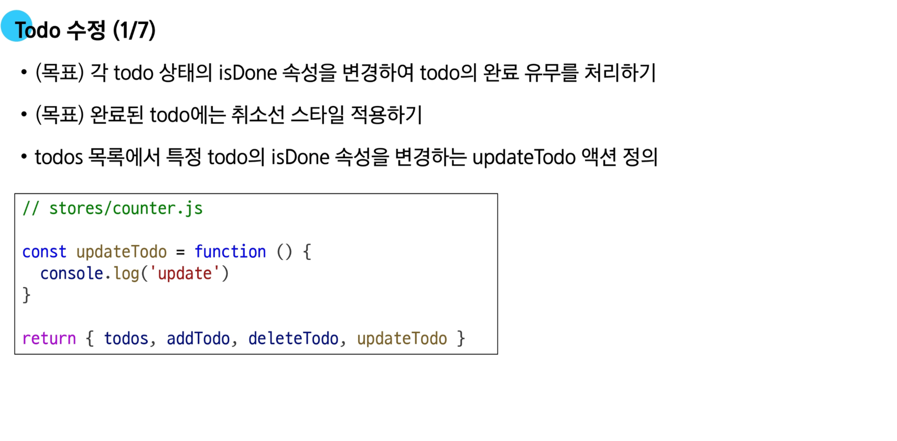

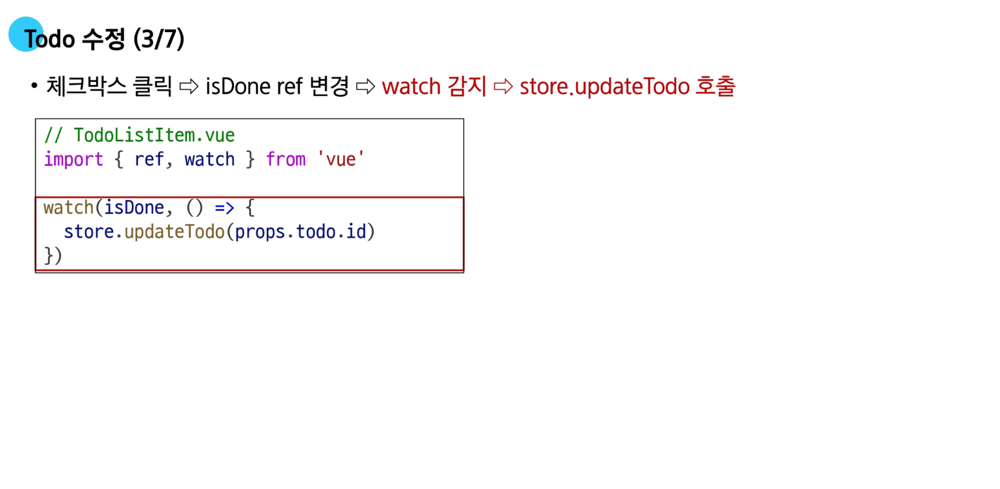

### ✨ 수정과 삭제 구현 방식

- **In-place 방식 (하나만 수정/삭제)
  - 배열 전체 재성성 없이 필요한 항목만 바로 수정 또는 제거
- 전체 배열 재생성 방식
  - 배열을 순회하면서 특정 조건을 만족하지 않으면 누락하거나, 필요한 변경 사항만 반영해 새로운 배열을 만든 뒤 기존 배열에 재할당

- 두 가지 접근 모두 성능과 가독성 면에서 큰 차이가 없는 경우가 많지만, 프로젝트나 팀 컨벤션에 따라 방식이 달라질 수 있다
- 중요한 것은, 무엇을 의도하고 있는지(단일 항목 수정/삭제 vs 전체 재생성)를 *명확히 알고 선택*하는 것

### 🚀 Todo 카운팅
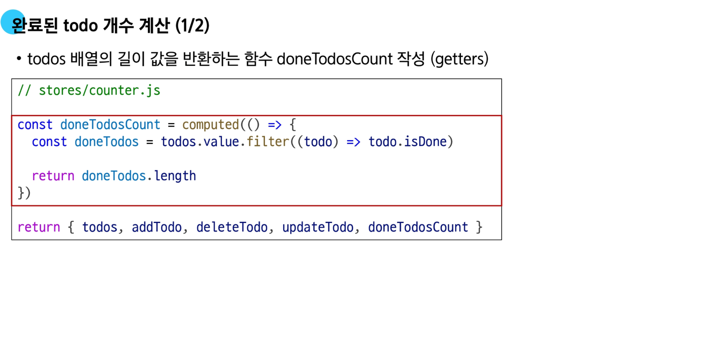
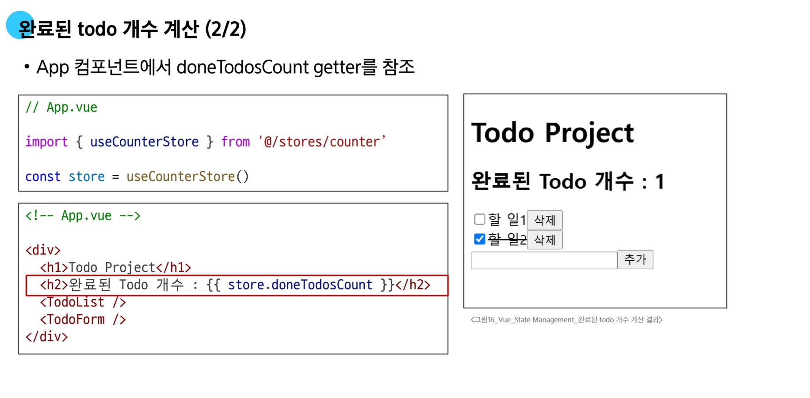

### 📦 Local Storage

- Local Storage
  - 브라우저 내에서 key-value 쌍을 저장하는 스토리지 객체
  - 웹 브라우저에 데이터를 영구적으로 저장할 수 있는 개인 하드디스크
  - 브라우저를 껏다 켜거나 컴퓨터를 재부팅해도 사라지지 않고 그대로 남아 있는다
  - 사용자의 설정 등 서버와 상관없이 브라우저만 기억해두면 되는 정보를 저장하는데 사용된다 (예: 다크 모드)

- Local Storage 특징
  - 페이지를 새로 고침하고 브라우저를 다시 실행해도 데이터가 유지
  - 쿠키와 다르게 네트워크 요청 시 서버로 전송되지 않는다
  - 여러 탭이나 창 간에 데이터를 공유할 수 있다

- Local Storage 사용 목적
  - 웹 애플리케이션에서 사용자 설정, 상태정보, 캐시 데이터 등을 클라이언트 측에서 보관하여 웹사이트의 성능을 향상시키고 사용자 경험을 개선하기 위해 사용한다

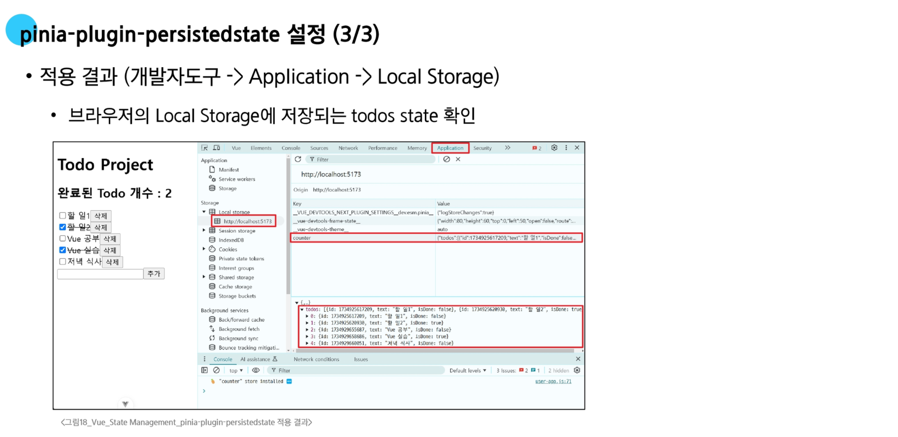

## 📚 참고

### 📦 Pinia 활용 시점

- **모든 데이터를 store에서 관리해야 하는가?**
  - `Pinia`를 사용한다고 해서 모든 데이터를 `state`에 넣어야 하는 것은 아니다
    - 컴포넌트 내부에서만 사용하는 데이터까지 `Pinia`로 관리하면, **코드가 불필요하게 복잡해진다**
  - `pass props`, `emin event`를 함께 사용하여 애플리케이션을 구성해야 한다
    - 단순한 부모-자식 데이터 전달은 `pinia`보다 `props`가 더 간단하고 직관적인 방법

- **Pinia 를 언제 사용해아 하나?**
  - Pinia는 공유된 상태를 관리하는데 유용하지만, 구조적인 개념을 이해하고 시작하는 비용이 크다
  - 애플리케이션이 **단순**하다면 **Pinia가 없는 것**이 더 효율적일 수 있다
  - 그러나 중대형규모의 *SPA*를 구축한는 경우 `Pinia`는 자연스럽게 선택할 수 있는 단계가 오게 된다
  - 적절한 상황에서 `Pinia`를 활용했을 떄 효용을 극대화 할 수 있다

# 🔥 요약 정리

- `Pinia`
  - `Vue`의 공식 상태 관리 라이브러리로, 컴포넌트들이 공유하는 상태를 관리하기 위한 중앙 저장소(store)를 제공
  - `Pinia`를 사용하면 어떤 컴포넌트든 `props`나 `emit` 없이 중앙 저장소에 직접 접근하여 상태를 읽거나 변경 가능하다
  - `state`
    - `ref()`로 정의된 반응형 데이터로, 여러 컴포넌트가 공유하는 상태의 원본
  - `getters`
    - `computed()`로 정의되며, `state`를 기반으로 하는 계산된 값으로 `state` 원본에 의존하기 때문에 캐싱(`caching`) 기능이 존재한다
  - `actions`
    - `function`으로 정의되며, `state`를 변경하는 메서드이다
    - 비동기 로직을 포함 가능하다

- `State Persistence`
  - `Pinia`의 상태는 기본적으로 메모리에 저장되므로, 페이지를 새로고침하면 초기화된다
  - `pinia-plugin-persistedstate`
    - `Pinia`의 상태를 브라우저의 `Local Storage`에 자동으로 저장하여, 새로고침해도 데이터가 유지되도록 하는 플러그인
  - `Local Storage`
    - 브라우저를 닫았다 열어도 데이터가 사라지지 않는 영구적인 웹 스토리지 객체
    - 플러그인을 설치하고 `main.js`에 등록한 후, `defineStore`의 세번째 인자로 `{persist: true}`옵션을 추가하면 해당 `store`의 상태가 자동으로 `Local Storage`에 저장

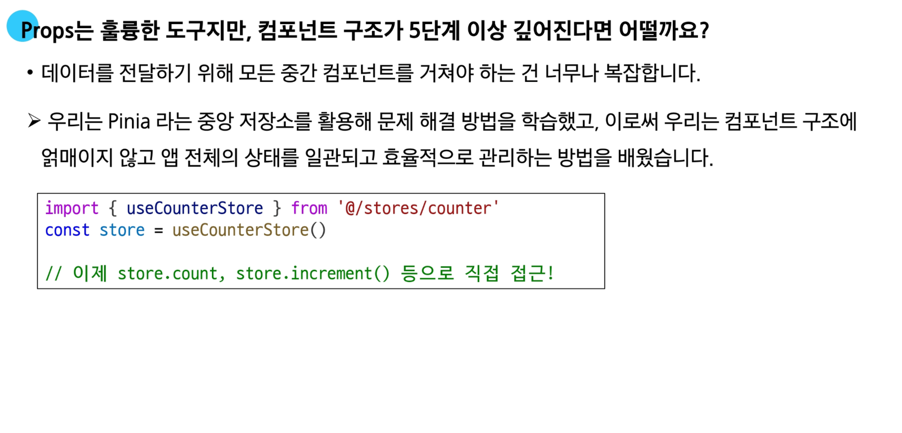