# 💻 Day_83 Vue with DRF 02

## ♻️ 인증 with DRF

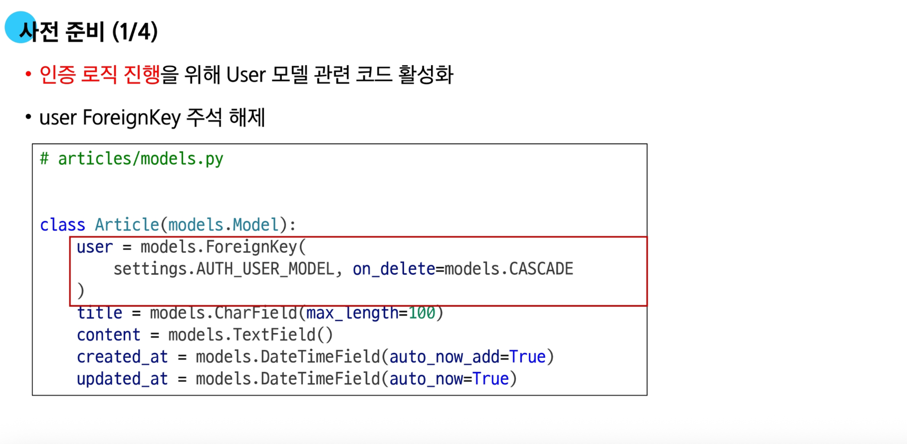

- `read_only_fields` : 사용자의 입력이 필요하지 않은 필드

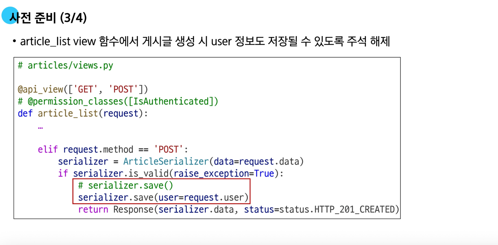
- 저장하지 않으면 Not Null 에러 발생
    - `read_only_fields` 라면 직접 데이터를 할당한다


- migrations 디렉토리를 통째로 삭제했다면 다시 만들고 `__init__.py` 를 만든다 (빈 파일이어도 괜찮다)


### 🔍 인증

- **[복습] 인증의 필요성**
  - 클라이언트와 서버 간의 상태정보를 유지하기 위해서 *쿠키*와 *세션을 사용*
    - 클라이언트 : `브라우저`
    - 서버 : `Django`
  - 사용자를 식별하기 위해서 필요한 과정이 인증(`Authentication`)
    - 아이디와 비밀번호
    - 소셜 로그인(`OAuth`)
        - 구글 로그인
        - 카톡 로그인
    - 생체 인증
        - 홍채 인식
        - 지문 인식
  - Django에서는 사용자 인증과 관련된 가장 중요하고 기본적인 뼈대를 제공한다 (`Django Authentications System`)

- **DRF에서의 인증**
  - DRF에서 인증을 알아보기 위해 공식문서를 보는 것이 중요
    - [https://www.django-rest-framework.org]
  - 인증은 항상 `view` 함수 시작 시 다른 코드의 진행이 허용되기 전에 실행된다
      - 수신 요청을 해당 요청의 사용자 또는 해당 요청이 서명된 토큰(`token`)과 같은 자격 증명 자료와 연결
  - 이후 인증이 완료된 해당 자격 증명을 사용하여 권한 및 제한 정책을 환인하고 요청읋 허용해야 하는지를 결정
  - 인증 자체로는 들어오는 요청을 허용하거나 거부할 수 없고, 단순히 요청에 사용된 자격 증명만 식별한다는 점

- **승인되지 않은 응답 및 금지된 응답**
  - 인증되지 않은 요청이 권한을 거부하는 경우 2가지 오류 코드 응답 (`400 번대`)
  1. `HTTP 401 Unauthorized` (**로그인 안됨**)
      - 요청에 유효한 인증 자격 증명이 없어 “사용자를 식별할 수 없다”를 의미
          - `API 요청`을 할 때 `API Key`를 누락하면 발생하는 에러
  2. `HTTP 403 Forbidden` (**권한 없음**)
      - 서버에 요청이 전달되었지만, *권한* 때문에 거절되었다는 것을 의미
          - `csrf` 토큰을 누락한 경우
      - 401과 다른 점은 서버는 클라이언트가 누구인지 알고 있다

### 🧭 인증 정책 설정

- **인증 정책 설정 방법 2가지**
  - `전역 설정`
    - (예: 로그인 해야만 요청을 처리한다)
  - `view 함수별 설정`
      - 특정 기능별로 설정 하는 것
      - (예: 로그인한 사람과 안 한 사람 모두 메인 페이지를 보여준다)

1. 전역 설정
  - 프로젝트 전체에 적용되는 기본 인증 방식을 정의
  - `DEFAULT_AUTHENTICATION_CLASSES`를 사용
    - 전역 설정은 `settings.py`에서 설정한다
  - 기본값 : `SessionAuthentication`과 `BasicAuthentication`
    - `BasicAuthentication` : 아이디와 비밀번호를 서버에 전달
    - `SessionAuthentication` : 쿠키키의 세션을 서버에 전달
  ```python
  REST_FRAMEWORK = {
      'DEFAULT_AUTHENTICATION_CLASSES': [
          'rest_framework.authentication.BasicAuthentication',
          'rest_framework.authentication.SessionAuthentication',
      ]
  }
  ```


- `article_list` 함수를 쓰려면 토큰 권한이나 베이직 권한이 필요하다

- **DRF가 제공하는 인증 체계**
1. BasicAuthentication
  - 요청마다 사용자 이름과 비밀번호를 `Base64`로 인코딩하여 `Authorization` 헤더에 담아 보내는 방식
2. **TokenAuthentication**
    - 로그인 시 발급받은 고유한 토큰(`Token`)을 `Authorization` 헤더에 담아 요청함으로써 사용자를 인증하는 방식
    - *프론트와 백을 구분해서 개발할 때 활용*
3. `SessionAuthentication`
    - 장고의 기본 세션 시스템을 활용하여, 브라우저가 보내는 `sessionid` 쿠키를 통해 사용자를 인증하는 방식
    - Django에서만 개발하는 경우
4. RemoteUserAuthentication
    - 웹 서버 등 외부 시스템이 이미 처리한 인증결과를 신회하고, 전달받은 사용자 이름으로 사용자를 인증하는 방식
    - 통합 로그인 방식(하위 페이지 자동 로그인)

- **TokenAuthentication**
  - Token 기반 HTTP 인증 체계
  - 로그인 시 발급받은 고유한 토큰을 Authorization 헤더에 담아 요청함으로써 사용자를 인증하는 방식
  - 기본 데스크탑 및 모바일 클라이언트와 같은 클라이언트 서버 설정에 적합
  - *서버가 인증된 사용자에게 토큰을 발급하고 사용자는 매 요청마다 발급받은 토큰을 요청과 함께 보내 인증 과정을 거침*


### 🔑 Token 인증 설정

- **TokenAuthentication**
  1. 인증 클래스 설정
  2. INSTALLED_APPS 추가
  3. Migrate 진행


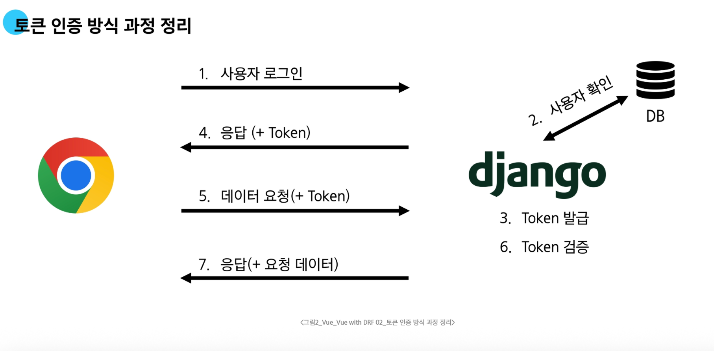

### 🗂️ Dj-Rest-Auth 라이브러리

- **Dj-Rest-Auth**
  - 회원가입, 로그인/로그아웃, 비밀번호 재설정, 소셜 로그인 등 다양한 인증 관련 기능을 API 엔드포인트로 제공하는 라이브러리
  - `dj-rest-auth`는 `django.contrib.auth`를 대체하는 것이 아니라, 그 위에 만들어져 기능을 확장
  - **인증 기능을 RESTful API로 제공**


- 공식 문서를 활용해서 설치
    - https://dj-rest-auth.readthedocs.io/en/latest/

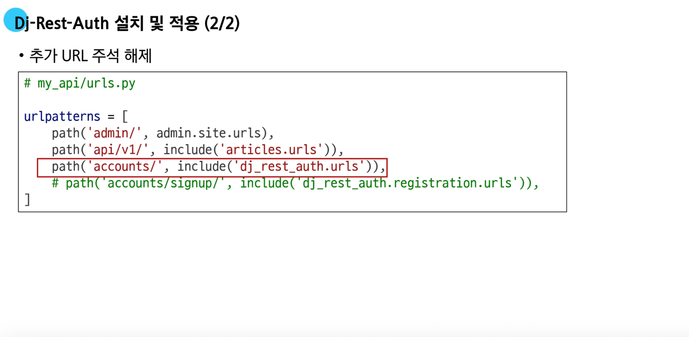


- `pip install dj-rest-auth[with social]`
    - 소셜 로그인 기능까지 설치가 가능

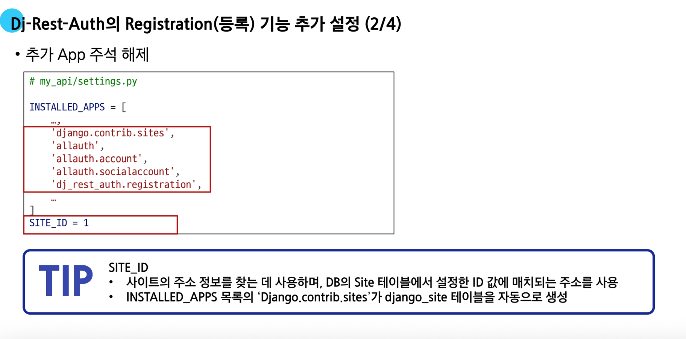

- `allauth` 공식 문서
    - https://docs.allauth.org/en/latest/installation/quickstart.html
    - LLM에 물어보면 없는 버전을 업그레이드 하라고 하기 때문에 공식문서를 보는 연습이 필요하다

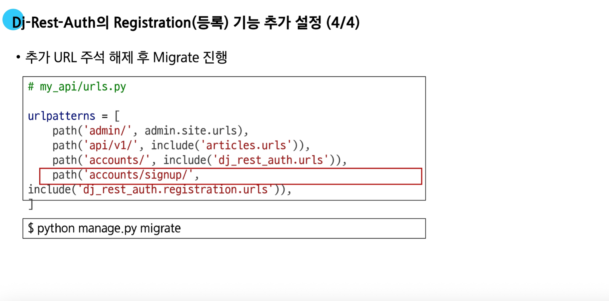

### 💽 Token 발급 및 활용
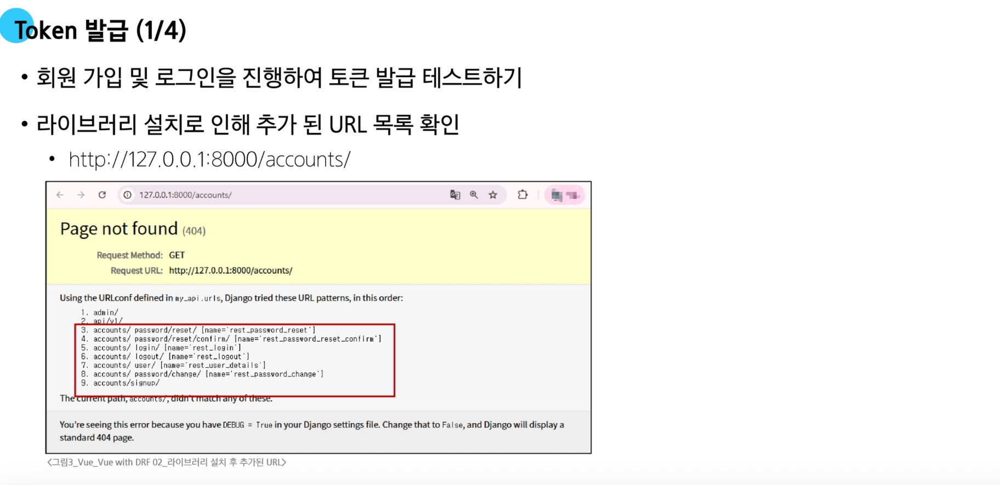
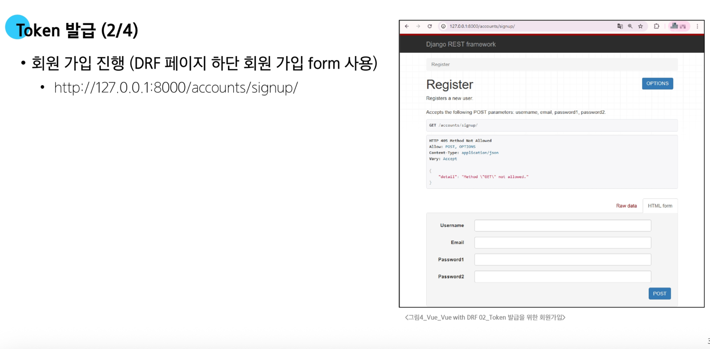
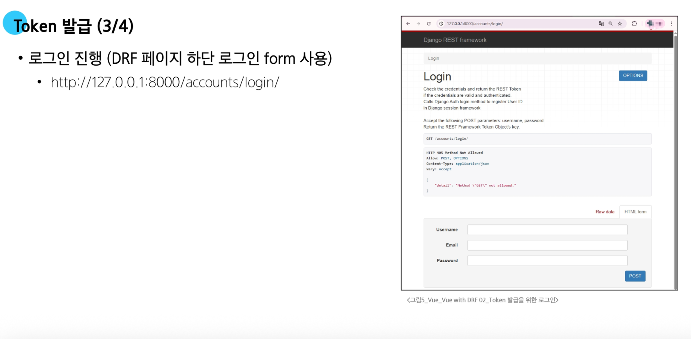


- 글 작성시 유저 정보가 필요하고 토큰을 통해 작성이 가능하다


## 🛠️ 권한 with DRF

### ⚙️ 권한 정책 설정

- **권한 정책 설정**
  1. 전역 설정
  2. View 함수 별 설정

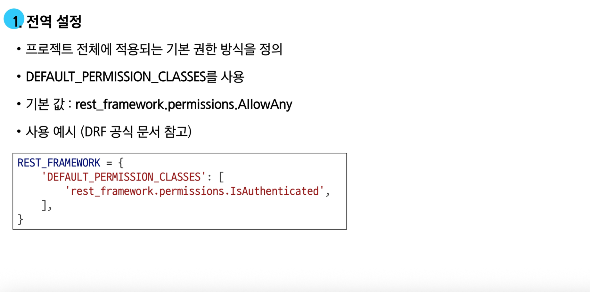
- `IsAuthenticated` : 인증된 사용자만


---

- **DRF가 제공하는 권한 정책**
  1. **IsAuthenticated**
    - 인증된(로그인한) 사용자만 접근을 허용
  2. IsAdminUser
    - 스태프 권한(is_staff=True)을 가진 관리자 사용자만 접근을 허용
  3. IsAuthenticatedOrReadOnly
    - 인증된 사용자는 모든 요청(읽기/쓰기)을 허용하고, 비인증 사용자는 읽기 전용 요청만 허용
  4. **AllowAny**
    - 아무런 제한 없이 모든 사용자의 접근을 허용


  - API 관리에 활용

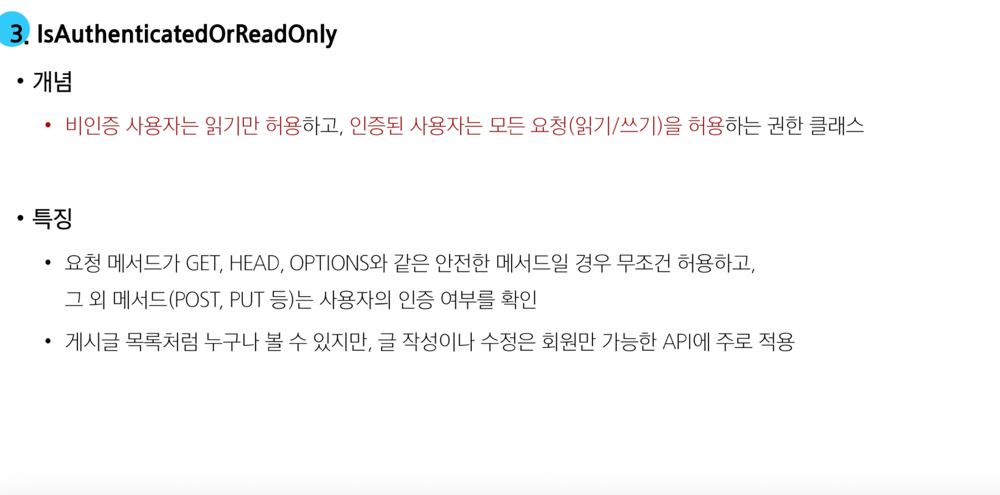
  - 비인증 사용자는 읽기만 허용하고 인증된 사용자는 모든 요청을 허용

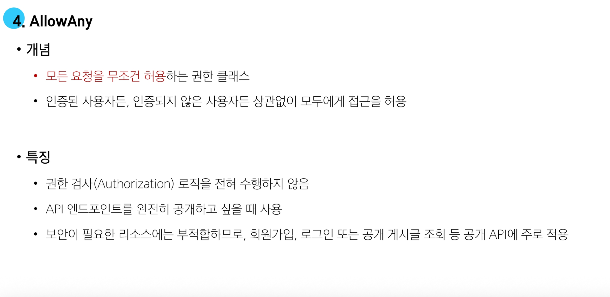

### 🔧 IsAuthenticated 설정


  - 인증된 사용자(로그인한)만 접근 가능하게 하는 방법

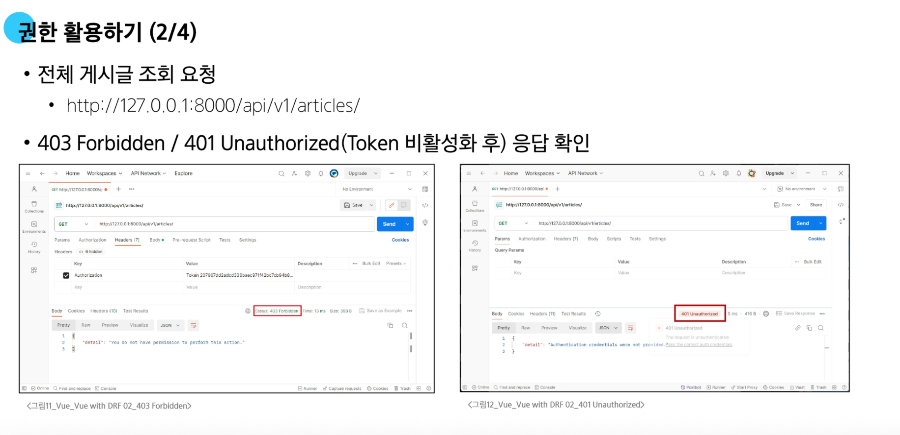
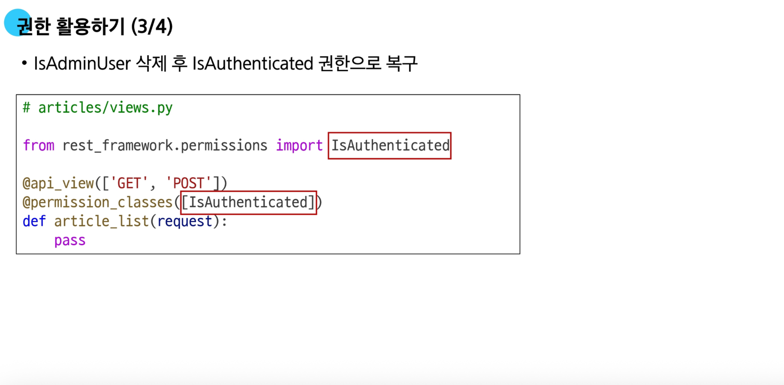


# 🔥 요약 정리

- **인증 (Authentication)**
  - 요청을 보낸 사용자가 누구인지 식별하는 과정이며, 인증 자체는 접근을 허용하거나 거부하지 않는다

- **권한 (Permission)**
  - 인증된 사용자가 특정 요청을 보낼 자격이 있는지 결정하는 과정

- **HTTP 응답 코드**
  - `401 Unauthorized`
    - 유효한 인증 정보가 없어 요청이 실패했음을 의미 (로그인되지 않은 상태)
  - `403 Forbidden`
    - 인증은 성공했지만, 해당 요청에 대한 권한이 없음을 의미

- **DRF 토큰 기반 인증**
  - 사용자가 로그인하면, 서버는 고유한 토큰(`Token`)을 발급
  - 클라이언트(`Vue`)는 이 토큰을 저장
  - 이후 서버에 데이터를 요청할 때마다, 헤더의 `Authorization` 필드에 `Token <key>`형식으로 토큰을 담아 보낸다
  - 서버는 이 토큰을 검증하여 사용자를 식별하고 인증

- **dj-rest-auth 라이브러리**
  - DRF에서 회원가입, 로그인 등 인증 관련 API 엔드포인트를 쉽게 구현할 수 있도록 도와주는 라이브러리
  - `settings.py`에서 `DEFAULT_AUTHENTICATION_CLASSES`를 `TokenAuthentication`으로 설정하여 프로젝트 전반에 토큰 인증을 적용

- **DRF 권한 설정**
  - 전역 설정
    - `settings.py`의 `DEFAULT_AUTHENTICATION_CLASSES`에서 프로젝트 기본 권한을 설정
  - View별 설정
    - `@permission_classes` 데코레이터를 사용하여 특정 `View 함수`에만 다른 권한을 적용
  - 주요 권한 클래스
    - `isAuthenticated` : 인증된 사용자에게만 접근을 허용
    - `isAuthenticatedOrReadOnly` : 비인증 사용자에게는 읽기만 허용하고, 인증된 사용자에게는 모든 작업을 허용
    - `AllowAny` : 모든 사용자에게 접근을 허용

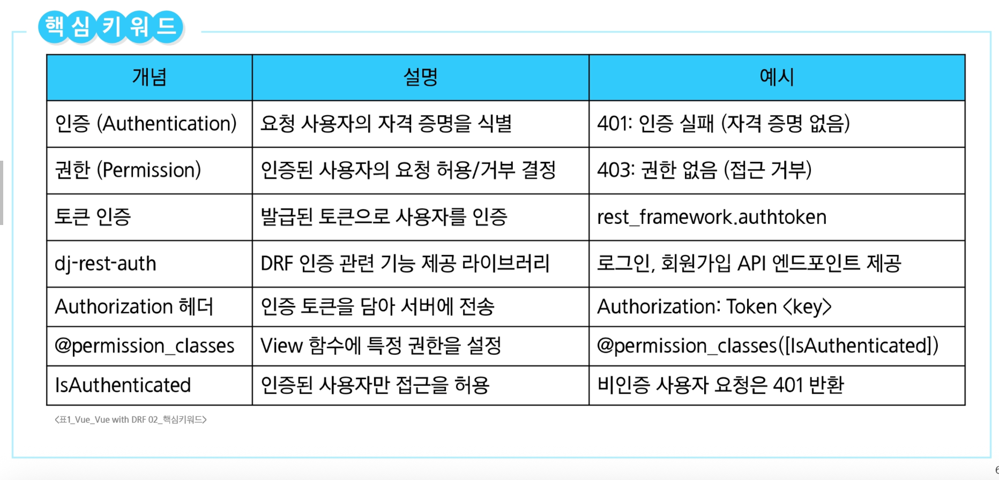
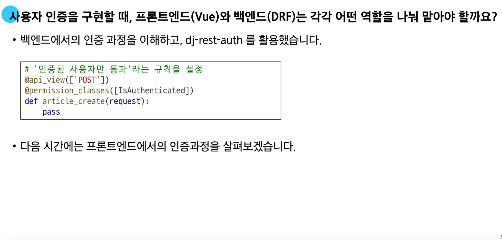