# 📚 Day_78 Basic Syntax 02

## 🚀 Computed Property

### 🔧 Computed

- **computed()**
  - *계산된 속성*을 정의하는 함수
  - 미리 계산된 속성을 만들어 템플릿의 표현식을 단순하게 하고, 불필요한 반복 연산을 줄여 준다

- **Computed 가 없는 경우**
  - 할 일이 남았는지 여부에 따라 다른 메세지를 출력하기
  ```html
  <!-- computed.html -->

  const todos = ref([
    { text : "Vue 실습" },
    { text : "자격증 공부" },
    { text : "TIL 작성" },
  ])
  ```
  ```html
  <h2>남은 할 일</h2>
  <p>{{ todos.length > 0 > '아직 남았다' : '퇴근!' }}</p>
  ```
  - 템플릿이 복잡해지며 todos에 따라 계산을 수행하게 된다
  - 만약 이 계산을 템플릿에 여러 번 사용하는 경우에는 매번 계산이 발생한다

- **Computed를 사용하는 경우**
  - 반응형 데이터를 포함하는 복잡한 로직의 경우 `computed`를 활용하여 미리 값을 계산하여 계산된 값을 사용
  - 여러 곳에서 사용해야 한다면, `computed`로 정의된 `restOfTodos`를 필요한 곳마다 재사용하면 된다
  ```javascript
  const { createApp, ref, computed} = Vue
  
  const restOfTodos = computed(() => {
    return todos.value.length > 0 ? '아직 남았다' : '퇴근!'
  })
  ```
  ```html
  <h2>남은 할 일</h2>
  <p>{ restOfTodos }</p>
  ```

- **computed 특징**
  - 반환되는 값은 계산된 `ref(computed ref)`이며, 일반 `ref`와 유사하게 계산된 결과를 `.value`로 참조 가능 (템플릿에서는 `.value` 생략 가능)
  - `computed` 속성은 의존된 반응형 데이터를 **자동으로 추적**
  - 의존하는 반응형 데이터가 **변경될 때만 재평가**
    - `restOfTodos`의 계산은 `todos`에 의존하고 있다
    - 따라서 `todos`가 변경될 떄만 `restOfTodos`가 업데이트 된다
    ```javascript
    const restOfTodos = computed(() => {
      return todos.value.length > 0 ? '아직 남았다' : '퇴근!'
    })
    ```

### ⚙️ Computed vs Methods
- **computed와 동일한 로직을 처리할 수 있는 method**
  - `computed` 속성 대신 `method`로도 동일한 기능을 정의할 수 있다
  ```javascript
  // coputed 예시

  const { createApp, ref, computed} = Vue
  
  const restOfTodos = computed(() => {
    return todos.value.length > 0 ? '아직 남았다' : '퇴근!'
  })
  ```
  ```html
  <h2>남은 할 일</h2>
  <p>{ restOfTodos }</p>
  ```
  ```javascript
  // method 예시

  const restOfTodos = function() {
    return todos.value.length > 0 ? '아직 남았다' : '퇴근!'
  }
  ```
  ```html
  <p>{{ getRestOfTodos() }}</p>
  ```

- **computed와 method 차이**
  - `computed` 속성은 **의존하는 반응형 데이터를 기반으로 그 결과를 캐시(cached)**
  - 의존하는 데이터가 변경된 경우에만 재평가 된다
  - 의존하는 데이터가 변경되지 않는 한, 해당 `computed` 속성에 여러 번 접근해도 함수를 다시 실행하지 않고 캐시된 결과를 즉시 반환
  - *반면, `method` 호출은 다시 렌더링이 발생할 떄마다 항상 함수를 실행*
  - 템플릿에서 `computed`는 괄호 없이, `method`는 괄호를 붙여 호출한다

- **캐시**
  - 데이터나 결과를 일시적으로 저장 해두는 임시 저장소
  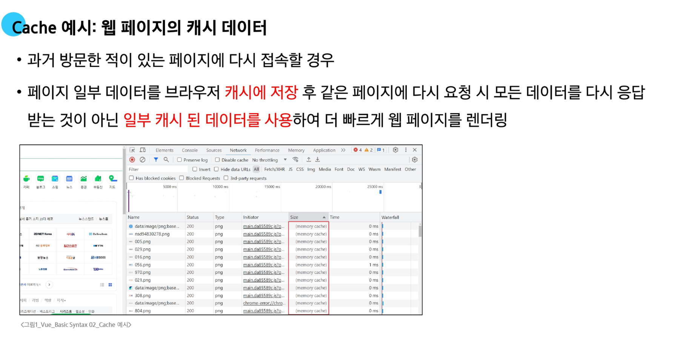

- **computed 와 method의 적절한 사용처**
  - `computed`
    - 의존하는 데이터에 따라 결과가 바뀌는 계산된 속성을 만들 때 유용
    - 동일한 의존성을 가진 여러 곳에서 사용할 때 계산 결과를 캐싱하여 중복계산 방지

  - `method`
    - 단순히 특정 동작을 수행하는 함수를 정의할 떄 사용
    - 데이터에 의존하는지 여부와 관계없이 항상 동일한 결과를 반환하는 함수

  


## 📦 Conditional Rendering

### 🔑 v-if

- `v-if`
  - 표현식 값의 true/false를 기반으로 요소를 조건부로 렌더링
  - 특정 조건이 참이라면 화면에 보여주고, 거짓이라면 DOM에서 완전히 제거 된다
  - 로그인 여부에 따라 로그인 창을 표시하는 페이지를 구현할 수 도 있다
  

- `v-else`
  - `v-if`의 조건이 참이 아니라면 실행
  

- `v-else-if`
  - `v-if`에 대한 `else if` 블록을 나타낼 수 있다
  - `name`에 할당된 값을 바꾸면 조건 맞는 태그가 보인다
  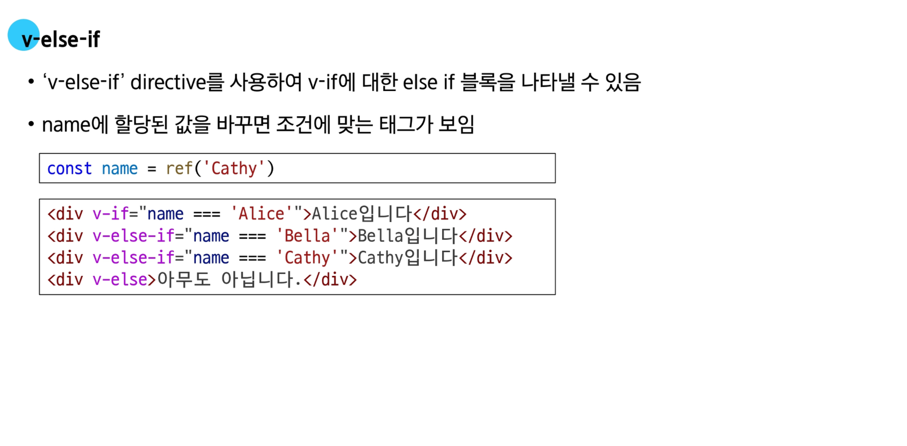
  - 요소를 연속되게 작성해야 정상 실행이 된다
    - 연속되지 않고 중간에 가로 줄이나 공백 등도 작성 불가능하다

- 여러 요소에 대한 `v-if`적용
  - `<template>` 요소에 `v-if`를 사용하면, 여러 요소를 하나의 조건부 블록으로 묶을 수 있다
  

### ✨ v-if vs v-show

- `v-show`
  - 표현식 값의 `true/false`를 기반으로 요소를 보여주거나 숨기는 기능
  - `v-if`와 달리 `v-show`는 CSS의 display 속성을 `none`으로 바꿔 화면에서만 보이지 않게 숨긴다

- `show 예시`
  - `v-show`를 사용한 요소는 조건과 관계없이 항상 DOM에서 렌더링 된다
  - CSS display 속성만 전환하기 때문
  ```javascript
  const isShow = ref(false)
  ```
  ```html
  <div v-show="isShow">v-show</div>
  ```
  ```html
  <div style="display: none;">v-show</div>
  ```

- `v-if`와 `v-show`의 적절한 사용처
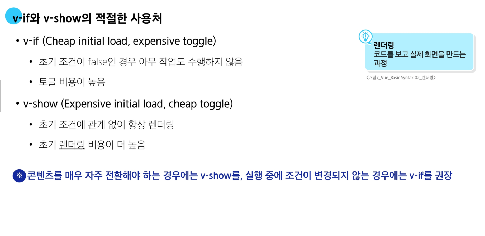


## 🚀 List Rendering

### 🔑 v-for

- `v-for`
  - 소스 데이터를 기반으로 요소 또는 템플릿 블록을 반복 렌더링
  - 배열이나 객체의 데이터를 렌더링하는 반복문

- `v-for` 구조


- `v-for` 예시


- 여러 요소에 대해 `v-for`적용


- 중첩된 `v-for`


### ✨ v-for with key

  - `v-for`는 반드시 `key`와 함께 쓴다 (Vue3 이후 필수)

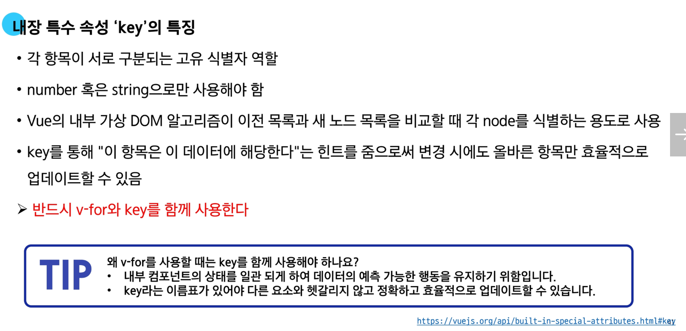

- **올바른 key 선택 기준**
  - 권장되는 `key`
    - 데이터베이스의 고유 ID
    - 항목 고유 식별자 (예: UUDI)
  - 피해야 할 `key`
    - 배열 인덱스(index)
    - 객체 자체

### ✨ v-for with v-if

  - `v-for`와 `v-if`는 하나의 요소에 같이 사용 불가


- `v-for`와 `v-if` 해결법 2가지
  1. computed 활용
  2. v-for와 <template> 요소 활용


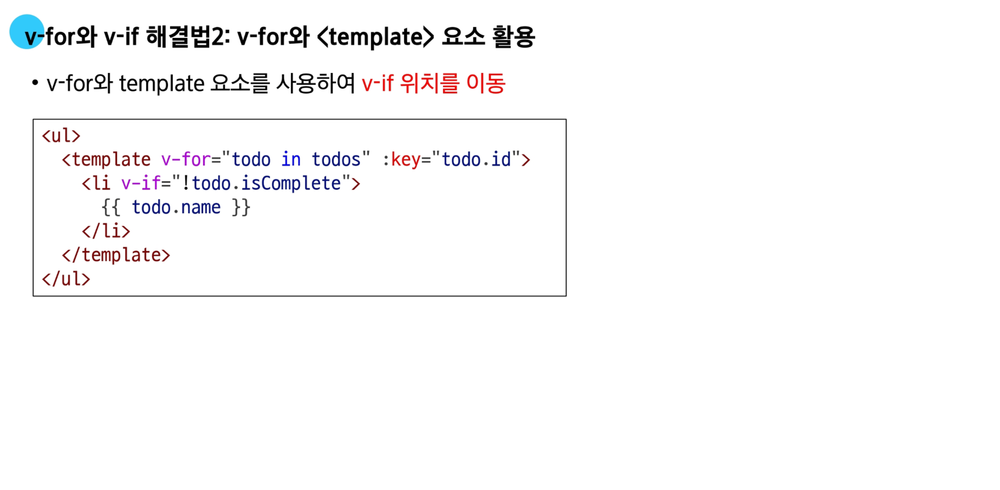


## 🚀 Watchers

### 🔑 watch

- `watch()`
  - 하나 이상의 반응형 데이터를 감시하고, 데이터가 변경되면 콜백함수 호출
  - 데이터가 바뀔 때 특정 행동을 수행하기 위해 사용

- `watch` 구조
  ```javascript
  watch(source, (newValue, oldValue) => {
    // do someting
  })
  ```
  1. 첫 번째 인자 (source)
    - watch가 감시하는 대상 (반응형 변수, 값을 변환하는 함수 등)
  2. 두 번째 인자 (callback function)
    - source가 변경될 때 호출되는 콜백 함수
    1. newValue
      - 감시하는 대상이 변화된 값
    2. oldValue(optional)
      - 감시하는 대상의 기존 값

- `watch` 기본 동작


- `watch` 예시
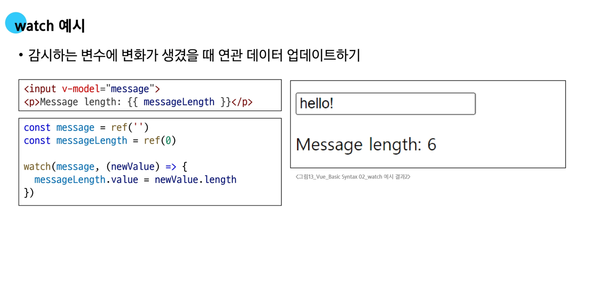

- 여러  `source`를 감시하는 `watch`
```javascript
watch([foo, bar], ([newFoo, newBar], [prevFoo, prevBar]) => {
  /*...*/
})
```

### ✨ computed vs watch
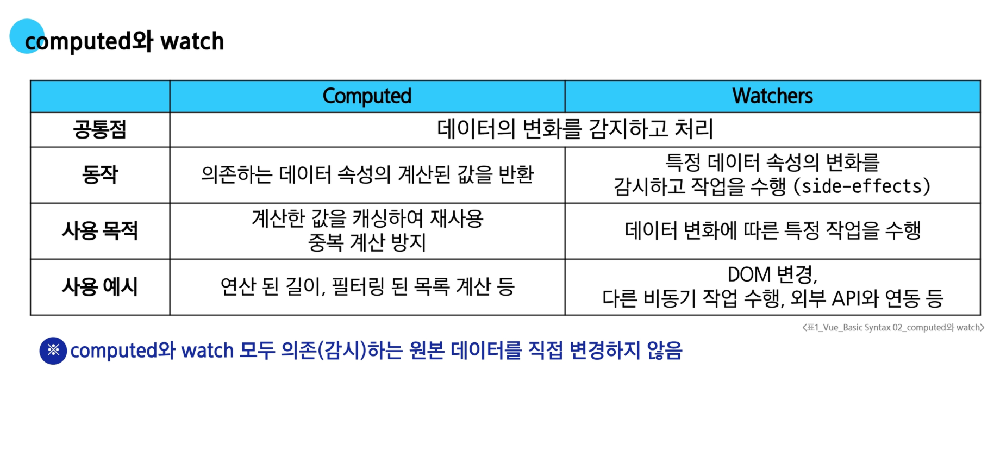


## ⚙️ Lifecycle Hooks
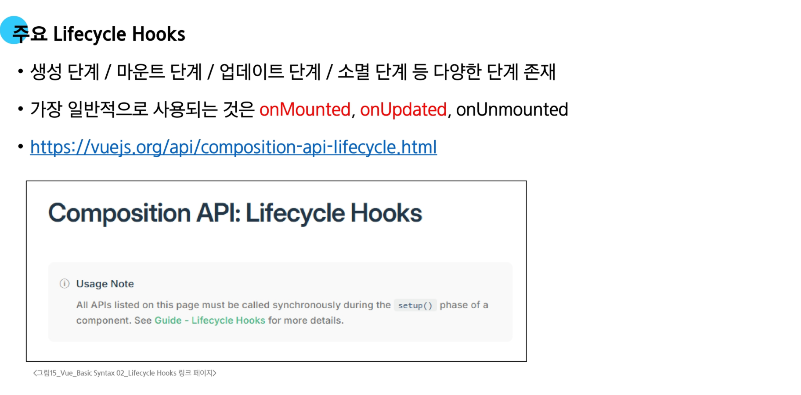
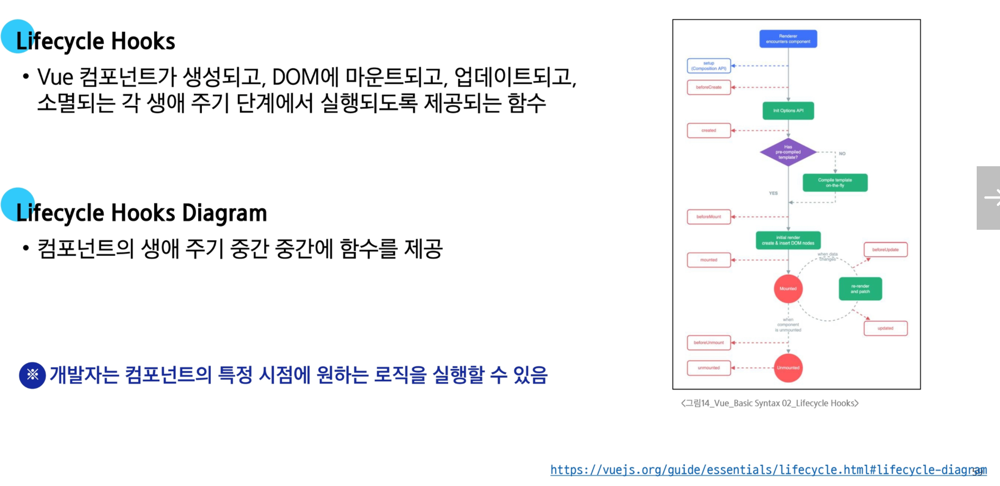
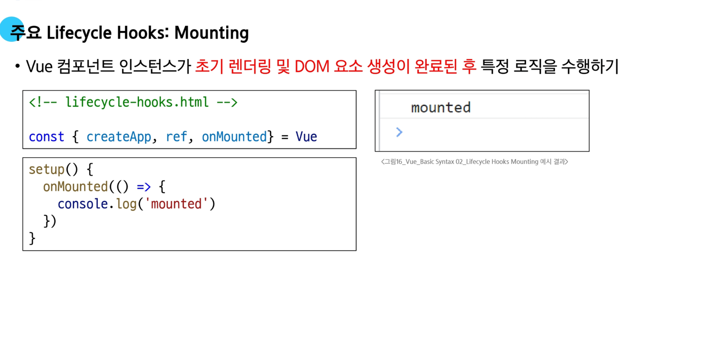


### 🔑 Lifecycle Hooks


## 🚀 Vue Style Guide
- **Vue Style Guide**
  - Vue의 스타일 가이드 규칙은 우선순위에 따라 4가지 범주로 나뉜다
  - 규칙 범주
    - 우선순위 A : 필수로 지켜야 하는 사항
    - 우선순위 B : 적극 권장하는 사항
    - 우선순위 C : 권장하는 사항
    - 우선순위 D : 주의 필요


## 📚 참고

### 💡 computed 주의사항


### 💡 Lifecycle Hooks 주의사항

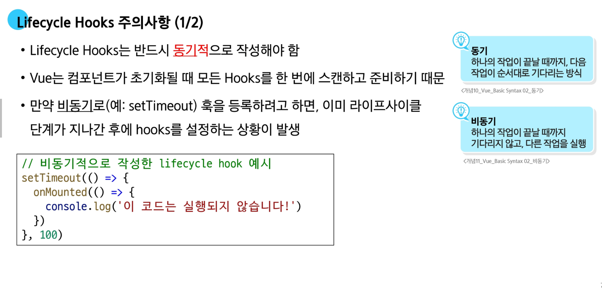

### 💡 v-for와 배열을 활용한 “필터링/정렬”
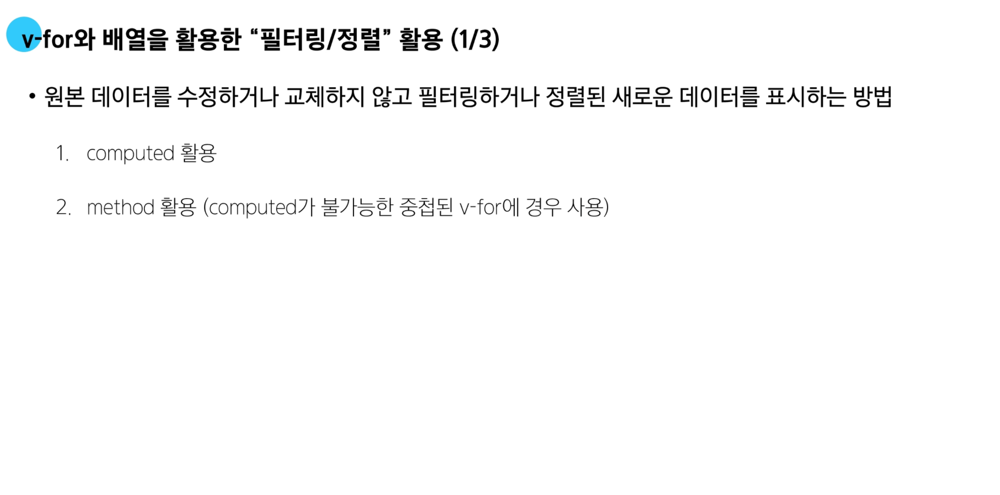
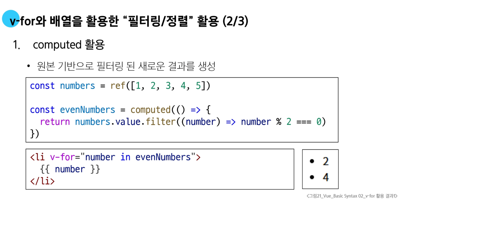
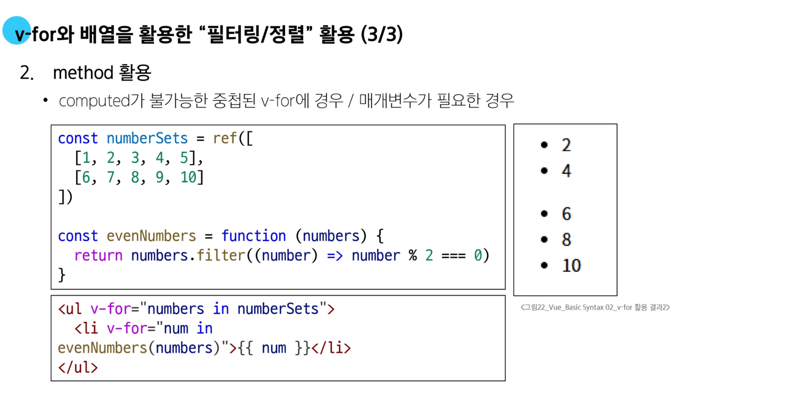

### 💡 배열 변경 관련 메서드


### 💡 Todo 애플리케이션 구현


## 🔥 요약 정리


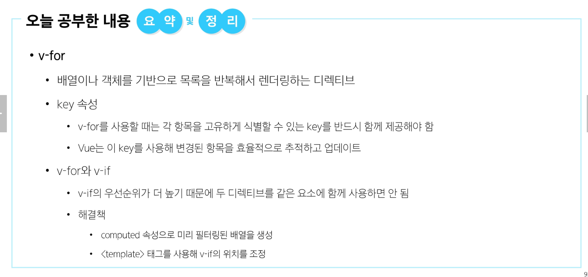


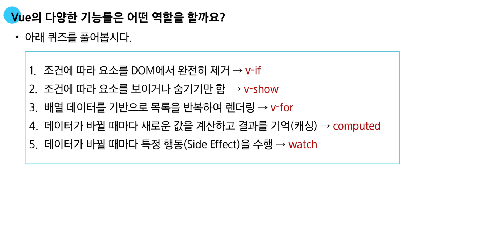