# 💻 Day_79 Single File Components

## 🌍 Single File Components

### 🔑 Component

- `Component`
  - 재사용이 가능한 코드 블록

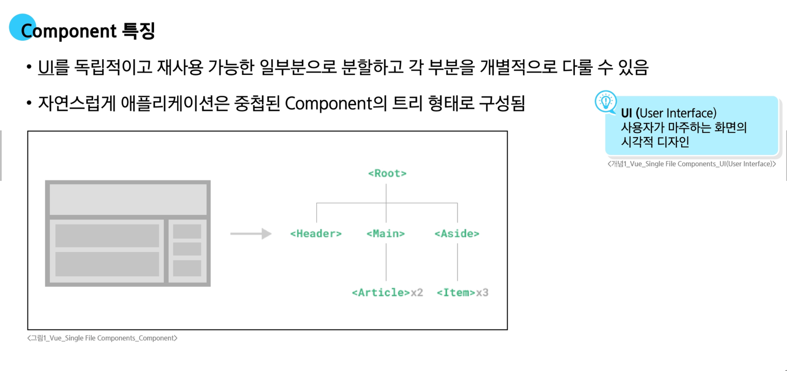
  - 전체 페이지가 Root
  - 최상단은 header
  - 그 아래는 main, aside


- **Single File Components**
  - 컴포넌트 템플릿, 로직 및 스타일을 하나의 파일로 묶어는 파일 형식
  - `.vue` 라는 파일이 싱글 파일 컴포넌트 이다
  - 컴포넌트 파일 내부에는 html 화면 구조를 작성하는 `<template>`, JS로직을 작성하는 `<script>`, 스타일을 담당하는 `<style>` 3곳으로 나누어져 있다.
  


### 🔑 SFC 구성요소

- **SFC 구성요소**
  - `.vue` 파일은 세가지 유형의 최상위 언어 블록 `<template>`, `<script>`, `<style>` 으로 구성된다
  - 순서는 상관 없으나 일반적으로 `template -> script -> style` 순서로 작성한다 (수업도 동일 방식)

  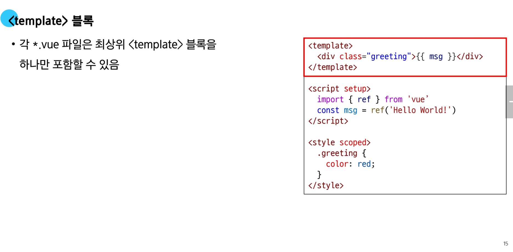
  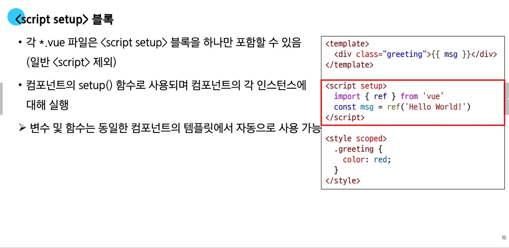
  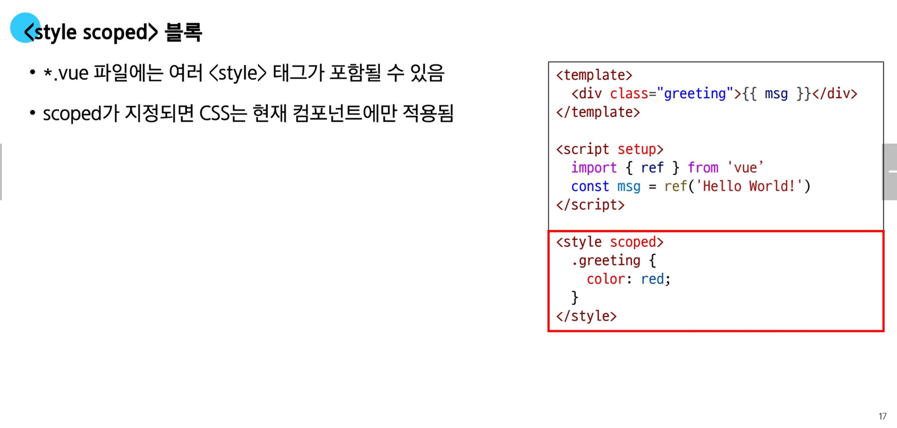

- **컴포넌트 사용하기**
  - `https://play.vuejs.org/` 에서 `Vue` 컴포넌트 코드 작성 및 미리보기
  - `Vue SFC`는 일반적인 방법으로는 실행할 수 없으며 컴파일러를 통해 컴파일된 후 빌드 되어야 한다
  - 실제 프로젝트에서는 `Vite`와 같은 공식 *빌드(build)* 도구를 사용한다
  - `빌드(build)`
    - 개발자가 쓴 소스 코드를 실행 가능한 파일로 변환하는 과정


## 🚀 SFC build tool

### 🔑 Vite

- **Vite**
  - 프론트 엔드 개발을 위한 빌드 도구
  - 빠른 개발 환경을 위한 빌드 도구와 개발 서버를 제공

-**Build**
  - 프로젝트의 소스 코드를 최적화 하고 번들링하여 베포할 수 있는 형식으로 변환하는 과정
  - `Vite`는 이러한 **빌드 프로세스를 수행하는 데 사용되는 도구**

### 📦 Vue Project

- **Vue Project 생성**
  1. Vue Project(Application) 생성 (Vite 기반 필드)
    ```javascript
    $ npm create vue@latest
    ```
  
  2. 프로젝트명 설정
    - `tab` 클릭 시 기본 값 사용
    - `enter` 클릭시 결정 후 진행

  3. 프로젝트에 추가 할 설정 선택
    - `space` 클릭 시 중복 선택 가능
    - `enter` 클릭 시 결정 후 진행
  
  4. 실험용 기능을 설치할 지 묻는 단계
    - 버그가 있거나 안정적이지 않을 수 있다
    - 해당 기능을 꼭 사용할 필요는 없다

  5. 프로젝트 생성 완료

  6. 프로젝트 폴더 이동
    ```javascript
    $ cd vue-project
    ```
  
  7. 패키지 설치
    ```javascript
    $ npm install
    ```

  8. Vue 프로젝트 서버 실행
    ```javascript
    $ npm run dev
    ```

### 📝 NPM

- **NPM**
  - Node Package Manager
  - Node.js의 기본 패키지 관리자
  - python의 pip와 동일한 역할

- **Node.js**
  - 브라우저 안에서만 동작하던 `JS`를 브라우저가 아닌 **서버 측에서도 실행** 할 수 있게 하는 도구
  - 로컬에서 서버 개발을 할 수 있는 환경
  - 하나의 언어로도 풀스택 구현이 가능해졌다

### 🔒 모듈과 번들러

- **Module**
  - 프로그램을 구성하는 독립적인 코드 블록 (.js 파일)

- **Module의 한계**
  - 애플리케이션이 점점 더 발전함에 따라 처리해야 하는 JS 모듈의 개수도 극적으로 증가했다
  - 모듈 간의 의존성(연결성)이 깊어지면서 특정한 곳에서 발생한 문제가 어떤 모듈 간의 문제인지 파악하기 어려워 졌다
    - 이를 해결하기 위해 `Bundler` 도구가 생겼다
  

- **Bundler**
  - 모듈 파일을 번들로 묶어서 최적화 하여 사용할 수 있게 만들어주는 도구
  - 의존성 관계를 파악해서 필요한 내용을 하나의 파일로 합쳐준다
  - 하나의 파일로 되다 보니 브라우저가 이해하기 쉽고 웹사이트의 로딩 속도가 빨라진다

- **Bundler의 역할**
  - 의존성 관리
  - 코드 최적화
  - 리소스 관리


## 📜 Vue Project 구조

### 📱 기본 구조

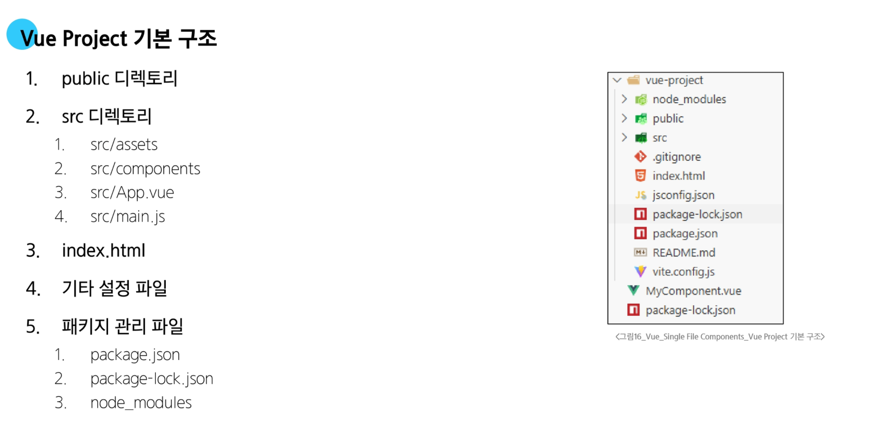

1. `public` 디렉토리
  
  - `public` 디렉토리 안의 favicon은 웹페이지의 탭 왼쪽에 표시되는 아이콘
  - 소스코드에서 참조되지 않는 코드 (번들러로 합쳐질 필요가 없는 파일)
      - `robots.txt` (크롤링 할 때 정책 작성 파일)
      - `favicon` (웹 페이지 탭 좌측 아이콘)
  - 수업할 때는 퍼블릭 디렉토리를 수정할 필요가 없다

2. `src` 디렉토리
  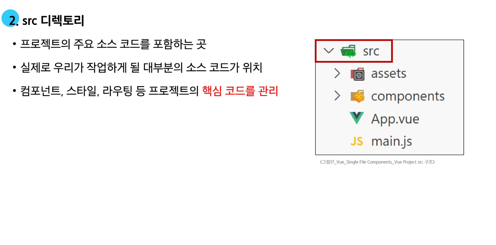
  - `src` 디렉토리는 우리가 수업에서 가장 많이 사용한다
  - 실질적으로 페이지에 가져다 쓰는 것들 (`asset`에 넣어서 사용)

  1) `assets`
    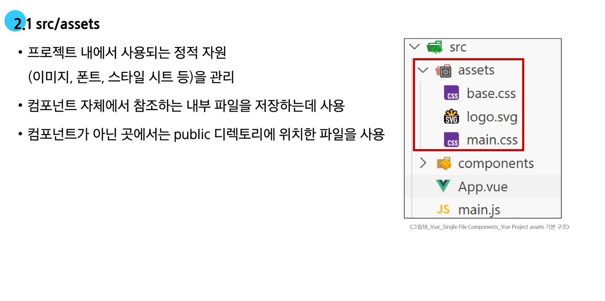
    - 대부분 에셋에서 불러온다
  
  2) `components`
    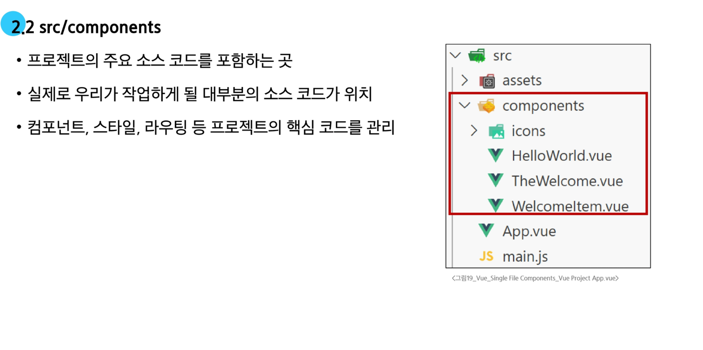

  3) `App.vue`
    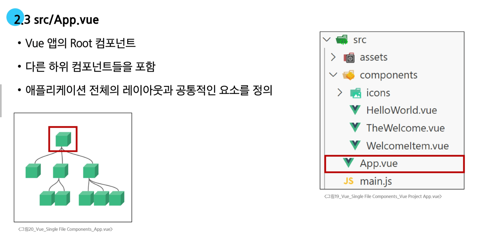
    - `App.vue` 는 최상위 컴포넌트이다. (Root)
    - 전체 웹 페이지의 레이아웃을 설정할 때 사용한다
    - 주요 컴포넌트

  4) `main.js`
    
    - `main.js` 는 필요한 라이브러리를 `import`를 하고 전역 설정을 수행한다
    - `html`과 `DOM`을 연결한다
  
3. `index.html`
  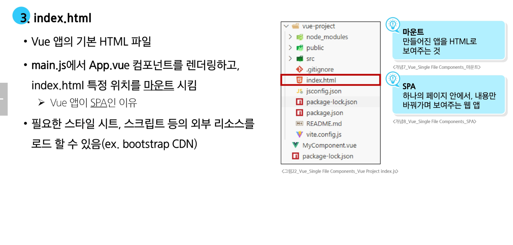
  - 실제로 유저가 받는 `html` 파일
  - 부트스트랩 `CDN`을 넣어서 활용할 수도 있다

4. 기타 설정 파일
  


### 📦 패키지 관리

5. **패키지 관리**
  1) `package.json`
    - 프로젝트 기본정보와 패키지 의존성을 정의하는 설계도 파일
    - nom install 시 참조하여 패키지를 설치
    - *집을 짓기 전에 필요한 재료 목록과 건축 계획서*

  2) `package-lock-json`
    - 실제 설치된 패키지들의 정확한 버전 정보를 기록하는 파일
    - 다른 환경에서도 동일한 패키지 구성을 재현 가능하게 한다
    - *장바구니에 담긴 물건들의 정확한 브랜드와 생산일자가 적힌 구매 내역서*

  3) `node_modules`
    - 실제로 설치된 모든 패키지가 저장되는 곳
    - `GitHub` 같은 원격 저장소에 올리지 않는다
    - `venv`처럼 `gitignore`에 포함되어야 할 항목
    - *계획서와 내역서대로 확보한 실제 건축 자재들이 쌓여있는 창고*

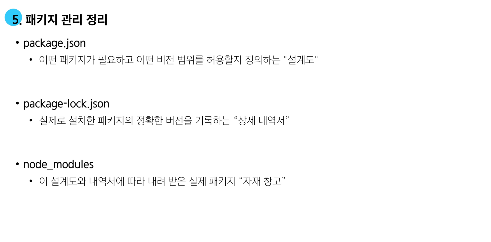

## ✨ Vue Component 활용


  - `.vue` 를 생성할 때는 `component` 폴더 안에 만들면 된다
  
  - `vb3s(vue-base-3)`를 통해 자동완성을 하고 `lang` 부분만 지운다

  - 컴포넌트를 배치한다 (수업시간에는   <MyComponent /> 처럼 싱글 태그를 사용한다)

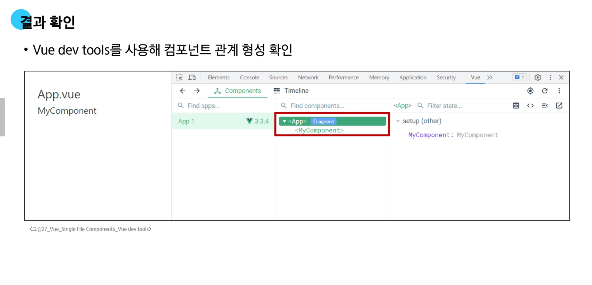
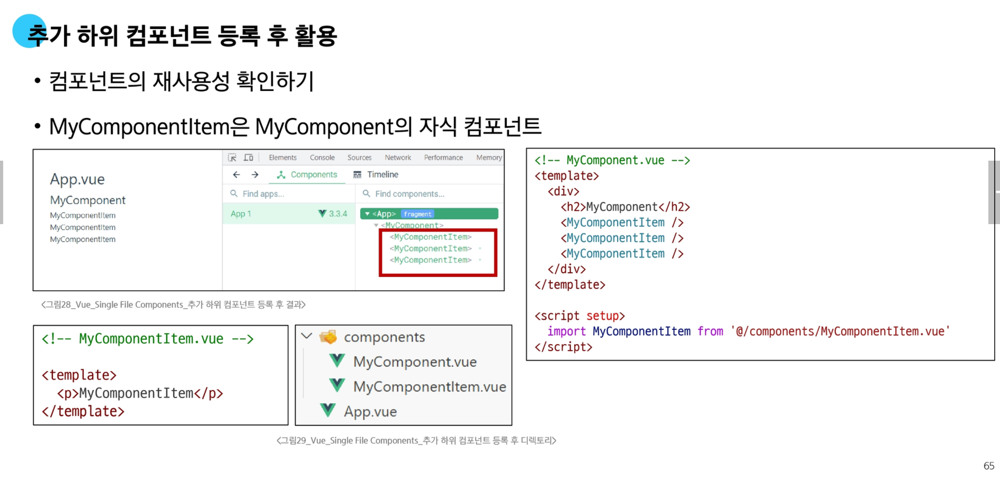


## 🧠 추가 주제

### 💻 Virtual DOM


- **Virtual DOM**
  - 가상의 `DOM`을 메모리에 저장하고 실제 `DOM`과 동기화하는 프로그래밍 개념

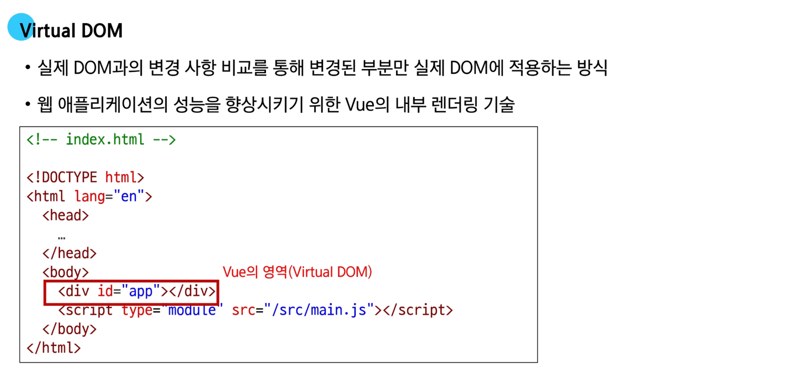
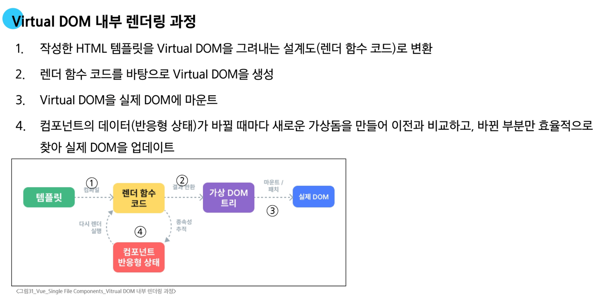

- **Virtual DOM 패턴의 장점**
  1. 효율성
    - 실제 `DOM` 조작을 최소화 하고, 변경된 부분만 업데이트하여 성능을 향상
  2. 반응성
    - 데이터의 변경을 감지하고 `Virtual DOM`을 효율적으로 갱신하여 `UI`를 자동으로 업데이트
  3. 추상화
    - 개발자는 실제 `DOM` 조작을 `Vue`에게 맡기고 컴포넌트의 템플릿을 활용하는 추상화된 프로그래밍 방식을 원하는 `UI`구조를 구성하고 관리할 수 있다


### ✨ Composition API & Option API

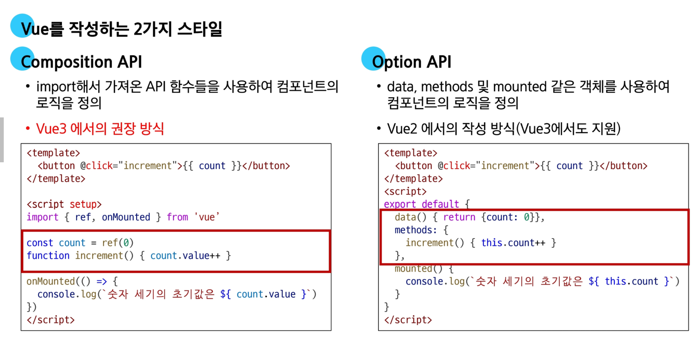
  - 좌측은 `Vue3` 방식, 우측은 `Vue2` 방식


## 📚 참고

### 💡 Single Root Element
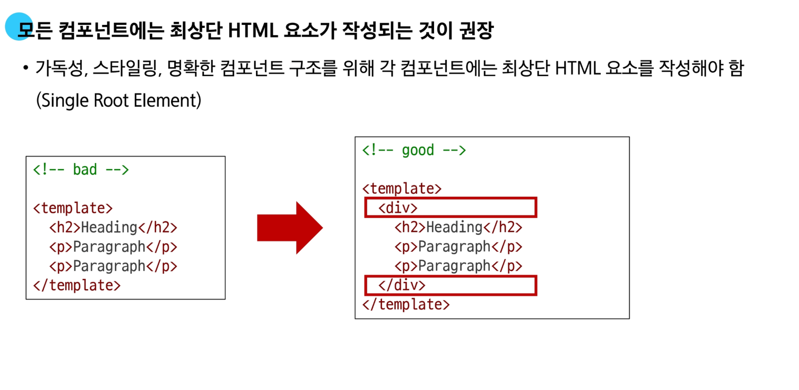

### 💡 CSS scoped
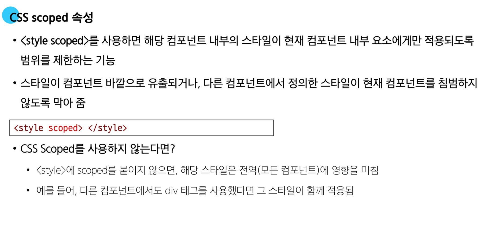


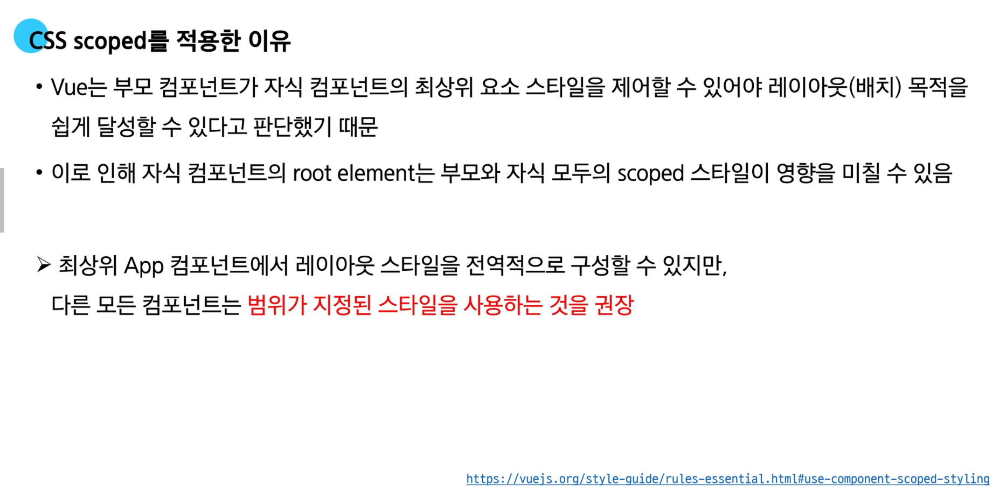


### 💡 Scaffolding

- **스캐폴딩(Scaffolding)**
  - 새로운 프로젝트나 모듈을 시작할 때, 초기 구조와 코드를 자동으로 생성하는 과정
  ```javascript
  $ npm create vue@latest
  ```
  

### 💡 패키지 관리 주의사항

- **패키지 관리 주의 사항**
  1. `npm install`을 입력하는 위치
    - 항상 프로젝트 루트 디렉토리(프로젝트 생성 폴더)에서 실행
  
  2. `node_modules` 폴더 관리 주의
    - 필요할 때마다 `npm install`을 통해 재생성할 수 있으므로, 직접 수정하거나 `git`으로 관리할 필요 없다
  
  3. `package.json`과 `package-lock.json` 직접 편집 자제
    - `npm install` 패키지명 명령을 통해 자동 업데이트하는 것이 안전
  
  4. 문제가 발생했을 때 재설치 고려
    - 패키지 버전 충돌이나 이상 동작이 의심될 때는 `node_modules`폴더를 삭제한 뒤 다시 `npm install`을 실행

# 🔥 요약 정리

- **Single-File Components (SFC)**
  - `Vue`에서 사용하는 특별한 파일 형식(`.vue`)으로, 컴포넌트 하나를 구성하는 `HTML`, `JavaScript`, `CSS`를 한 파일에 모두 담아 관리하는 방식

- **SFC의 구조**
  - `<tempalte>` : 컴포넌트의 `HTML` 구조를 정의하는 부분
  - `<script setup>` : 컴포넌트의 반응형 데이터와 `로직(JavaScript)`을 작성하는 부분
  - `<style scoped>` : 컴포넌트의 `CSS`를 작성하는 부분

- **SFC 개발 환경**
  - `.vue` 파일은 브라우저가 직접 이해할 수 없으므로, 웹에서 실행 가능하 코드로 변환하는 빌드(build) 과정이 필요
  - `Vite` : Vue 의 공식 빌드 도구로 빠른 개발 서버와 최적화된 빌드 기능을 제공
  - `NPM` : `Vue`, `Vite` 등 프로젝트에 필요한 외부 패키지를 설치하고 관리하는 도구
  - 모듈과 번들러
    - **모듈** : 기능을 기준으로 분리된 각각의 `.js` 파일을 의미
    - **번들러** : 여러 모듈 파일들을 브라우저가 효율적으로 로드할 수 있도록 하나의 파일로 묶어주는 도구
  
- **Vue 프로젝트**
  1. 프로젝트 생성
    - 터미널에서 `npm create vue@latest` 명령어를 실행하여 프로젝트의 기본 구조를 자동으로 생성
  
  2. 패키지 관리
    - `package.json` : 프로젝트 이름, 버전 정보와 필요한 패키지들의 목록(의존성)을 기록하는 **설계도**
    - `package-lock.json` : `package.json`을 바탕으로 실제로 설치된 패키지들의 정확한 버전 정보를 기록하여, 다른 환경에서도 동일한 개발 환경을 보장
    - `node_modules` : 설치된 모든 패키지 파일들이 실제로 저장되는 폴더

  3. 주요 구조
    - `src/main.js` : `Vue` 앱 인스턴스를 생성하고 `DOM`에 마운트 하는 프로젝트의 시작점
    - `src/App.js` : 모든 컴포넌트를 감싸는 최상위 루트 컴포넌트
    - `src/components` : 재사용할 자식 컴포넌ㄴ트를 저장하는 폴더

- **가상 돔(Virtual DOM)**
  - 실제 `DOM`의 구조를 복사한 가상의 `DOM`을 메모리에 저장해두는 프로그래밍 개념
  - 데이터가 변경되면, `Vue`는 실제 `DOM`을 직접 수정하는 대신 가상 `DOM`에서 변경 사항을 먼저 계산
  - 그 후 계산된 최소한의 변경사항만 실제 `DOM`에서 딱 한 번 적용하여 불필요한 렌더링을 줄이고 성능을 크게 향상

